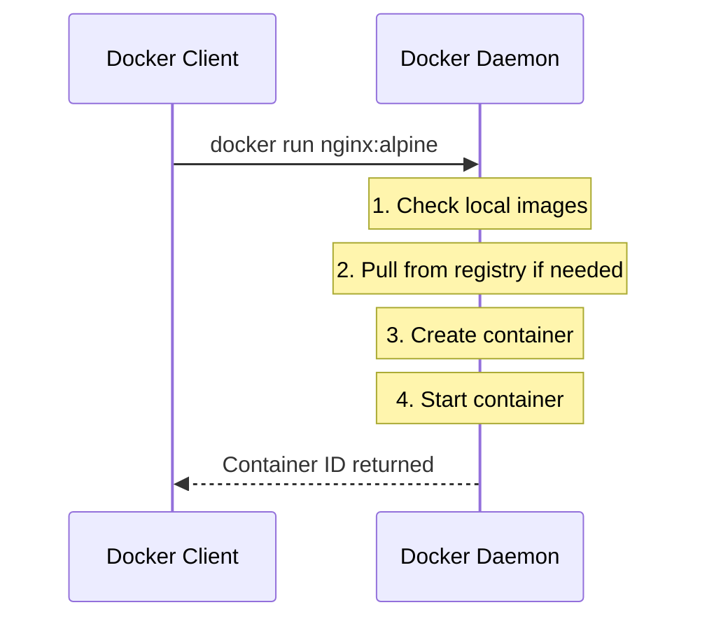
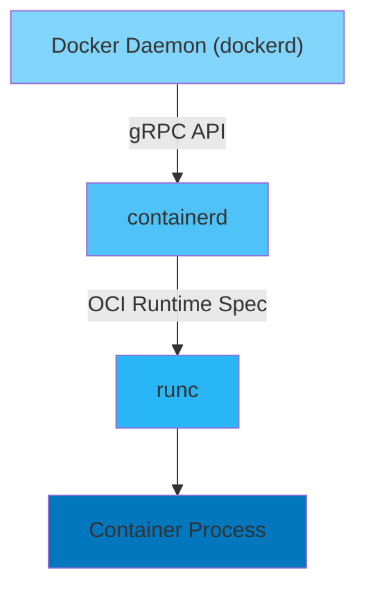
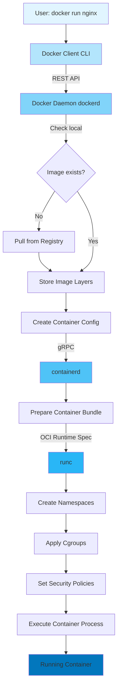
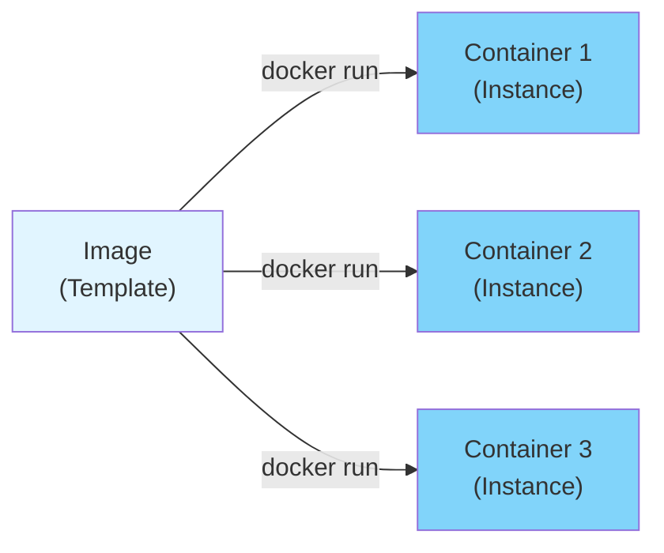
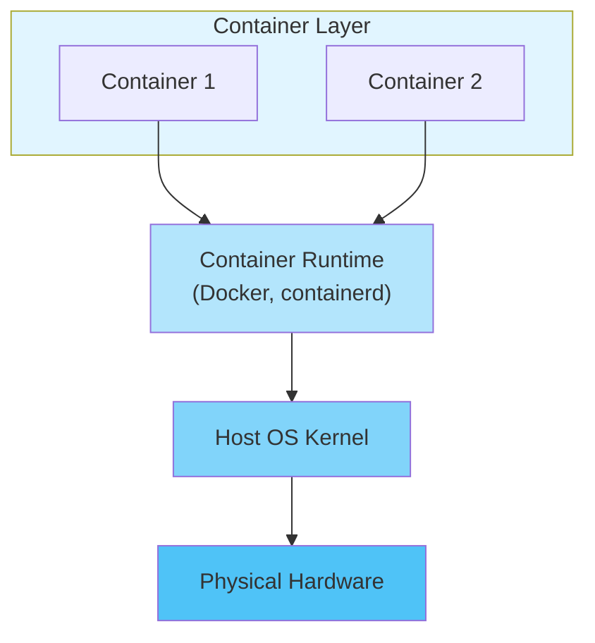
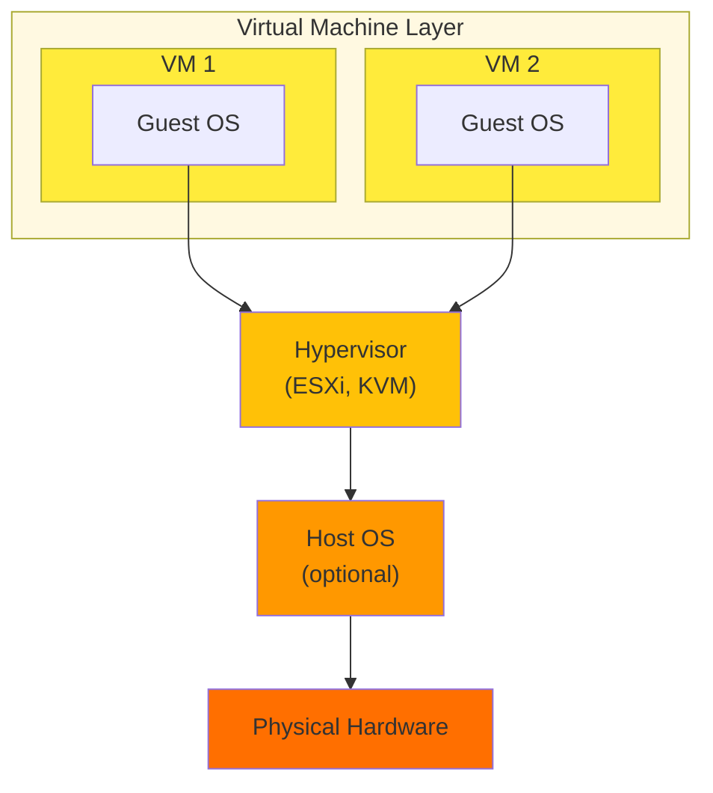

#continuous-integration #shell #docker #software-architecture #client-server #application-layer #web-server #dbms #binary-image #operating-system #process #memory #virtual-memory #site-realibility-engineering #container-engine #container-orchestration #linux
#computer-network #go
# Overview
- Docker is a ==client-server container engine== for developing, shipping, and running OCI-compliant containers.
- Uses a <mark style="background: #e4e62d;">daemon-based architecture</mark> where a central daemon (dockerd) manages all container operations.
- Implements a layered architecture with multiple components working together to provide container functionality.
# Components
## Docker Client
### Purpose
- Provides ==user interface== for interacting with Docker daemon.
- Sends commands to Docker daemon via REST API over Unix sockets or network.
- Multiple interfaces available:
  - **Docker CLI** (`docker` command): Command-line interface
  - **Docker Desktop**: GUI application for Windows, macOS, Linux
  - **Docker Compose**: Tool for defining multi-container applications
  - **Docker API**: RESTful HTTP API for programmatic access
### Communication Methods
- **Unix Socket** (default on Linux): `/var/run/docker.sock`
  - Fast local communication
  - Requires appropriate permissions
- **TCP Socket**: Remote Docker daemon access
  - Format: `tcp://host:port`
  - Requires TLS for secure communication
- **Named Pipe** (Windows): `npipe:////./pipe/docker_engine`
### Client-Server Model

## Docker Daemon (dockerd)
### Purpose
- Core ==background service== that manages Docker objects: containers, images, networks, volumes.
- Listens for Docker API requests and processes them.
- Communicates with other daemons for orchestration (Swarm mode).
### Responsibilities
#### Image management
   - Pulling images from registries
   - Building images from Dockerfiles
   - Caching and storing image layers
   - Pushing images to registries
#### Container lifecycle management
   - Creating containers from images
   - Starting, stopping, restarting containers
   - Monitoring container state
   - Removing containers
#### Network management
   - Creating virtual networks
   - Connecting containers to networks
   - Port mapping and forwarding
   - DNS resolution between containers
#### Volume management
   - Creating and managing volumes
   - Mounting volumes to containers
   - Volume driver plugins
#### Resource management
   - CPU and memory limits (cgroups)
   - Process isolation (namespaces)
   - Security policies (SELinux, AppArmor, Seccomp)
### Daemon Configuration
- Configuration file: `/etc/docker/daemon.json`
- Command-line flags: `dockerd --option=value`
- Common settings:
    - Storage driver selection
    - Registry mirrors
    - Logging drivers
    - Network settings
## containerd
### Purpose
- Industry-standard ==container runtime== that manages container lifecycle.
- Sits between Docker daemon and runc.
- Originally part of Docker Engine, now a separate CNCF graduated project.
### Responsibilities
- **Image Transfer**: Pulling and pushing images from/to registries
- **Image Storage**: Managing local image storage
- **Container Execution**: Creating and managing container processes via runc
- **Network Namespace Management**: Setting up container networking
- **Storage Management**: Managing container filesystem layers
### Architecture Position

## runc
### Purpose
- Lightweight ==OCI-compliant runtime== for spawning and running containers.
- Low-level tool that creates containers according to OCI Runtime Specification.
- Written in Go.
### Responsibilities
#### Namespace isolation
- Creates Linux namespaces for isolation
  - PID: Process isolation
  - NET: Network isolation
  - MNT: Filesystem mount isolation
  - UTS: Hostname isolation
  - IPC: Inter-process communication isolation
  - USER: User ID isolation
#### CGroup configuration
 - Sets resource limits
     - CPU limits
      - Memory limits
      - I/O limits
      - Network bandwidth

- **Security Policies**: Applies security configurations
  - Seccomp profiles
  - SELinux contexts
  - AppArmor profiles
  - Capabilities
# Architectural Flow
## Container Creation and Execution

## Image Build Process
1. **Docker CLI** receives `docker build` command
2. **Docker Daemon** reads Dockerfile
3. **Layer Creation**.
4. **Image Tagging** and storage in local image cache
5. **Optional Push** to registry
## Container Networking Flow
1. **Network Creation**: Docker daemon creates virtual network
2. **Bridge Setup**: Creates Linux bridge (default: docker0)
3. **veth Pair**: Creates virtual Ethernet pair
   - One end in container network namespace
   - Other end attached to bridge
4. **IP Assignment**: Assigns IP from bridge subnet
5. **Port Mapping**: iptables rules for port forwarding
6. **DNS Configuration**: Container DNS resolver

# Storage Architecture
- Docker images use ==layered filesystem== with Copy-on-Write (CoW) mechanism.
- Each layer is ==immutable== and uniquely identified by ==SHA-256 hash==.
- Containers add a ==writable layer== on top of image layers.
- See [Container storage](site-reliability-engineering/container-engine/Container%20storage.md) for detailed information on:
  - Storage drivers (overlay2, devicemapper, btrfs, zfs, vfs)
  - Storage locations and volume management
  - Layer structure and Copy-on-Write mechanism
  - Rootless storage considerations

# Network Architecture
- Docker provides multiple network drivers for different use cases.
- Each container runs in isolated ==network namespace==.
- Default bridge network (docker0) connects containers on single host.
- See [Container networking](site-reliability-engineering/container-engine/Container%20networking.md) for detailed information on:
  - Network drivers (bridge, host, none, overlay, macvlan)
  - Network namespace isolation and veth pairs
  - DNS resolution and port mapping
  - Bridge network topology and configuration

# Registry Architecture
- Docker uses ==centralized registries== for image distribution.
- Implements Docker Registry HTTP API V2 (now OCI Distribution Specification).
- Default registry: Docker Hub (hub.docker.com)
- See [Container registry](site-reliability-engineering/container-engine/Container%20registry.md) for detailed information on:
  - Registry hierarchy and image naming conventions
  - Registry types (Docker Hub, ECR, GCR, ACR, GHCR, Quay.io)
  - Authentication and TLS configuration
  - Image signing and verification

# Image vs Container
## Docker Image
- ==Runnable binary package== containing application code, dependencies, and configurations.
- Immutable and versioned.
- Composed of ==multiple layers== stacked on top of each other.
- Each layer identified by ==SHA-256 hash==.
- Stored in registry for distribution $\equiv$ program or executable.
## Docker Container
- ==Running instance== of a Docker image.
- Loaded into memory and executed as one or more [processes](operating-system/unix/linux/process/Process.md).
- Adds writable layer on top of image layers.
- Has own network, storage, and process namespace.
- Ephemeral by design $\implies$ destroyed data unless persisted in volumes $\equiv$ process.
## Relationship

# Security Architecture
- Docker implements multiple isolation and security mechanisms.
- Uses Linux kernel features: namespaces, cgroups, capabilities.
- Applies syscall filtering via seccomp profiles.
- See [Container security](site-reliability-engineering/container-engine/Container%20security.md) for detailed information on:
  - Isolation mechanisms (namespaces, cgroups, capabilities)
  - Seccomp filtering and MAC (AppArmor, SELinux)
  - Docker daemon security and TLS authentication
  - Rootless containers and user namespace mapping

# Docker vs Traditional VMs
## Architecture Comparison
| Aspect             | Docker Containers             | Virtual Machines              |
| ------------------ | ----------------------------- | ----------------------------- |
| **Abstraction**    | OS-level virtualization       | Hardware-level virtualization |
| **Startup Time**   | Seconds                       | Minutes                       |
| **Size**           | MBs                           | GBs                           |
| **Performance**    | Near-native                   | Overhead from hypervisor      |
| **Isolation**      | Process-level (shared kernel) | Full OS isolation             |
| **Resource Usage** | Lightweight                   | Heavy                         |
| **Portability**    | High (same kernel)            | Moderate (full OS)            |
| **Security**       | Shared kernel risks           | Stronger isolation            |
|                    |                               |                               |

## Deployment Model
### Containers

### Virtual Machines

# Docker Daemon vs Podman Architecture
| Feature | Docker | Podman |
|---------|--------|--------|
| **Architecture** | Client-Server (daemon) | Daemonless (fork-exec) |
| **Background Service** | dockerd required | No daemon |
| **Root Requirement** | Daemon runs as root | Rootless by default |
| **Process Model** | All containers owned by daemon | Containers owned by user |
| **Systemd Integration** | Via daemon | Native support |
| **Single Point Failure** | Daemon crash kills containers | No single point of failure |
| **Socket** | /var/run/docker.sock | No socket needed |
| **Security** | Daemon runs as root | Better isolation |

# Advantages
1. **Easy Distribution**: Package applications with dependencies in portable images
2. **Rapid Deployment**: Start containers in seconds vs minutes for VMs
3. **Resource Efficiency**: Share host kernel, minimal overhead
4. **Scalability**: Run hundreds of containers on single host
5. **Version Control**: Tag and version images for rollback
6. **Ecosystem**: Large registry of pre-built images (Docker Hub)
7. **CI/CD Integration**: Standardized build and deployment pipeline
8. **Microservices**: Ideal for microservice architectures
9. **Development Parity**: Same environment from dev to production
# Limitations
1. **Shared Kernel**: All containers share host kernel $\implies$ kernel exploits affect all
2. **Linux-Centric**: Native Linux support only, Windows/Mac use VM
3. **Daemon Dependency**: Single daemon failure affects all containers
4. **Storage Complexity**: Multiple storage drivers with different characteristics
5. **Network Overhead**: Bridge network adds latency vs host network
6. **Persistent Data**: Requires volume management for stateful applications
7. **GUI Applications**: Challenging to run GUI apps in containers
8. **Debugging**: More complex than traditional application debugging

***
# References
1. [Docker Official Documentation](https://docs.docker.com/) for comprehensive Docker documentation.
2. [Docker Architecture Overview](https://docs.docker.com/get-started/overview/) for official architecture explanation.
3. [containerd](https://containerd.io/) for containerd project documentation.
4. [runc](https://github.com/opencontainers/runc) for OCI runtime reference implementation.
5. [OCI Runtime Specification](https://github.com/opencontainers/runtime-spec) for container runtime standards.
6. [OCI Image Specification](https://github.com/opencontainers/image-spec) for image format specification.
7. [Podman architecture](site-reliability-engineering/container-engine/podman/Podman%20architecture.md) for comparison with daemonless architecture.
8. [OCI-compliant container](site-reliability-engineering/container-engine/OCI-compliant%20container.md) for container fundamentals.
9. [OCI-compliant image](site-reliability-engineering/container-engine/OCI-compliant%20image.md) for image layer concepts.
10. [Containerfile](site-reliability-engineering/container-engine/artifacts/Containerfile.md) for Dockerfile syntax and image building.
11. [Container commands](site-reliability-engineering/container-engine/Container%20commands.md) for Docker CLI commands.
12. [Container storage](site-reliability-engineering/container-engine/Container%20storage.md) for storage drivers and volume management.
13. [Container networking](site-reliability-engineering/container-engine/Container%20networking.md) for network drivers and configuration.
14. [Container security](site-reliability-engineering/container-engine/Container%20security.md) for security mechanisms and best practices.
15. [Container registry](site-reliability-engineering/container-engine/Container%20registry.md) for registry types and image distribution.
16. https://www.udemy.com/course/docker-mastery/ for Docker Mastery course.
17. https://www.aquasec.com/blog/a-brief-history-of-containers-from-1970s-chroot-to-docker-2016/ for container history.
