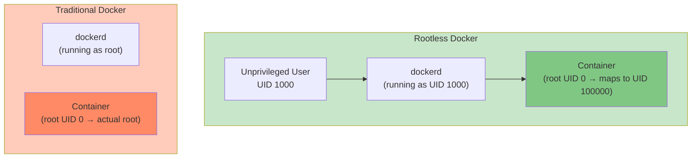

#docker #linux #operating-system #access-control #unix-permissions #cybersecurity  #security #shell
#continuous-integration
# Docker Socket Permissions
## Docker Socket Location
- Docker daemon communicates via ==Unix socket== at `/var/run/docker.sock`.
- Socket owned by `root:docker` with permissions `srw-rw----` (`660`).
- Only `root` user and members of `docker` group can access the socket.
## Permission Model
```Shell title='Check Docker socket permissions'
ls -l /var/run/docker.sock
```

```Text title='Output'
srw-rw---- 1 root docker 0 Jan 18 10:30 /var/run/docker.sock
```
- `s`: Unix socket file type.
- `rw-rw----`: Owner and group have read-write, others have no access.
- Requires either:
    - Running commands with `sudo` (execute as root).
    - Adding user to `docker` group (grants socket access).
# Running Docker Commands with `{Shell}sudo`
## Behavior
- `sudo docker <command>` executes Docker CLI as `root` user.
- Root user has direct access to `/var/run/docker.sock` without group membership.
- Every Docker command requires `sudo` prefix $\implies$ cumbersome for frequent use.
## Example
```Shell title='Run Docker with sudo'
sudo docker container run -d nginx:alpine

sudo docker container ls

sudo docker image pull redis:latest
```
- Secure approach as it requires explicit privilege elevation for each command.
- User must be in `sudoers` file with appropriate permissions.
## Advantages
- Explicit privilege escalation for each command.
- Audit trail via `sudo` logs in `/var/log/auth.log` or `/var/log/secure`.
- No permanent privilege granted to user account.
- Reduces attack surface compared to `docker` group membership.
## Disadvantages
- Requires typing `sudo` for every command $\implies$ inconvenient.
- Password prompt interrupts workflow.
- Scripts and automation require `NOPASSWD` `sudo` configuration or credential caching.
# Docker Group Membership
## Behavior
- Adding user to `docker` group grants ==permanent access== to Docker socket.
- Eliminates need for `sudo` prefix on Docker commands.
- Group membership persists across sessions and system reboots.
## Add User to Docker Group
```Shell title='Add current user to docker group'
sudo usermod -aG docker $USER

sudo usermod -aG docker username
```
- `-a`: Append to supplementary groups, preserve existing memberships.
- `-G`: Specify supplementary group list.
- Changes take effect on ==next login== $\implies$ user must log out and log back in.
## Activate Group Membership
```Shell title='Activate group without logout (current session only)'
newgrp docker
```
- Creates new shell with updated group membership.
- Temporary for current shell session only.
- Alternatively, log out and log back in for system-wide activation.
## Verify Group Membership
```Shell title='Check user groups'
groups

id
```

```Text title='Output showing docker group'
username adm cdrom sudo dip plugdev docker
```
- `docker` appears in group list after successful addition and login.
## Example Without sudo
```Shell title='Run Docker commands without sudo'
docker container run -d nginx:alpine

docker image ls

docker container exec -it nginx sh
```
- No `sudo` required after group membership activated.
- Commands execute with same privileges as `root` for Docker operations.
# Security Implications of Docker Group
## Equivalent to Root Access
- Docker group membership grants ==root-equivalent privileges== on the host system.
- Users can escape container isolation and gain root access to host.
- Docker daemon runs as root $\implies$ containers can be created with host filesystem mounts.
## Container Escape Attack Vectors
### Mount Host Filesystem
```Shell title='Mount host root filesystem to container'
docker run -v /:/hostfs -it ubuntu bash
```
- Mounts entire host filesystem at `/hostfs` inside container.
- Attacker can read, write, delete any file on host system including `/etc/shadow`, `/etc/passwd`.
- Can modify system binaries, install backdoors, extract sensitive data.
### Privileged Container
```Shell title='Run privileged container with full capabilities'
docker run --privileged -it ubuntu bash
```
- `--privileged` grants ==all capabilities== and device access to container.
- Bypasses security restrictions: seccomp, AppArmor, SELinux.
- Can load kernel modules, access hardware devices, modify iptables.
- Full control over host kernel from within container.
### Override Entrypoint with Root Shell
```Shell title='Run container as root with shell'
docker run -u 0 -v /:/hostfs -it ubuntu bash
```
- `-u 0`: Run as UID $0$ $\equiv$ root user.
- Combined with volume mount, provides root access to host filesystem.
### Modify Host Files via Bind Mount
```Shell title='Modify SSH configuration'
docker run -v /etc:/host-etc -it ubuntu bash

echo "PermitRootLogin yes" >> /host-etc/ssh/sshd_config
```
- Modifies host SSH configuration from within container.
- Can add SSH keys, create users, install malware.
## Comparison with sudo
| Aspect | Docker Group | sudo Access |
|--------|--------------|-------------|
| **Privilege Duration** | Permanent | Per-command |
| **Audit Trail** | Limited Docker logs | Full sudo logs |
| **Revocation** | Requires group removal | Modify sudoers file |
| **Attack Surface** | Always available | Requires password |
| **Privilege Scope** | Docker operations only | All root operations |
| **Accidental Damage** | Higher risk | Lower risk |
## Best Practices
- Only add ==trusted users== to `docker` group.
- Treat `docker` group membership as equivalent to `sudo` or `root` access.
- Use rootless Docker for non-privileged users when possible.
- Implement monitoring and auditing for Docker socket access.
- Consider policy-based access control (e.g., Open Policy Agent, Kyverno).
- Use Docker Content Trust for image signature verification.
- Regularly audit `docker` group membership:
```Shell title='List all users in docker group'
getent group docker
```
# Rootless Docker
## Overview
- ==Rootless mode== allows running Docker daemon and containers without root privileges.
- Docker daemon runs as unprivileged user instead of root.
- Containers execute within user namespace $\implies$ root inside container maps to unprivileged UID on host.
## Architecture

## Installation
```Shell title='Install rootless Docker on Ubuntu/Debian'
dockerd-rootless-setuptool.sh install
```

```Shell title='Install rootless Docker on Fedora/RHEL'
dnf install docker-ce-rootless-extras

dockerd-rootless-setuptool.sh install
```
- Installs rootless Docker components and configures user environment.
- Sets up user-specific systemd service for Docker daemon.
## Configuration
```Shell title='Enable rootless Docker service'
systemctl --user enable docker.service

systemctl --user start docker.service
```
- `--user`: Manages user-level systemd units instead of system-wide.
- Docker daemon runs as user process without root privileges.
## Set Environment Variables
```Shell title='Configure Docker client for rootless mode'
export DOCKER_HOST=unix://$XDG_RUNTIME_DIR/docker.sock
```
```Shell title='Add to ~/.bashrc for persistence'
echo 'export DOCKER_HOST=unix://$XDG_RUNTIME_DIR/docker.sock' >> ~/.bashrc
source ~/.bashrc
```
- `XDG_RUNTIME_DIR`: User-specific runtime directory, typically `/run/user/1000`.
- Docker client connects to user's socket instead of system socket.
## User Namespace Mapping
- Root inside container (UID $0$) maps to unprivileged UID on host (e.g., $100000$).
- Subuid and subgid ranges configured in `/etc/subuid` and `/etc/subgid`.
```Shell title='Check subuid mapping'
cat /etc/subuid
```
```Text title='Example output'
username:100000:65536
```
- User `username` can map $65536$ subordinate UIDs starting from $100000$.
- Container UID $0$ maps to host UID $100000$, UID $1$ to $100001$, etc.
## Advantages
- ==No root privileges required== for Docker daemon or containers.
- Container escape only grants access to unprivileged user account, not root.
- Improved security isolation via user namespace remapping.
- Suitable for multi-tenant environments and shared systems.
- No need for `docker` group membership or `sudo` access.
## Limitations
### Port Binding Restrictions
- Cannot bind to ==privileged ports== (ports $< 1024$) without additional configuration.
- Ports $\geq 1024$ work normally.
- Workaround: Use `sysctl` to adjust `net.ipv4.ip_unprivileged_port_start`:
```Shell title='Allow binding to port 80 as unprivileged user'
sudo sysctl -w net.ipv4.ip_unprivileged_port_start=80
```
### Storage Driver Limitations
- `overlay2` storage driver requires kernel $\geq 5.11$ with unprivileged overlay support.
- Older kernels fall back to slower `fuse-overlayfs` or `vfs` drivers.
- Performance may be degraded compared to rootful Docker.
### Network Driver Limitations
- `bridge` network uses `slirp4netns` for user-mode networking.
- `host` network mode not supported $\implies$ containers cannot share host network namespace.
- `macvlan` and `ipvlan` drivers not available.
### Cgroups Limitations
- Requires cgroups v2 for resource limits (memory, CPU).
- Cgroups v1 does not support rootless resource control.
- Check cgroups version:
```Shell title='Check cgroups version'
stat -fc %T /sys/fs/cgroup/
```
```Text title='Output'
cgroup2fs    # cgroups v2
tmpfs        # cgroups v1
```
### Device Access
- Cannot access host devices (`/dev/*`) without CAP_SYS_ADMIN.
- GPU passthrough and hardware acceleration limited.
- USB devices, block devices not accessible.
## Use Cases
- Development environments where root access is unavailable or restricted.
- Multi-user systems requiring isolated container execution.
- CI/CD pipelines running as unprivileged service accounts.
- Security-conscious deployments minimizing root attack surface.
# Docker Permission Escalation in Kubernetes
## Service Account Permissions
- Kubernetes pods running Docker-in-Docker (DinD) require privileged mode or Docker socket mount.
- Mounting host Docker socket (`/var/run/docker.sock`) grants cluster-wide container access.
- Grants same privileges as `docker` group membership on node.
## Example DinD Configuration
```YAML title='Kubernetes pod with Docker socket mount (INSECURE)'
apiVersion: v1
kind: Pod
metadata:
  name: docker-client
spec:
  containers:
  - name: docker
    image: docker:latest
    volumeMounts:
    - name: docker-socket
      mountPath: /var/run/docker.sock
  volumes:
  - name: docker-socket
    hostPath:
      path: /var/run/docker.sock
      type: Socket
```
- Grants pod root-equivalent access to all containers on node.
- Can start containers, read secrets, access host filesystem.
- Security risk: compromised pod can escalate to node takeover.
## Secure Alternative
- Use Kaniko, Buildah, or Podman for building images without privileged access.
- Use remote Docker daemon with TLS authentication instead of socket mount.
- Implement Pod Security Standards to restrict privileged containers.
```YAML title='Kaniko build (rootless, no Docker daemon)'
apiVersion: v1
kind: Pod
metadata:
  name: kaniko-build
spec:
  containers:
  - name: kaniko
    image: gcr.io/kaniko-project/executor:latest
    args:
    - --dockerfile=Dockerfile
    - --context=git://github.com/user/repo.git
    - --destination=registry.example.com/image:tag
```
- Kaniko builds images without Docker daemon or root privileges.
- Suitable for Kubernetes-native CI/CD pipelines.
# Permission Best Practices Summary
## For Development Environments
- Add user to `docker` group for convenience on trusted personal machines.
- Use rootless Docker on shared development systems.
- Enable Docker Content Trust to verify image signatures:
```Shell title='Enable Docker Content Trust'
export DOCKER_CONTENT_TRUST=1
```
## For Production Environments
- Use rootless Docker or Podman for production workloads.
- Avoid mounting Docker socket in containers.
- Implement least-privilege access control using policy engines.
- Use managed container services (ECS, EKS, GKE, AKS) with IAM-based permissions.
- Enable audit logging for Docker daemon:
```JSON title='/etc/docker/daemon.json'
{
  "log-level": "info",
  "log-driver": "json-file",
  "log-opts": {
    "max-size": "10m",
    "max-file": "3"
  }
}
```
## For Multi-User Systems
- Use rootless Docker exclusively.
- Implement user quotas for storage and resource limits.
- Monitor Docker socket access with tools like `auditd`:
```Shell title='Audit Docker socket access with auditd'
sudo auditctl -w /var/run/docker.sock -p rwxa -k docker-socket
```
- Regularly review `docker` group membership.
## For CI/CD Pipelines
- Use dedicated service accounts with minimal privileges.
- Prefer rootless runners (GitLab Runner rootless, GitHub Actions hosted runners).
- Use image scanning and vulnerability detection (Trivy, Clair, Anchore).
- Implement image signing and verification in pipeline.
***
# References
1. [Docker Official Documentation - Post-installation steps for Linux](https://docs.docker.com/engine/install/linux-postinstall/) for Docker group configuration.
2. [Docker Official Documentation - Rootless mode](https://docs.docker.com/engine/security/rootless/) for rootless Docker setup and limitations.
3. [Docker Security Documentation](https://docs.docker.com/engine/security/) for comprehensive security best practices.
4. [Docker architecture](site-reliability-engineering/container-engine/docker/Docker%20architecture.md) for Docker daemon and socket architecture.
5. [Container security](site-reliability-engineering/container-engine/Container%20security.md) for isolation mechanisms and security controls.
6. [Container commands](site-reliability-engineering/container-engine/Container%20commands.md) for Docker command examples with sudo.
7. [Podman architecture](site-reliability-engineering/container-engine/podman/Podman%20architecture.md) for rootless-by-default container engine.
8. https://docs.docker.com/engine/security/security/ for Docker security overview.
9. https://www.redhat.com/sysadmin/rootless-podman for rootless container best practices.
10. https://github.com/GoogleContainerTools/kaniko for Kaniko rootless image builder.
11. [[operating-system/unix/linux/system-administration/access-control/User]] for Linux User
12. [[operating-system/unix/linux/system-administration/access-control/File permissions]] for Linux File permissions.
13. [[operating-system/unix/linux/system-administration/access-control/Group]] for Linux Group.
14. 
