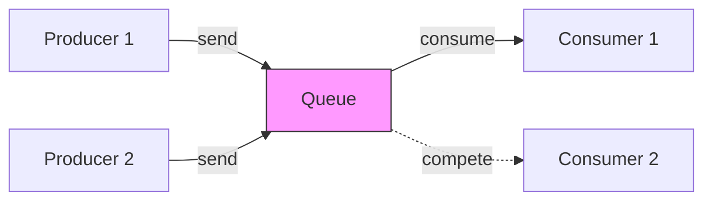
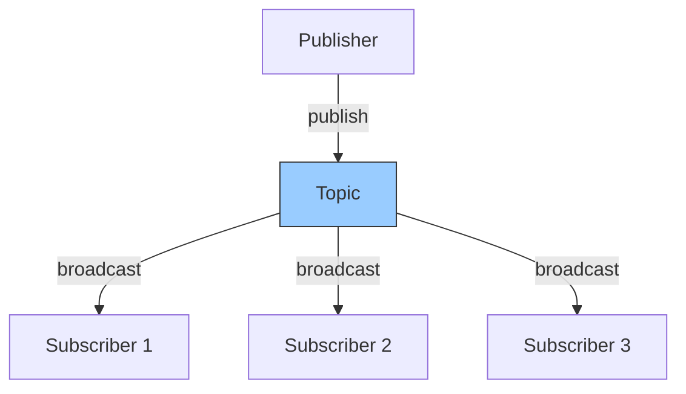
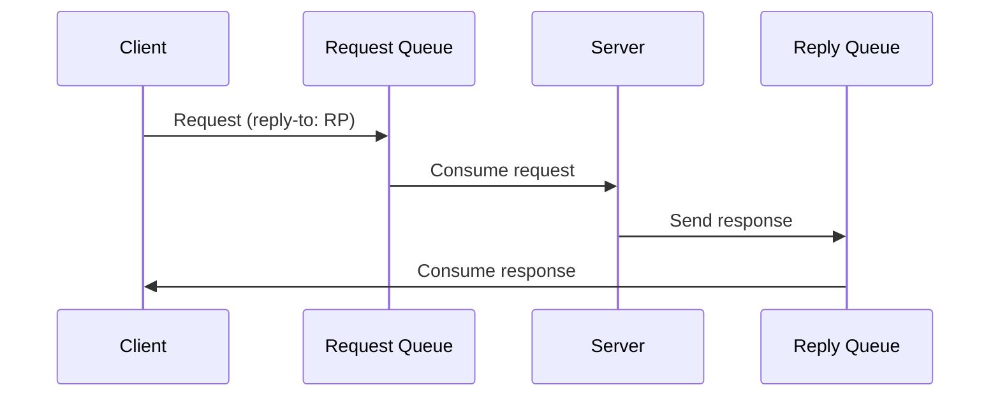
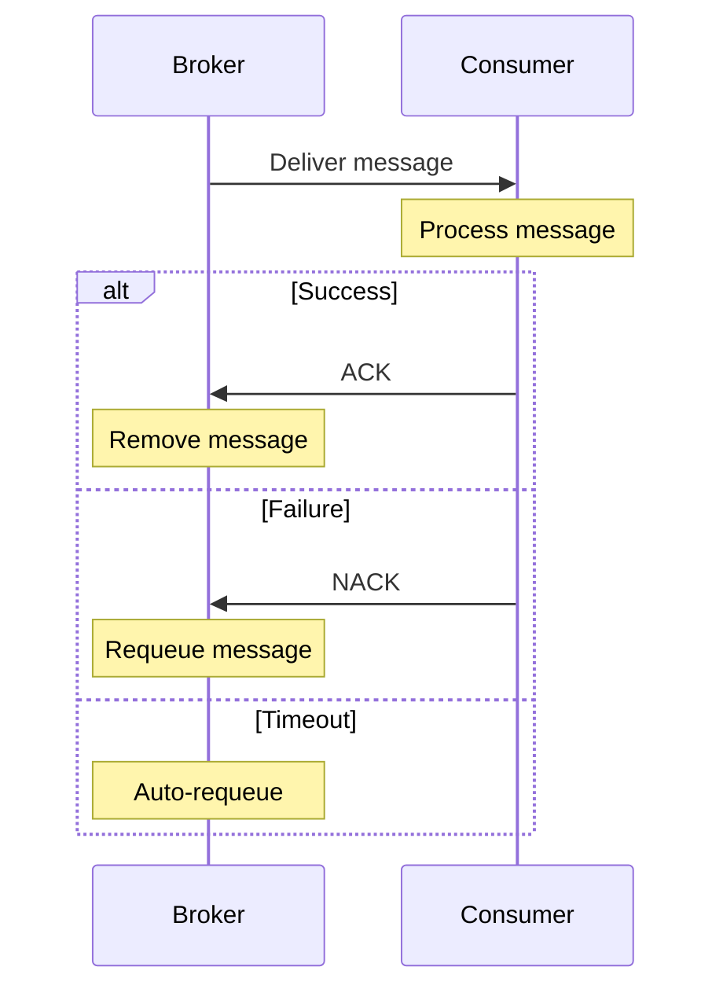
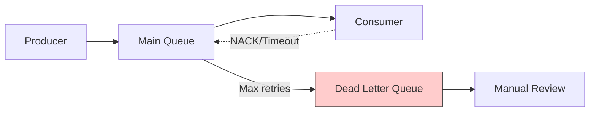

#software-architecture  #distributed-systems #asynchronous #integration-pattern

- A message broker is an intermediary software component that enables applications, services, and systems to communicate by <mark class="hltr-yellow">exchanging messages</mark> between formal messaging protocols. 
- It acts as a <mark class="hltr-yellow">middleman</mark> that receives messages from publishers and routes them to appropriate subscribers.
## Core Concepts
### Message-Oriented Middleware
- Message brokers implement ==message-oriented middleware (MOM)== architecture, providing *asynchronous communication* between distributed components. 
- Unlike synchronous request-response patterns, message brokers *decouple* producers from consumers in both time and space.
### Components
- **Producer/Publisher**: Application that sends messages to the broker
- **Consumer/Subscriber**: Application that receives messages from the broker
- **Queue**: Message storage that follows FIFO ordering for point-to-point communication
- **Topic**: Logical channel for publish-subscribe communication patterns
- **Exchange**: Routing mechanism that determines message destinations based on rules
- **Binding**: Configuration that links exchanges to queues with routing logic
## Communication Patterns
### Point-to-Point (Queue-Based)

- Each message is consumed by exactly one consumer. Multiple consumers compete for messages, enabling load distribution and horizontal scaling.
### Publish-Subscribe (Topic-Based)

- Messages are broadcast to all subscribers. Each subscriber receives a copy of every message published to the topic.
### Request-Reply

- Messages are first published to the Request Queue by the Client.
- The server subscribes to the Request Queue and consumes messages. After processing, the server publishes a response message to the Reply Queue.
- The client listens on the Reply Queue and consumes the response message.
## Message Delivery Guarantees
### At-Most-Once
- Messages are delivered zero or one time. Fast but may lose messages during failures. Suitable for metrics, logs, and non-critical data.
### At-Least-Once
- Messages are delivered one or more times. May produce duplicates but ensures no message loss. Requires idempotent consumers.
### Exactly-Once
- Messages are delivered exactly one time. Most expensive guarantee, requiring distributed transactions or deduplication mechanisms.
## Message Acknowledgment

- *Auto-acknowledgment*: Broker removes message immediately upon delivery
- *Manual acknowledgment*: Consumer explicitly confirms processing completion
- *Negative acknowledgment*: Consumer rejects message for redelivery or dead-letter handling
## Routing Strategies
### Direct Routing
- Messages route to queues based on <mark class="hltr-yellow">exact routing key</mark> match.
### Topic Routing
- Pattern-based routing using wildcards:
    - `*` matches exactly one word
    - `#` matches zero or more words
- Example: `order.*.created` matches `order.product.created` and `order.service.created`
### Fanout Routing
- Broadcasts messages to all bound queues regardless of routing key.
### Header Routing
- Routes based on message header attributes instead of routing keys.
## Message Persistence
### Transient Messages
- Stored in *memory* only. Fast but lost on broker restart. Suitable for real-time data with short relevance.
### Persistent Messages
- Written to *disk* before acknowledgment. Survives broker restarts but incurs I/O overhead.
### Durability Configuration
- **Durable queues**: Queue definition persists across restarts
- **Persistent messages**: Message content survives broker failure
- Both required for true message durability
## Dead Letter Handling

- Messages that cannot be processed after multiple attempts route to ==dead letter queues (DLQ)== for manual inspection and remediation.
## Use Cases
### Event-Driven Architecture
- Decouples microservices through domain events. Services publish business events that other services consume asynchronously.
### Task Distribution
- Distributes workload across worker instances. Queue consumers scale horizontally to handle variable load.
### System Integration
- Connects heterogeneous systems with different protocols, data formats, and processing speeds.
### Log Aggregation
- Collects logs from distributed services into centralized processing pipeline.
### Stream Processing
- Feeds real-time data to analytics engines for continuous computation.
## Architectural Considerations
### Scalability
- **Horizontal scaling**: Add broker nodes or consumer instances
- **Partitioning**: Distribute messages across multiple queues/topics
- **Consumer groups**: Coordinate consumption across multiple instances
### High Availability
- **Clustering**: Multiple broker instances sharing load
- **Replication**: Message copies across nodes for fault tolerance
- **Failover**: Automatic promotion of standby nodes
### Performance Factors
- **Message size**: Smaller messages enable higher throughput
- **Persistence**: Disk I/O impacts latency and throughput
- **Acknowledgment mode**: Auto-ack faster but less reliable
- **Prefetch count**: Messages delivered to consumer before acknowledgment
### Observability
- **Queue depth**: Number of unprocessed messages
- **Consumer lag**: Time delay between publish and consumption
- **Message rate**: Throughput in messages per second
- **Error rate**: Failed deliveries and negative acknowledgments
- **Connection count**: Active producer and consumer sessions
***
# References
1. Enterprise Integration Patterns - Gregor Hohpe, Bobby Woolf - 2003 - Addison-Wesley
    1. Chapter 3: Messaging Systems
    2. Chapter 4: Messaging Channels
2. Designing Data-Intensive Applications - Martin Kleppmann - 2017 - O'Reilly
    1. Chapter 11: Stream Processing
3. https://www.enterpriseintegrationpatterns.com/patterns/messaging/
4. Building Microservices - Sam Newman - 2nd Edition - 2021 - O'Reilly
    1. Chapter 4: Microservice Communication Styles
