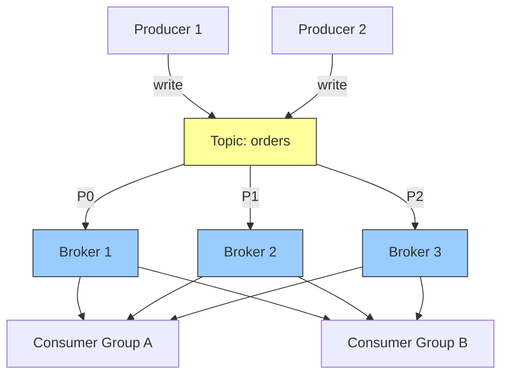
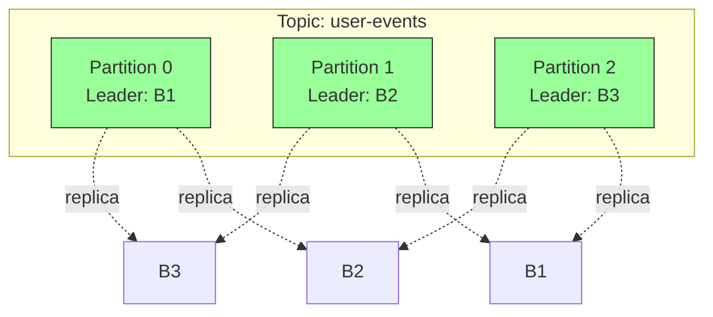
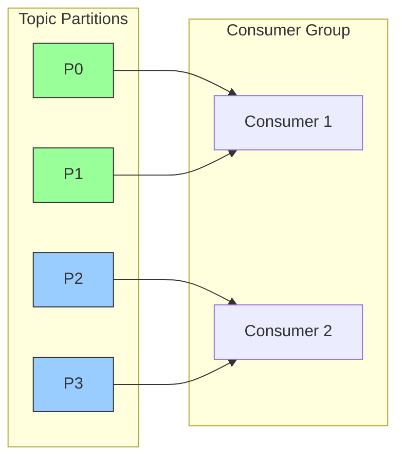
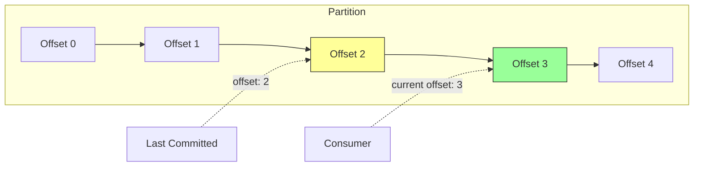
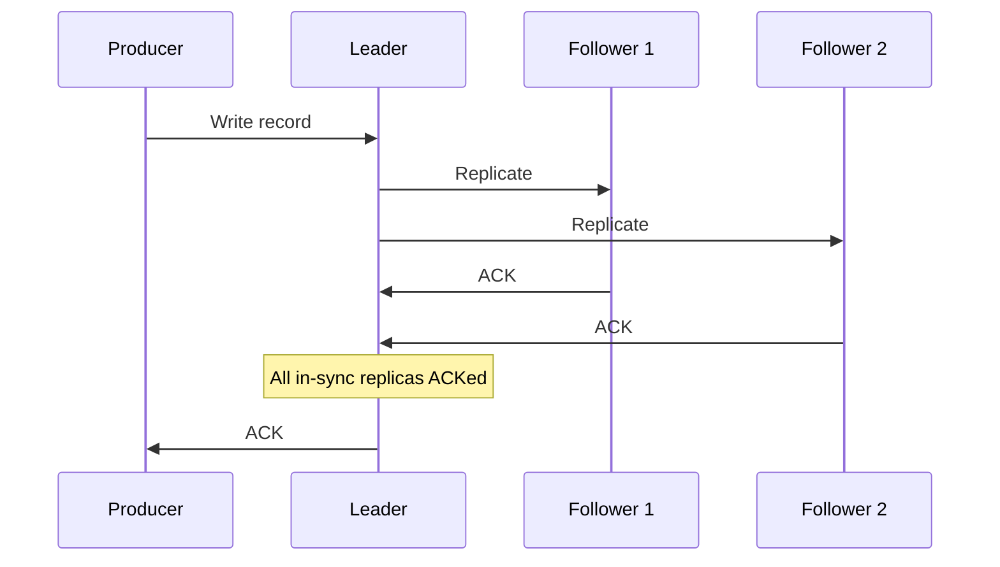
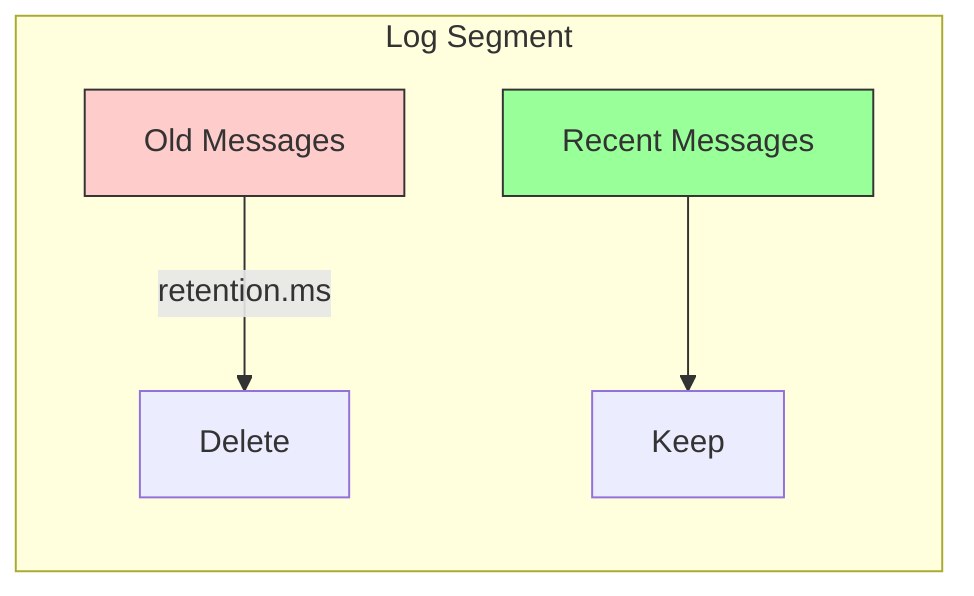
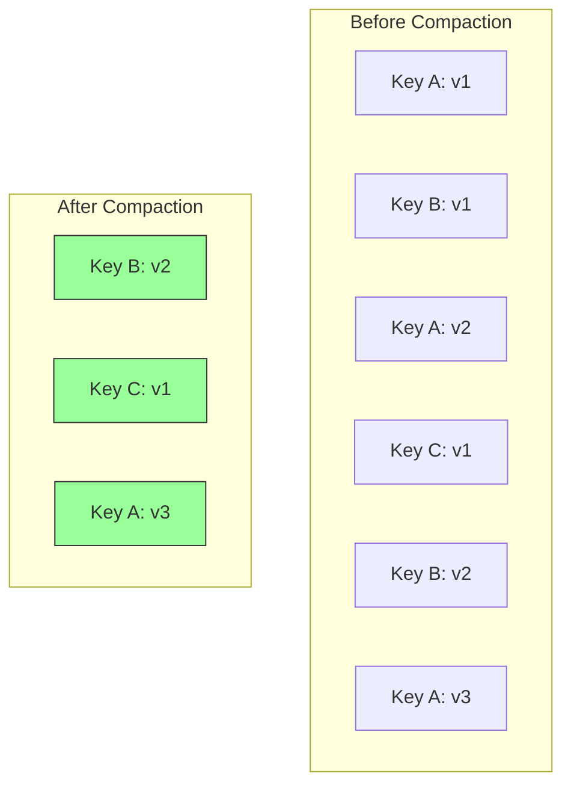
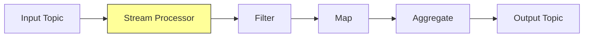
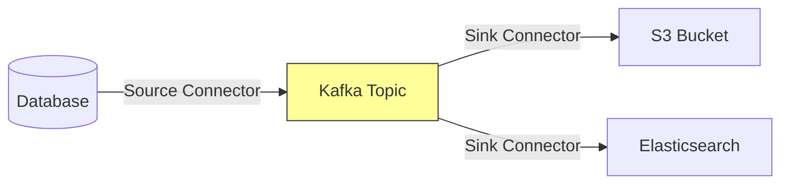

#messaging #kafka #event-streaming #distributed-systems #log-based
==Apache Kafka== is a distributed event streaming platform designed for high-throughput, fault-tolerant, and scalable data pipelines. Unlike traditional message brokers, Kafka persists messages in a distributed commit log, enabling event replay and stream processing.

## Architecture



### Core Components

- **Broker**: Kafka server that stores and serves messages
- **Topic**: Logical category for organizing messages
- **Partition**: Ordered, immutable sequence of records within a topic
- **Producer**: Client that publishes records to topics
- **Consumer**: Client that subscribes to topics and processes records
- **Consumer Group**: Set of consumers that coordinate to consume partitions
- **ZooKeeper/KRaft**: Cluster coordination and metadata management

## Topics and Partitions



### Partitioning Strategy

- **Key-based**: Records with same key route to same partition (maintains ordering per key)
- **Round-robin**: Distributes evenly when key is null
- **Custom partitioner**: Application-specific routing logic

```Java
Properties props = new Properties();
props.put("bootstrap.servers", "localhost:9092");
props.put("key.serializer", "org.apache.kafka.common.serialization.StringSerializer");
props.put("value.serializer", "org.apache.kafka.common.serialization.StringSerializer");

Producer<String, String> producer = new KafkaProducer<>(props);
ProducerRecord<String, String> record =
    new ProducerRecord<>("orders", "user-123", orderJson);
producer.send(record);
```

## Consumer Groups



Consumers within same group coordinate to consume partitions. Each partition consumed by exactly one consumer in the group, enabling parallelism and load balancing.

```Java
Properties props = new Properties();
props.put("bootstrap.servers", "localhost:9092");
props.put("group.id", "order-processor");
props.put("key.deserializer", "org.apache.kafka.common.serialization.StringDeserializer");
props.put("value.deserializer", "org.apache.kafka.common.serialization.StringDeserializer");

KafkaConsumer<String, String> consumer = new KafkaConsumer<>(props);
consumer.subscribe(Arrays.asList("orders"));

while (true) {
    ConsumerRecords<String, String> records = consumer.poll(Duration.ofMillis(100));
    for (ConsumerRecord<String, String> record : records) {
        processOrder(record.value());
    }
    consumer.commitSync();
}
```

## Offset Management



==Offset== is the sequential ID of each record within partition. Consumers track position to enable resumption and replay.

### Commit Strategies

- **Auto-commit**: Periodic automatic offset commits (may duplicate processing)
- **Manual sync commit**: Explicit blocking commit after processing
- **Manual async commit**: Non-blocking commit with callback

```Java
// Manual sync commit
consumer.commitSync();

// Manual async commit
consumer.commitAsync((offsets, exception) -> {
    if (exception != null) {
        log.error("Commit failed", exception);
    }
});
```

## Delivery Guarantees

### At-Most-Once
Enable auto-commit or commit before processing. Fast but may lose messages on consumer failure.

### At-Least-Once
Process then commit. May duplicate messages on consumer failure before commit. Requires idempotent consumers.

### Exactly-Once Semantics (EOS)

```Java
Properties props = new Properties();
props.put("enable.idempotence", "true");
props.put("transactional.id", "order-processor-1");

KafkaProducer<String, String> producer = new KafkaProducer<>(props);
producer.initTransactions();

try {
    producer.beginTransaction();
    producer.send(new ProducerRecord<>("topic", "key", "value"));
    producer.commitTransaction();
} catch (Exception e) {
    producer.abortTransaction();
}
```

Requires idempotent producer and transactional semantics. Prevents duplicates across retries and failures.

## Replication and Fault Tolerance



### In-Sync Replicas (ISR)
Replicas that are caught up with leader. Leader waits for ISR acknowledgment based on `acks` configuration.

- **acks=0**: No acknowledgment (fastest, may lose data)
- **acks=1**: Leader acknowledgment only (may lose data if leader fails)
- **acks=all**: All ISR acknowledgment (strongest guarantee)

### Leader Election
When leader fails, one of the ISR replicas is elected as new leader. Ensures no data loss when using `acks=all`.

## Log Retention



Kafka retains messages based on time or size policies, independent of consumption.

```Shell
# Time-based retention (7 days)
retention.ms=604800000

# Size-based retention (1GB)
retention.bytes=1073741824

# Compaction - keeps latest value per key
cleanup.policy=compact
```

## Log Compaction



Retains only latest value for each key. Useful for state snapshots and changelog topics.

## Stream Processing (Kafka Streams)



Native stream processing library for transformations, aggregations, and joins.

```Java
StreamsBuilder builder = new StreamsBuilder();
KStream<String, String> orders = builder.stream("orders");

orders
    .filter((key, value) -> parseOrder(value).getAmount() > 100)
    .mapValues(value -> processOrder(value))
    .to("high-value-orders");

KafkaStreams streams = new KafkaStreams(builder.build(), props);
streams.start();
```

## Performance Characteristics

### High Throughput
- Sequential disk I/O for log appends
- Zero-copy data transfer from disk to network
- Batch compression and transmission

### Low Latency
- End-to-end latency typically under 10ms
- Optimized for sustained throughput over individual message latency

### Scalability
- Horizontal scaling via partition distribution
- Consumer parallelism through consumer groups
- Linear scaling with broker addition

## Use Cases

### Event Sourcing
Store all state changes as immutable events. Rebuild application state by replaying event log.

### Stream Processing
Real-time data transformations, aggregations, and analytics on event streams.

### Log Aggregation
Centralized collection of application logs from distributed services.

### Metrics and Monitoring
High-throughput ingestion of operational metrics and telemetry data.

### Change Data Capture (CDC)
Track and propagate database changes to downstream systems.

## Kafka Connect

Framework for integrating Kafka with external systems through connectors.



- **Source connectors**: Import data into Kafka
- **Sink connectors**: Export data from Kafka

## Schema Registry

Centralized schema management for Kafka messages using Avro, Protobuf, or JSON Schema.

```Java
Properties props = new Properties();
props.put("schema.registry.url", "http://localhost:8081");

KafkaAvroSerializer serializer = new KafkaAvroSerializer();
KafkaAvroDeserializer deserializer = new KafkaAvroDeserializer();
```

Ensures producer-consumer compatibility and enables schema evolution.

## Common Pitfalls

### Too Many Partitions
Increases ZooKeeper overhead and recovery time. Start conservatively and scale as needed.

### Ignoring Rebalancing
Frequent rebalances impact consumer performance. Tune `session.timeout.ms` and `max.poll.interval.ms`.

### Not Monitoring Consumer Lag
Growing lag indicates consumers cannot keep up. Scale consumers or optimize processing.

### Improper Key Selection
Poor key distribution causes partition skew. Choose keys that distribute evenly.

***
# References
1. Kafka: The Definitive Guide - Neha Narkhede, Gwen Shapira, Todd Palino - 2nd Edition - 2021 - O'Reilly
   1. Chapter 3: Kafka Producers
   2. Chapter 4: Kafka Consumers
   3. Chapter 6: Reliable Data Delivery
2. https://kafka.apache.org/documentation/
3. Designing Event-Driven Systems - Ben Stopford - 2018 - O'Reilly
4. https://kafka.apache.org/documentation/streams/
5. [[Message broker|Back to Message Broker Overview]]
