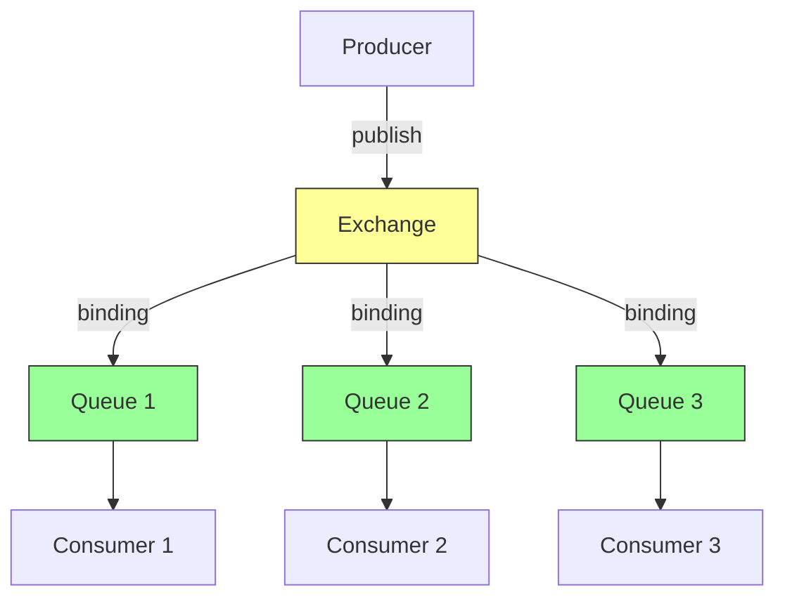
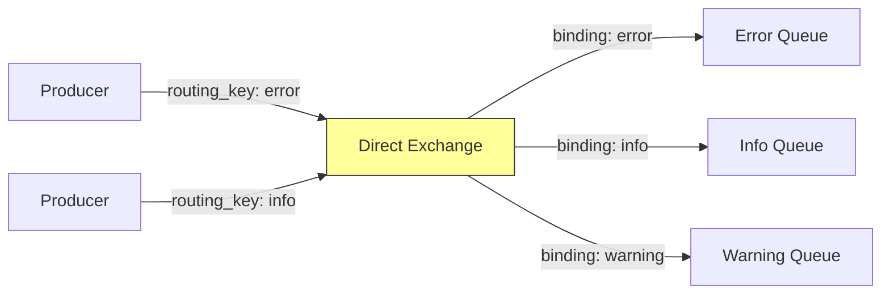
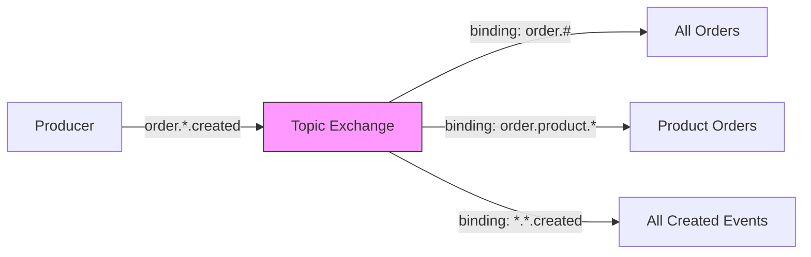
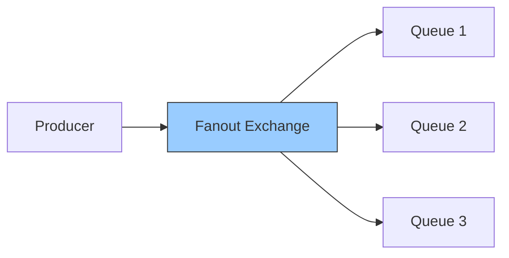
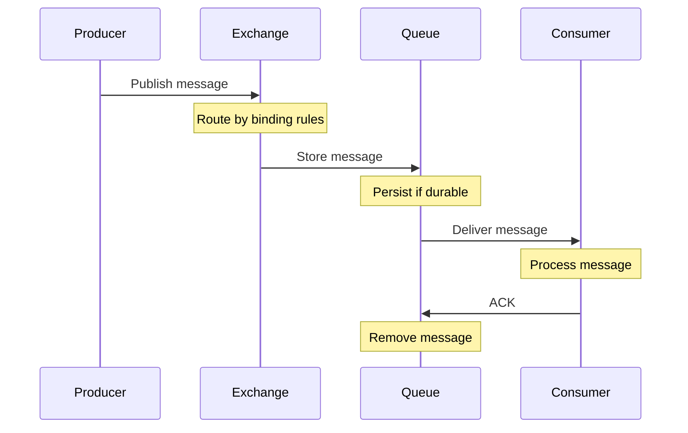
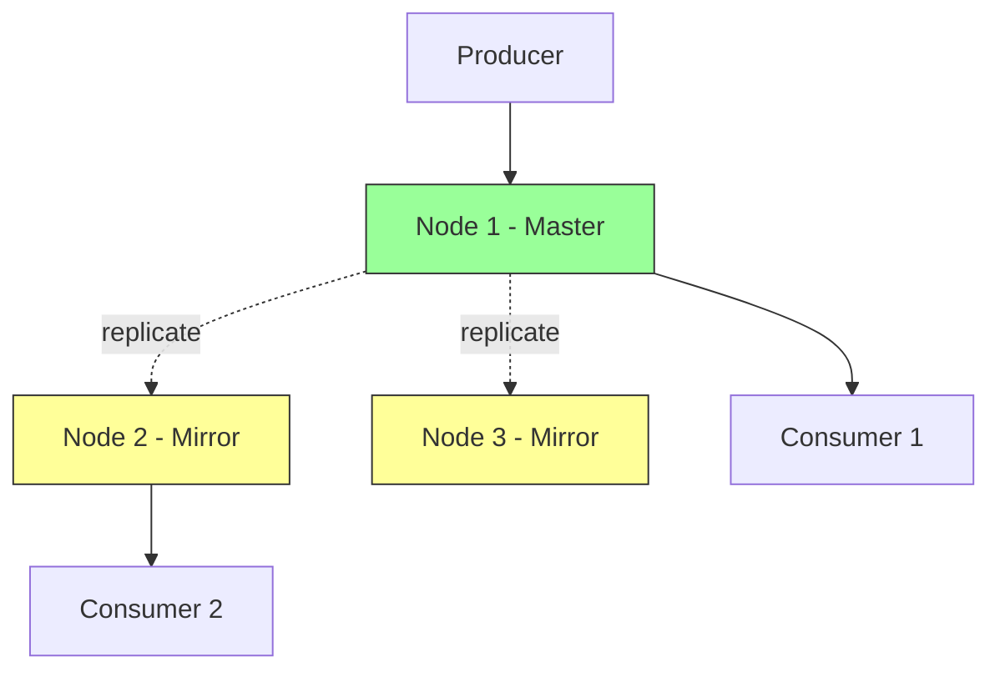
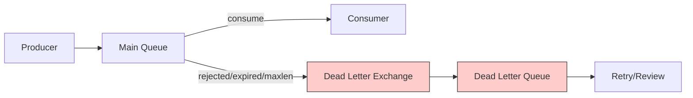

#rabbitmq #amqp #message-broker #distributed-systems
- ==RabbitMQ== is an open-source message broker that implements the Advanced Message Queuing Protocol (AMQP) and supports multiple messaging protocols.
# Architecture



## Components

- **Exchange**: Receives messages from producers and routes to queues based on bindings and routing keys
- **Queue**: Buffer that stores messages until consumed
- **Binding**: Rule linking exchange to queue with optional routing key pattern
- **Virtual Host**: Logical separation for multi-tenancy within single broker instance
- **Connection**: TCP connection between client and broker
- **Channel**: Lightweight connection multiplexed over single TCP connection

# Exchange Types

## Direct Exchange


- Routes messages to queues where binding key exactly matches routing key.
## Topic Exchange



- Pattern-based routing using wildcards:
    - `*` matches exactly one word
    - `#` matches zero or more words
## Fanout Exchange



- Broadcasts messages to all bound queues, ignoring routing keys.

## Headers Exchange
- Routes based on message header attributes instead of routing keys. Supports `all` or `any` matching logic.
# Message Flow



# Delivery Guarantees
## Publisher Confirms
- Broker acknowledges message receipt to producer, ensuring message reached the broker.

```Java
channel.confirmSelect();
channel.basicPublish(exchange, routingKey, null, message);
channel.waitForConfirms();
```
## Consumer Acknowledgments
- **Auto-ack**: Message removed upon delivery (fast, may lose messages)
- **Manual ack**: Consumer explicitly confirms processing
```Java
channel.basicConsume(queueName, false, (consumerTag, delivery) -> {
    try {
        processMessage(delivery.getBody());
        channel.basicAck(delivery.getEnvelope().getDeliveryTag(), false);
    } catch (Exception e) {
        channel.basicNack(delivery.getEnvelope().getDeliveryTag(), false, true);
    }
}, consumerTag -> {});
```
## Message Persistence
- **Durable queues**: Queue survives broker restart
- **Persistent messages**: Message marked for disk storage
```Java
channel.queueDeclare("myQueue", true, false, false, null);
channel.basicPublish("", "myQueue",
    MessageProperties.PERSISTENT_TEXT_PLAIN,
    message.getBytes());
```
# Clustering and High Availability
## Queue Mirroring



- Queues replicated across nodes. Master handles operations, mirrors provide failover capability.
## Quorum Queues
- Raft-based replicated queues introduced in RabbitMQ 3.8. Preferred over classic mirrored queues for better consistency and performance.
```Java
Map<String, Object> args = new HashMap<>();
args.put("x-queue-type", "quorum");
channel.queueDeclare("quorum-queue", true, false, false, args);
```
# Dead Letter Exchange


- Failed messages route to designated dead letter exchange for retry or inspection.
```Java
Map<String, Object> args = new HashMap<>();
args.put("x-dead-letter-exchange", "dlx-exchange");
args.put("x-dead-letter-routing-key", "failed");
channel.queueDeclare("main-queue", true, false, false, args);
```
# TTL and Message Expiration
## Queue-Level TTL
- All messages in queue expire after specified duration.
```Java
Map<String, Object> args = new HashMap<>();
args.put("x-message-ttl", 60000); // 60 seconds
channel.queueDeclare("ttl-queue", true, false, false, args);
```
## Per-Message TTL
```Java
AMQP.BasicProperties props = new AMQP.BasicProperties.Builder()
    .expiration("60000")
    .build();
channel.basicPublish("", "queue", props, message.getBytes());
```
# Prefetch and QoS
- Controls number of unacknowledged messages delivered to consumer.
```Java
channel.basicQos(10); // Prefetch 10 messages
```
- Prevents overwhelming slow consumers and enables better load distribution.
# Performance Considerations
## Message Size
- Smaller messages yield higher throughput. Large messages impact memory and network.
## Lazy Queues
- Store messages on disk immediately, reducing memory pressure for large queues.
```Java
Map<String, Object> args = new HashMap<>();
args.put("x-queue-mode", "lazy");
channel.queueDeclare("lazy-queue", true, false, false, args);
```
## Connection Pooling
- Reuse connections and channels to reduce TCP overhead and authentication cost.
## Batching
- Publish multiple messages in single operation for better throughput.
***
# References
1. RabbitMQ in Action - Alvaro Videla, Jason J.W. Williams - 2012 - Manning
   1. Chapter 2: Understanding Messaging
   2. Chapter 3: Running and Administering RabbitMQ
2. https://www.rabbitmq.com/documentation.html
3. RabbitMQ Essentials - David Dossot - 2nd Edition - 2020 - Packt
4. https://www.rabbitmq.com/tutorials/amqp-concepts.html
5. [[Message broker|Back to Message Broker Overview]]
