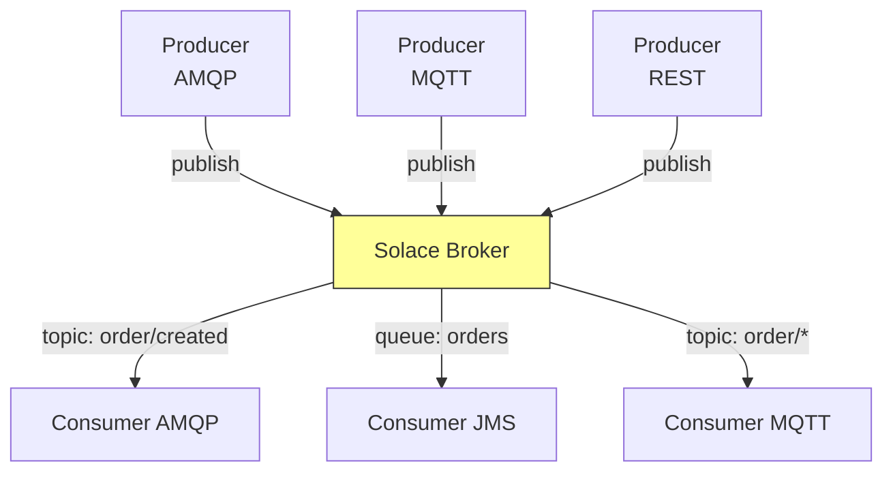
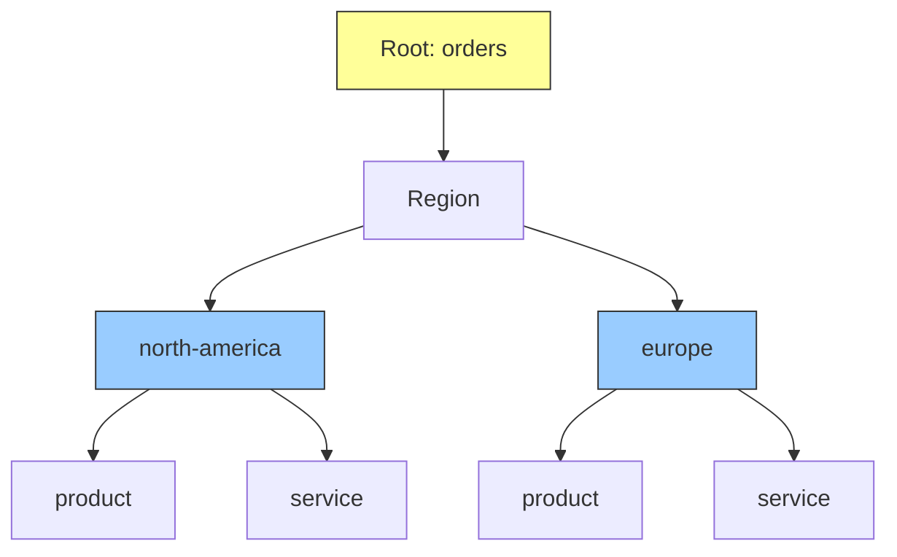
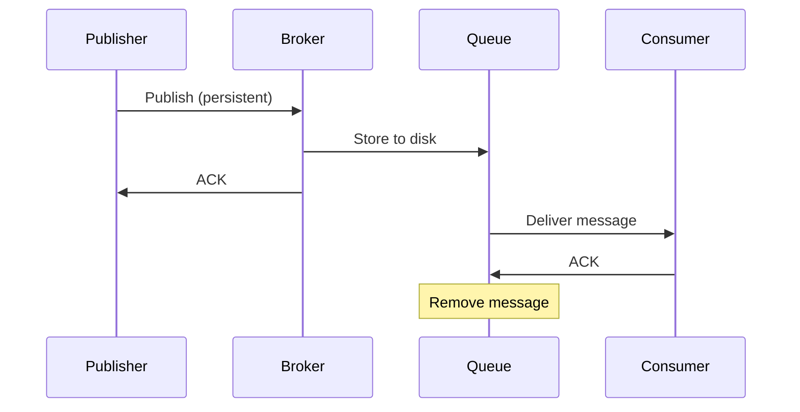
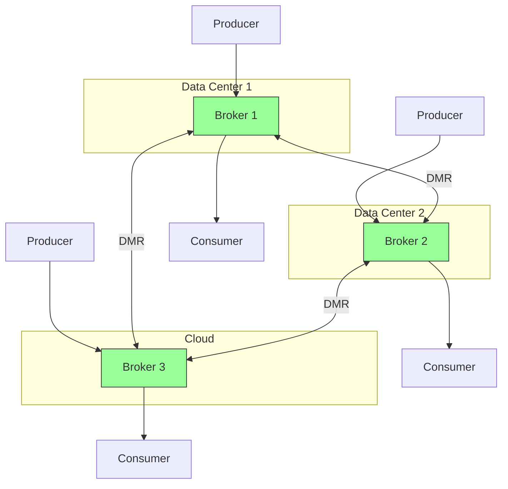
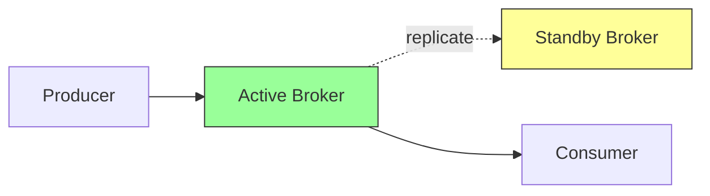
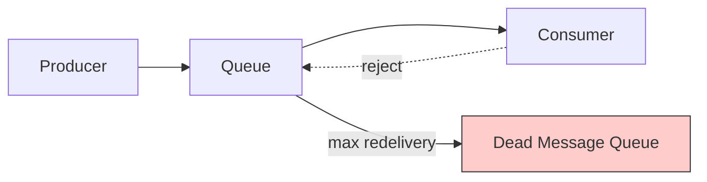

 #solace   #event-mesh #message-broker 
- Solace PubSub+ is an enterprise-grade messaging platform that supports multiple protocols, hybrid cloud deployments, and advanced event mesh architectures. 
- It provides high-performance message routing, guaranteed delivery, and WAN optimization for geographically distributed systems.
# Architecture


## Components
- **Event Broker**: Message router supporting multiple protocols and deployment models
- **Message VPN**: Virtual private network for logical separation and multi-tenancy
- **Topic**: Hierarchical addressing for publish-subscribe messaging
- **Queue**: Durable message storage for guaranteed delivery
- **Client Profile**: Configuration template for connection properties and resource limits
- **ACL Profile**: Access control for topic and queue permissions
# Protocol Support
## Native Support
- **SMF (Solace Message Format)**: Proprietary binary protocol optimized for performance
- **AMQP 1.0**: Enterprise messaging standard
- **MQTT 3.1.1/5.0**: IoT and lightweight messaging
- **JMS**: Java Message Service API
- **REST**: HTTP-based messaging
- **WebSocket**: Browser-based real-time communication
## Protocol Translation
- Single message published via MQTT can be consumed via AMQP, enabling heterogeneous system integration without custom adapters.
```Java
// JMS Producer
ConnectionFactory factory = SolJmsUtility.createConnectionFactory(
    "tcp://localhost:55555", "default", "default", null);
Connection connection = factory.createConnection();
Session session = connection.createSession(false, Session.AUTO_ACKNOWLEDGE);
Topic topic = session.createTopic("orders/created");
MessageProducer producer = session.createProducer(topic);
TextMessage message = session.createTextMessage(orderJson);
producer.send(message);
```
# Topic Hierarchy and Wildcards



- Topics use `/` hierarchy: `orders/north-america/product/created`
## Wildcard Subscriptions
- `*` matches one level: `orders/*/product` matches `orders/north-america/product`
- `>` matches multiple levels: `orders/north-america/>` matches all beneath north-america

```Java
consumer.subscribe("orders/*/product/>");
```
# Queue Types
## Durable Queues
- Messages persist to disk. Survive broker restarts and client disconnections.
## Non-Durable Queues
- Messages stored in memory only. Higher performance for transient data.
## Exclusive vs Non-Exclusive
- **Exclusive**: Single consumer permitted
- **Non-Exclusive**: Multiple consumers compete for messages
```Java
Queue queue = JCSMPFactory.onlyInstance().createQueue("orders.processed");
ConsumerFlowProperties flowProps = new ConsumerFlowProperties();
flowProps.setEndpoint(queue);
FlowReceiver consumer = session.createFlow(null, flowProps);
consumer.start();
```
# Guaranteed Messaging



## Publisher Acknowledgment
- Broker confirms message receipt and persistence before acknowledging publisher.
## Consumer Acknowledgment
- Consumer explicitly acknowledges processing completion. Unacknowledged messages redelivered.
```Java
XMLMessageProducer producer = session.getMessageProducer(
    new JCSMPStreamingPublishCorrelatingEventHandler() {
        public void handleAckEvent(JCSMPStreamingPublishCorrelatingEventHandler.MessageACKEvent ack) {
            log.info("Message acknowledged: {}", ack.getMessageId());
        }
    }
);
```
## Event Mesh Architecture


- *Dynamic Message Routing (DMR)* interconnects brokers across geographic locations and cloud environments, creating unified event fabric. Messages automatically route to consumers regardless of location.
# High Availability
## Hardware Redundancy
- Active-standby broker pairs with automatic failover. Standby synchronizes state from active node.



- Failover occurs within seconds, maintaining client connections and message delivery.
## Replication
- Synchronous or asynchronous replication to standby site for disaster recovery.

# Message Filtering and Selectors
## Topic Matching
- Consumers subscribe to specific topic patterns, receiving only relevant messages.
## Message Selectors (JMS)
- SQL-like expressions filter messages based on headers and properties.
```Java
String selector = "priority > 5 AND region = 'US'";
MessageConsumer consumer = session.createConsumer(queue, selector);
```
# Dead Message Queue (DMQ)
- Failed messages route to DMQ for investigation and retry.


- Configurable per queue with maximum redelivery attempts.
# Message Replay
- Log-based replay enables consumers to reprocess historical messages from specific points in time.
```Java
ReplayStartLocation startLoc = JCSMPFactory.onlyInstance()
    .createReplayStartLocationDate(new Date(timestamp));
flowProps.setReplayStartLocation(startLoc);
```
- Supports time-based or message-ID-based replay for event sourcing and recovery scenarios.
# Performance Characteristics
## Low Latency
- Sub-millisecond routing for in-memory messages. Hardware appliances optimized for deterministic performance.
## High Throughput
- Millions of messages per second per broker. Linear scaling with appliance models.
## WAN Optimization
- Compression, batching, and intelligent routing reduce bandwidth consumption for geographically distributed deployments.
## Monitoring and Management
### Solace PubSub+ Manager
- Web-based GUI for configuration, monitoring, and troubleshooting.
### SEMP (Solace Element Management Protocol)
- REST/SOAP API for programmatic administration and monitoring.
```Shell
curl -u admin:admin http://localhost:8080/SEMP/v2/monitor/msgVpns/default/queues
```
## Deployment Models
### Hardware Appliance
- Purpose-built hardware for maximum performance and predictable latency. Used in latency-sensitive financial applications.
### Software Broker
- Runs on commodity hardware or virtual machines. Flexible deployment in data centers or cloud.
### Cloud Service
- Fully managed PubSub+ Cloud service on AWS, Azure, and GCP. Eliminates operational overhead.
### Docker/Kubernetes
- Containerized deployment for cloud-native architectures with horizontal scaling.
***
# References
1. https://docs.solace.com/
2. Solace PubSub+ Event Broker Documentation
   1. Messaging Concepts
   2. Protocol Support
3. https://solace.com/blog/event-mesh-explained/
4. Event-Driven Architecture with Solace PubSub+ - Solace Academy
5. [[Message broker|Back to Message Broker Overview]]
