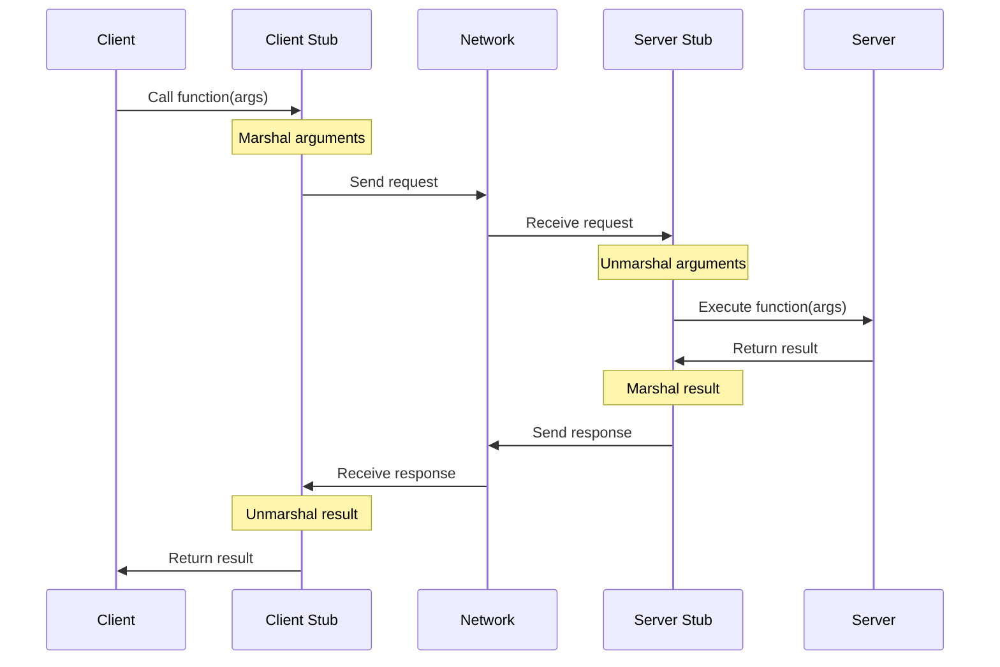
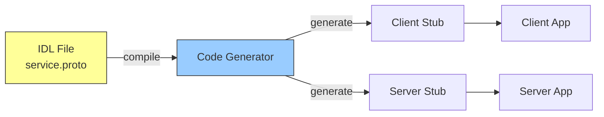
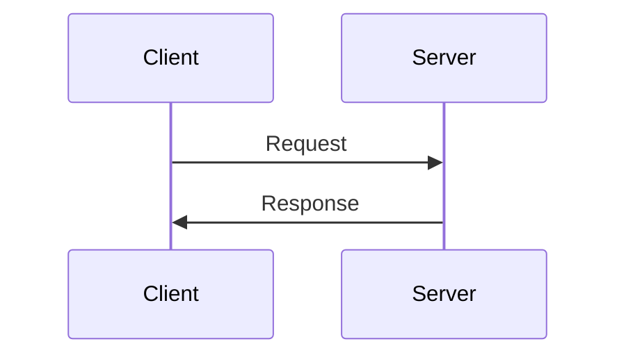
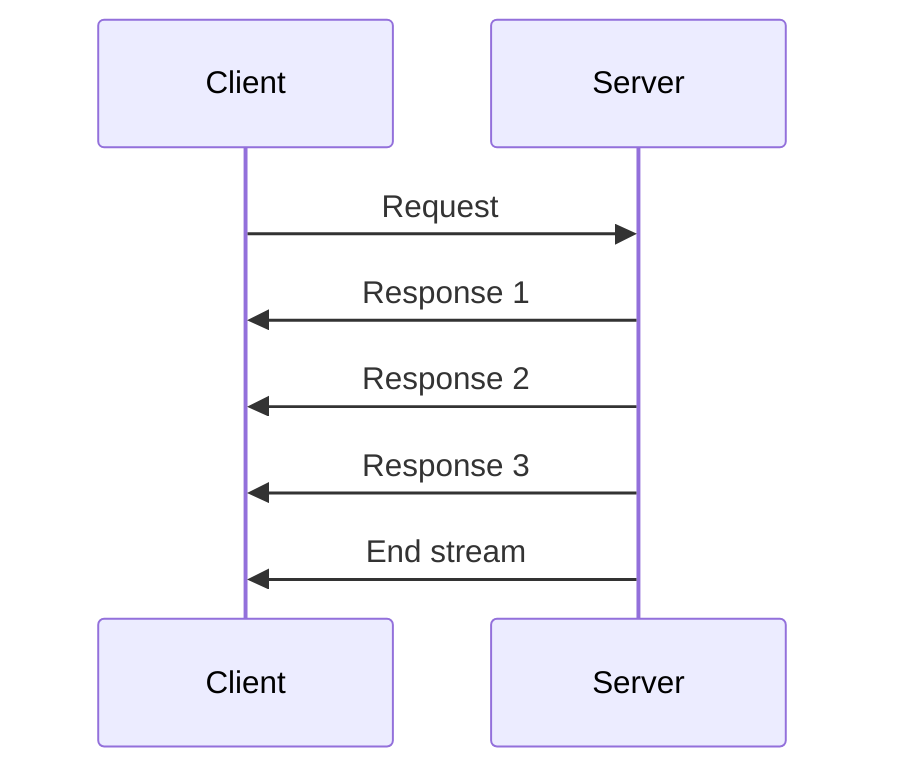
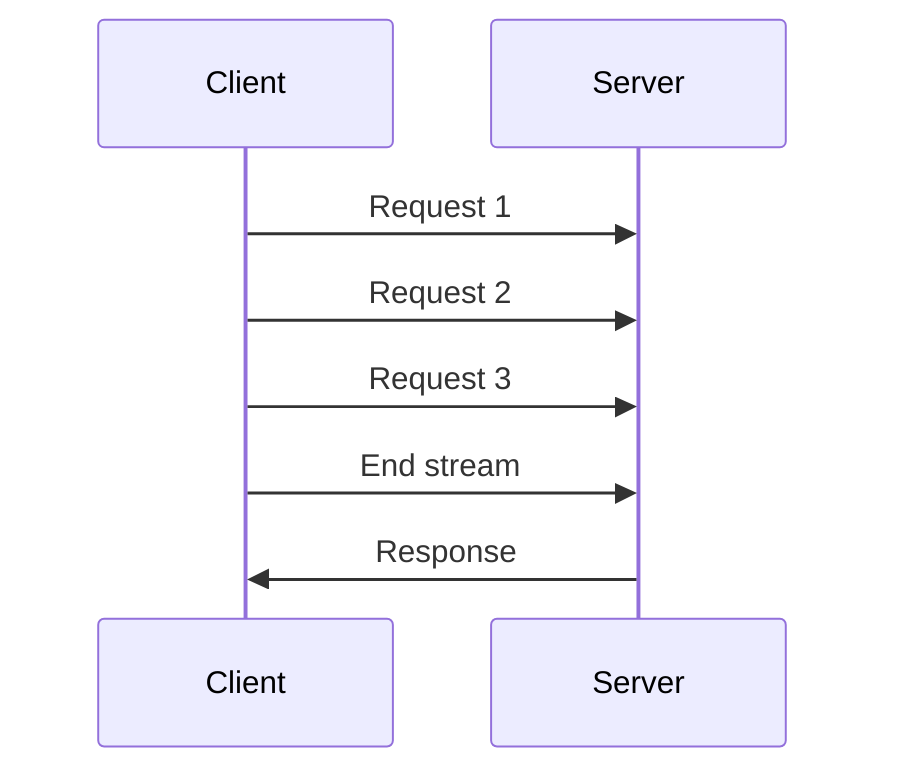
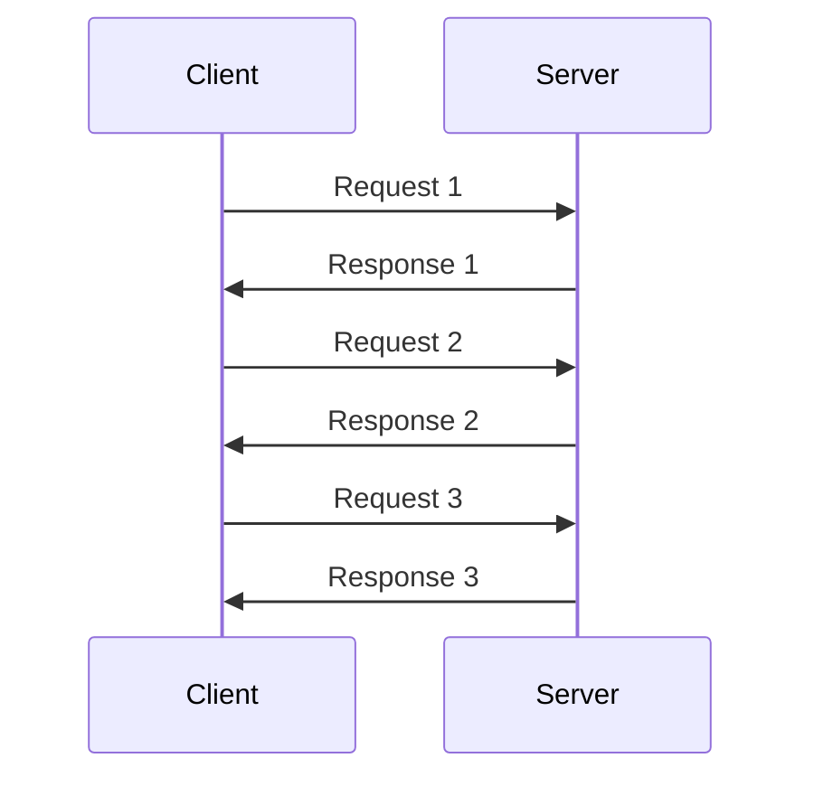
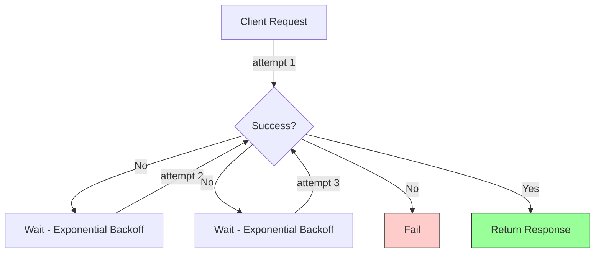
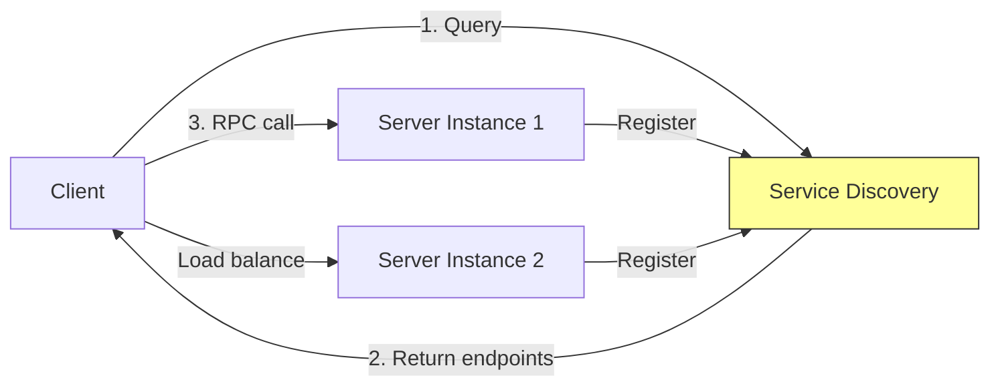

#software-architecture #remote-procedure-call #distributed-systems #api #client-server #network-protocol
- ==Remote Procedure Call (RPC)== is a protocol that enables a program to execute a procedure or function in a different address space, typically on another physical machine, as if it were a local procedure call. RPC abstracts network communication details, allowing developers to invoke remote services using familiar function call syntax.
## Core Concepts
### Abstraction Layer
- RPC provides location transparency by hiding network communication complexity. Client invokes remote procedures using the same syntax as local function calls, while the RPC framework handles serialization, network transmission, and deserialization.
### Client-Server Model



### Components

- **Client**: Initiates remote procedure call
- **Client Stub**: Proxy that marshals arguments and sends request
- **Server Stub/Skeleton**: Receives requests, unmarshals arguments, invokes actual procedure
- **Server**: Implements business logic and returns results
- **IDL (Interface Definition Language)**: Contract defining available procedures, parameters, and return types
- **Runtime Library**: Handles network communication, serialization, and error handling
## RPC Workflow
### Request Phase
1. Client calls remote procedure through local stub
2. Client stub marshals (serializes) arguments into binary format
3. Runtime library transmits request over network
4. Server runtime receives and routes to appropriate stub
5. Server stub unmarshals arguments
6. Server executes actual procedure
### Response Phase
1. Server procedure completes and returns result
2. Server stub marshals return value
3. Runtime library sends response to client
4. Client runtime receives response
5. Client stub unmarshals result
6. Client receives return value
## Interface Definition Language (IDL)



- IDL defines service interface independently of implementation language. Enables polyglot architectures where clients and servers use different programming languages.
### Common IDL Formats
- **Protocol Buffers (.proto)**: Used by gRPC, binary serialization
- **Thrift IDL (.thrift)**: Apache Thrift interface definitions
- **JSON Schema**: JSON-RPC service descriptions
- **XML (WSDL)**: SOAP web services definitions
## Serialization Formats
### Binary Serialization
- Compact representation, efficient parsing, not human-readable.
    - **Protocol Buffers (protobuf)**: Google's binary format, strongly typed, schema-based
    - **Apache Thrift**: Binary protocol with multiple encoding options
    - **MessagePack**: JSON-like binary format
    - **Apache Avro**: Schema-based with dynamic typing
### Text Serialization
- Human-readable, easier debugging, larger payload size.
    - **JSON**: Widely supported, loosely typed
    - **XML**: Verbose but expressive, used in SOAP
    - **YAML**: Human-friendly, less common in RPC
## Communication Patterns
### Unary RPC
- Single request, single response. Traditional synchronous function call pattern.


### Server Streaming RPC
- Single request, stream of responses. Server sends multiple messages for one client request.

### Client Streaming RPC
- Stream of requests, single response. Client sends multiple messages before server responds.

### Bidirectional Streaming RPC
- Both client and server send streams independently.


## Synchronous vs Asynchronous RPC
### Synchronous (Blocking)
- Client blocks until server response received. Simple programming model but may waste resources waiting.
```Java
// Blocking call
OrderResponse response = orderService.createOrder(request);
processResponse(response);
```
### Asynchronous (Non-Blocking)
- Client continues execution while waiting for response. Uses callbacks, futures, or reactive streams.
```Java
// Non-blocking call with future
CompletableFuture<OrderResponse> futureResponse =
    orderService.createOrderAsync(request);
futureResponse.thenAccept(response -> processResponse(response));
```
## Error Handling
### Network Failures
- **Timeouts**: Request exceeds configured time limit
- **Connection errors**: Network unreachable, server unavailable
- **Partial failures**: Request sent but response lost
### Application Errors
- **Invalid arguments**: Type mismatch, constraint violations
- **Business logic errors**: Insufficient funds, resource not found
- **Authorization failures**: Permission denied
### Retry Strategies


- **Immediate retry**: Retry instantly (may overwhelm failing service)
- **Exponential backoff**: Progressively longer delays between retries
- **Circuit breaker**: Stop retrying after threshold, periodically test recovery
## Transport Protocols
### HTTP/1.1
- Text-based protocol, widely supported, request-response model.
### HTTP/2
- Binary framing, multiplexing, header compression, server push. Used by gRPC.
### TCP
- Direct socket communication for custom protocols. Lower overhead but requires manual connection management.
### WebSocket
- Full-duplex communication over single TCP connection. Useful for bidirectional streaming.

## Service Discovery



- Clients locate server instances dynamically through service registry.
    - **Static configuration**: Hardcoded endpoints
    - **DNS-based**: SRV records or A records
    - **Centralized registry**: Consul, etcd, ZooKeeper
    - **Client-side discovery**: Client queries registry
    - **Server-side discovery**: Load balancer queries registry
## Load Balancing
### Client-Side Load Balancing
- Client selects server instance from available pool.
    - **Round-robin**: Distribute evenly across instances
    - **Weighted**: Favor instances by capacity
    - **Least connections**: Route to least busy instance
### Server-Side Load Balancing
- Proxy or load balancer distributes requests.
    - **L4 (Transport)**: TCP/UDP routing based on IP
    - **L7 (Application)**: HTTP routing with content awareness
## Authentication and Authorization
### Transport Security
- **TLS/SSL**: Encrypt communication channel
- **Mutual TLS (mTLS)**: Both client and server authenticate with certificates
### Token-Based Authentication
- **JWT**: Self-contained tokens with claims
- **OAuth 2.0**: Delegated authorization
- **API Keys**: Simple shared secrets
### Request Metadata
- Include credentials in request headers or metadata fields.
```Java
Metadata metadata = new Metadata();
metadata.put(Metadata.Key.of("authorization", Metadata.ASCII_STRING_MARSHALLER),
    "Bearer " + token);
stub.withMetadata(metadata).callMethod(request);
```
## Performance Optimization
### Connection Pooling
- Reuse TCP connections to avoid handshake overhead.
### Compression
- Reduce payload size with gzip or custom algorithms.
### Batching
- Combine multiple operations into single RPC call.
### Caching
- Cache responses at client or intermediate proxy.
### Deadline Propagation
- Cascade timeout constraints through call chain to prevent wasted work.
## RPC vs REST

| Aspect | RPC | REST |
|--------|-----|------|
| **Paradigm** | Function/procedure invocation | Resource manipulation |
| **Operations** | Custom methods | HTTP verbs (GET, POST, PUT, DELETE) |
| **Payload** | Binary or JSON | Typically JSON or XML |
| **Performance** | Higher throughput, lower latency | Moderate overhead |
| **Caching** | Requires custom implementation | HTTP caching built-in |
| **Streaming** | Native support in modern RPC | Limited (SSE, WebSocket) |
| **Tooling** | Requires code generation | Standard HTTP tools |
| **Use Case** | Microservices, low-latency APIs | Public APIs, CRUD operations |

## Use Cases
### Microservices Communication
- Efficient inter-service communication with strong typing and code generation.
### Real-Time Systems
- Low-latency requirements benefit from binary protocols and HTTP/2 multiplexing.
### Polyglot Architectures
- IDL-based code generation enables seamless cross-language integration.
### High-Throughput APIs
- Binary serialization and connection reuse support millions of requests per second.
### Streaming Data
- Native support for server, client, and bidirectional streaming.
## Anti-Patterns
### Chatty APIs
- Excessive round-trips due to fine-grained methods. Prefer batching or coarse-grained operations.
### Ignoring Timeouts
- Unbounded calls can cascade failures. Always configure deadlines.
### Missing Error Handling
- Network failures are inevitable. Implement retries, circuit breakers, and graceful degradation.
### Tight Coupling
- Exposing internal implementation details through RPC interface. Design APIs as stable contracts.
### Versioning Neglect
- Breaking changes disrupt clients. Use backward-compatible field additions and deprecation strategies.
***
# References
1. Designing Data-Intensive Applications - Martin Kleppmann - 2017 - O'Reilly
    1. Chapter 4: Encoding and Evolution
2. Building Microservices - Sam Newman - 2nd Edition - 2021 - O'Reilly
    1. Chapter 4: Microservice Communication Styles
3. https://grpc.io/docs/what-is-grpc/introduction/
4. Distributed Systems - Andrew S. Tanenbaum, Maarten Van Steen - 3rd Edition - 2017
    1. Chapter 4: Communication
5. https://www.enterpriseintegrationpatterns.com/patterns/messaging/
6. [[software-engineering/api/protocol/remote-procedure-call/grpc/gRPC]]
7. [[software-engineering/api/protocol/remote-procedure-call/apache-thrift/Apache Thrift]]
8. [[software-engineering/api/protocol/remote-procedure-call/json-rpc/JSON-RPC]]
9. 
