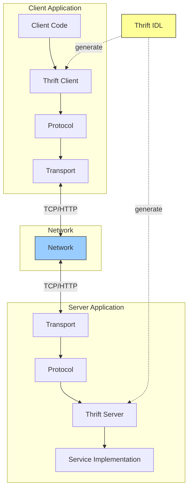
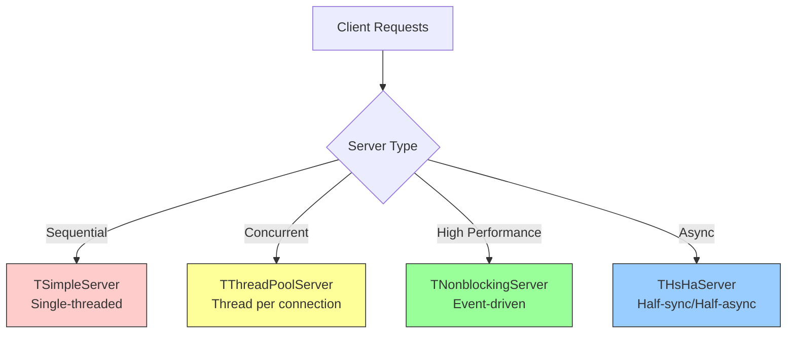

 #remote-procedure-call  #distributed-systems #software-engineering #software-architecture #computer-network
  #application-layer 
- ==Apache Thrift== is a cross-language RPC framework developed by Facebook for efficient communication between services written in different programming languages. It provides a robust interface definition language, code generation, and pluggable serialization protocols.
# Architecture

- Thrift separates concerns through layered architecture: transport handles data transmission, protocol manages serialization, and processors dispatch requests to service implementations.
# Thrift IDL
## Service Definition
```apacheconf title='Example of .thrift file'
namespace java com.example.order
namespace py order
namespace go order

struct OrderItem {
    1: required string product_id
    2: required i32 quantity
    3: required double price
}

struct CreateOrderRequest {
    1: required string user_id
    2: required list<OrderItem> items
    3: required double total_amount
}

struct OrderResponse {
    1: required string order_id
    2: required string status
    3: required i64 created_at
}

exception OrderNotFoundException {
    1: string message
    2: i32 error_code
}

service OrderService {
    OrderResponse createOrder(1: CreateOrderRequest request)
    OrderResponse getOrder(1: string order_id) throws (1: OrderNotFoundException notFound)
    list<OrderResponse> listOrders(1: string user_id)
    void deleteOrder(1: string order_id)
}
```
### Data Types
- **Base types**: `bool`, `i8`, `i16`, `i32`, `i64`, `double`, `string`, `binary`
- **Containers**: `list<type>`, `set<type>`, `map<keyType, valueType>`
- **Structs**: User-defined composite types
- **Exceptions**: Error handling types
- **Enums**: Named integer constants
### Field Qualifiers
- **required**: Field must be present (deprecated in favor of validation)
- **optional**: Field may be absent
- No qualifier: Default behavior, similar to optional
### Code Generation
```Shell title='Generate an .thrift file'
thrift --gen java order.thrift
thrift --gen py order.thrift
thrift --gen go order.thrift
```
- Generates language-specific code including data structures, client stubs, and server interfaces.
## Transport Layer
### Blocking Transports
- TSocket: Standard TCP socket transport
```Java
TTransport transport = new TSocket("localhost", 9090);
transport.open();
```
- **TFileTransport**: File-based transport for logging or batch processing
- **TZlibTransport**: Compressed transport wrapper
### Buffered Transports
- **TBufferedTransport**: Buffers writes and reads for improved performance

```Java
TTransport buffered = new TBufferedTransport(new TSocket("localhost", 9090));
```

**TFramedTransport**: Length-prefixed frames for non-blocking servers

```Java
TTransport framed = new TFramedTransport(new TSocket("localhost", 9090));
```

### Server Transports

**TServerSocket**: TCP server socket accepting client connections

```Java
TServerTransport serverTransport = new TServerSocket(9090);
```

**TNonblockingServerSocket**: Non-blocking server socket for async servers

## Protocol Layer

### Binary Protocol (TBinaryProtocol)
Efficient binary encoding with straightforward implementation. Default choice for most applications.

```Java
TProtocol protocol = new TBinaryProtocol(transport);
OrderService.Client client = new OrderService.Client(protocol);
```

### Compact Protocol (TCompactProtocol)
Space-efficient encoding using variable-length integers. Smaller payloads than binary protocol.

```Java
TProtocol protocol = new TCompactProtocol(transport);
```

### JSON Protocol (TJSONProtocol)
Human-readable JSON encoding. Useful for debugging or web APIs.

```Java
TProtocol protocol = new TJSONProtocol(transport);
```

### Simple JSON Protocol (TSimpleJSONProtocol)
Write-only JSON protocol for integration with non-Thrift systems.

## Server Types



### TSimpleServer
Single-threaded, blocks on each request. Simple but not suitable for production.

```Java
TServerTransport serverTransport = new TServerSocket(9090);
OrderService.Processor processor = new OrderService.Processor<>(handler);
TServer server = new TSimpleServer(
    new TServer.Args(serverTransport).processor(processor));
server.serve();
```

### TThreadPoolServer
Thread pool handles concurrent connections. Each connection gets dedicated thread.

```Java
TServer server = new TThreadPoolServer(
    new TThreadPoolServer.Args(serverTransport)
        .processor(processor)
        .minWorkerThreads(10)
        .maxWorkerThreads(100));
server.serve();
```

### TNonblockingServer
Event-driven, single-threaded server using Java NIO. Efficient for many connections with low concurrency.

```Java
TNonblockingServerSocket nonblockingSocket =
    new TNonblockingServerSocket(9090);
TServer server = new TNonblockingServer(
    new TNonblockingServer.Args(nonblockingSocket)
        .processor(processor)
        .protocolFactory(new TBinaryProtocol.Factory()));
server.serve();
```

### THsHaServer (Half-Sync/Half-Async)
Non-blocking I/O with separate thread pool for request processing. Best balance of throughput and simplicity.

```Java
TServer server = new THsHaServer(
    new THsHaServer.Args(nonblockingSocket)
        .processor(processor)
        .workerThreads(64));
server.serve();
```

## Client Implementation

### Synchronous Client

```Java
TTransport transport = new TSocket("localhost", 9090);
TProtocol protocol = new TBinaryProtocol(transport);
OrderService.Client client = new OrderService.Client(protocol);

transport.open();
try {
    CreateOrderRequest request = new CreateOrderRequest()
        .setUserId("user-123")
        .setTotalAmount(99.99);
    OrderResponse response = client.createOrder(request);
    System.out.println("Order created: " + response.getOrderId());
} finally {
    transport.close();
}
```

### Connection Pooling

```Java
public class ThriftClientPool {
    private GenericObjectPool<OrderService.Client> pool;

    public ThriftClientPool(String host, int port, int maxConnections) {
        GenericObjectPoolConfig config = new GenericObjectPoolConfig();
        config.setMaxTotal(maxConnections);

        pool = new GenericObjectPool<>(
            new BasePooledObjectFactory<OrderService.Client>() {
                @Override
                public OrderService.Client create() {
                    TTransport transport = new TSocket(host, port);
                    transport.open();
                    return new OrderService.Client(new TBinaryProtocol(transport));
                }
                @Override
                public PooledObject<OrderService.Client> wrap(OrderService.Client client) {
                    return new DefaultPooledObject<>(client);
                }
            }, config);
    }

    public OrderService.Client borrowClient() throws Exception {
        return pool.borrowObject();
    }

    public void returnClient(OrderService.Client client) {
        pool.returnObject(client);
    }
}
```

## Server Implementation

```Java
public class OrderServiceHandler implements OrderService.Iface {
    @Override
    public OrderResponse createOrder(CreateOrderRequest request)
            throws TException {
        // Business logic
        String orderId = UUID.randomUUID().toString();
        return new OrderResponse()
            .setOrderId(orderId)
            .setStatus("CREATED")
            .setCreatedAt(System.currentTimeMillis());
    }

    @Override
    public OrderResponse getOrder(String orderId)
            throws OrderNotFoundException, TException {
        Order order = repository.findById(orderId);
        if (order == null) {
            throw new OrderNotFoundException()
                .setMessage("Order not found: " + orderId)
                .setErrorCode(404);
        }
        return buildResponse(order);
    }

    @Override
    public List<OrderResponse> listOrders(String userId) throws TException {
        return repository.findByUserId(userId).stream()
            .map(this::buildResponse)
            .collect(Collectors.toList());
    }

    @Override
    public void deleteOrder(String orderId) throws TException {
        repository.deleteById(orderId);
    }
}
```

## Multiplexing

Handle multiple services over single connection.

```thrift
service UserService {
    User getUser(1: string user_id)
}

service OrderService {
    OrderResponse createOrder(1: CreateOrderRequest request)
}
```

```Java
// Server
TMultiplexedProcessor processor = new TMultiplexedProcessor();
processor.registerProcessor("UserService",
    new UserService.Processor<>(userHandler));
processor.registerProcessor("OrderService",
    new OrderService.Processor<>(orderHandler));

TServer server = new TThreadPoolServer(
    new TThreadPoolServer.Args(serverTransport).processor(processor));

// Client
TMultiplexedProtocol userProtocol =
    new TMultiplexedProtocol(protocol, "UserService");
UserService.Client userClient = new UserService.Client(userProtocol);

TMultiplexedProtocol orderProtocol =
    new TMultiplexedProtocol(protocol, "OrderService");
OrderService.Client orderClient = new OrderService.Client(orderProtocol);
```

## Versioning and Evolution

### Backward Compatibility
Add new optional fields without breaking existing clients.

```thrift
struct OrderResponse {
    1: required string order_id
    2: required string status
    3: required i64 created_at
    4: optional string tracking_number  // New field
}
```

### Field IDs
Never reuse field IDs. Deprecated fields remain reserved.

```thrift
struct Order {
    // 1: reserved (was user_email)
    2: required string user_id
    3: required double amount
}
```

## Performance Optimization

### Protocol Selection
- **TBinaryProtocol**: Balanced performance and simplicity
- **TCompactProtocol**: Minimize bandwidth (15-30% smaller)
- **TJSONProtocol**: Human-readable, debugging only

### Transport Selection
- **TFramedTransport**: Required for non-blocking servers
- **TBufferedTransport**: Batch I/O for better throughput
- **TZlibTransport**: Compress large payloads

### Server Tuning
- **THsHaServer**: Best for high concurrency
- Thread pool sizing: Balance latency and resource usage
- Connection limits: Prevent resource exhaustion

## Error Handling

### Exceptions

```thrift
exception InvalidOrderException {
    1: string message
    2: list<string> validation_errors
}

service OrderService {
    OrderResponse createOrder(1: CreateOrderRequest request)
        throws (1: InvalidOrderException invalid)
}
```

```Java
@Override
public OrderResponse createOrder(CreateOrderRequest request)
        throws InvalidOrderException, TException {
    List<String> errors = validate(request);
    if (!errors.isEmpty()) {
        throw new InvalidOrderException()
            .setMessage("Invalid order request")
            .setValidationErrors(errors);
    }
    // Process order
}

// Client
try {
    OrderResponse response = client.createOrder(request);
} catch (InvalidOrderException e) {
    log.error("Validation failed: {}", e.getValidationErrors());
} catch (TException e) {
    log.error("RPC failed", e);
}
```

## Cross-Language Support

Thrift generates idiomatic code for multiple languages:
- **Java**: Standard Java classes with builders
- **Python**: Native Python classes
- **C++**: Header and implementation files
- **Go**: Go structs and interfaces
- **JavaScript/Node.js**: JavaScript objects
- **PHP**, **Ruby**, **Erlang**, **Haskell**, and more

## Common Pitfalls

### Not Closing Transports
Always close transports to prevent resource leaks.

```Java
try {
    transport.open();
    // Use client
} finally {
    transport.close();
}
```

### Thread Safety
Thrift clients are not thread-safe. Use connection pooling or thread-local clients.

### Missing Exception Handling
Declare exceptions in IDL for proper client handling. Avoid relying on TException.

### Breaking Schema Changes
Never change field types or remove required fields. Always use optional fields for new additions.

***
# References
1. https://thrift.apache.org/docs/
2. Programming Apache Thrift - Randy Abernethy - 2019 - O'Reilly
   1. Chapter 3: Thrift Architecture
   2. Chapter 5: Implementing Services
3. https://github.com/apache/thrift
4. Building Scalable Web Services with Thrift - 2015
5. [[Remote Procedure Call|Back to RPC Overview]]
