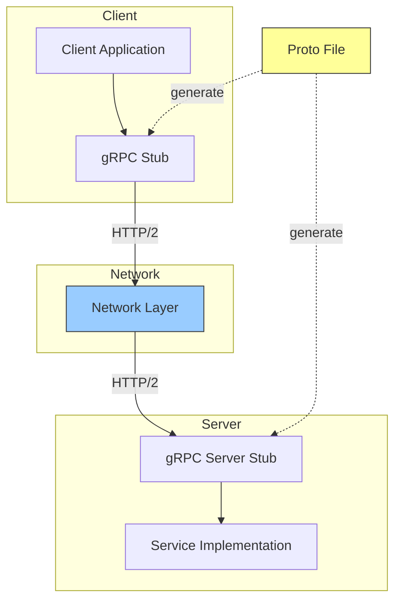
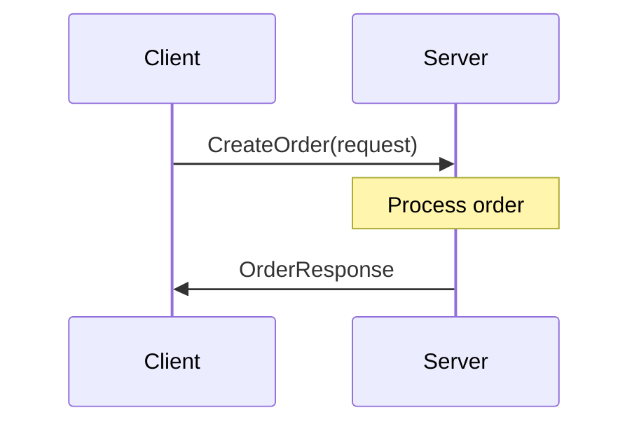
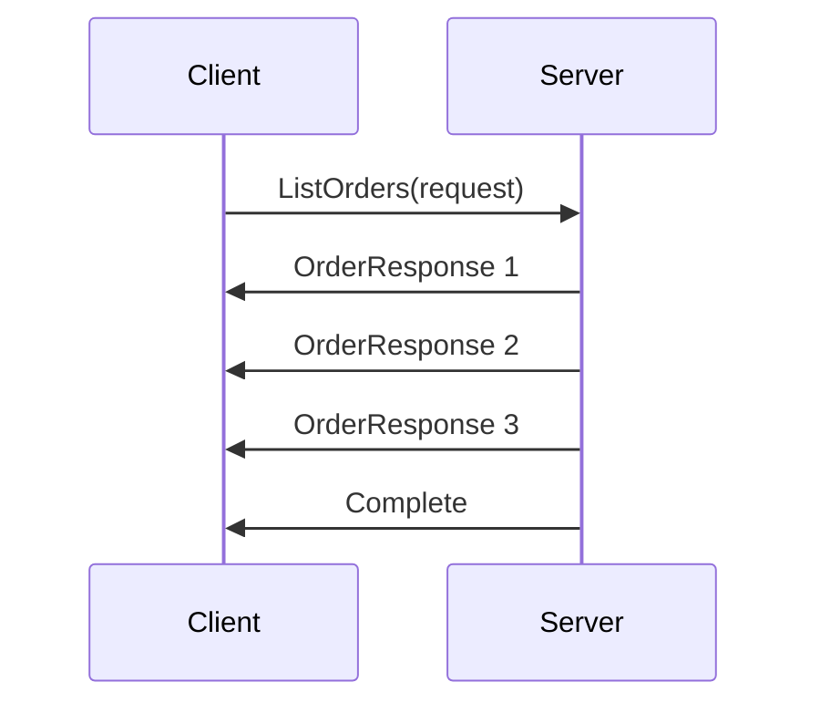
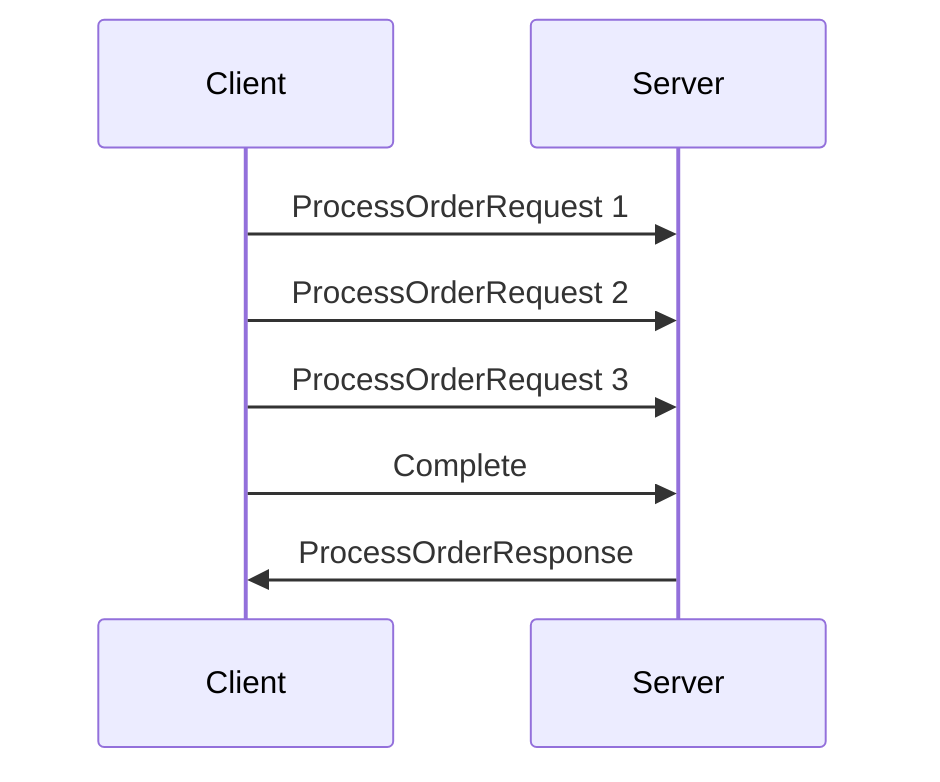
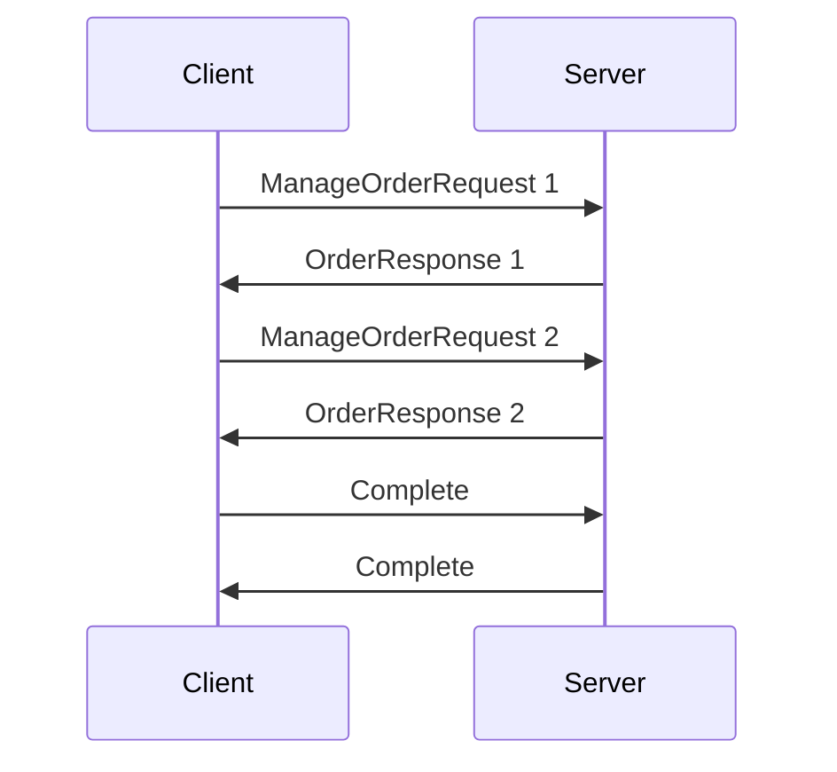
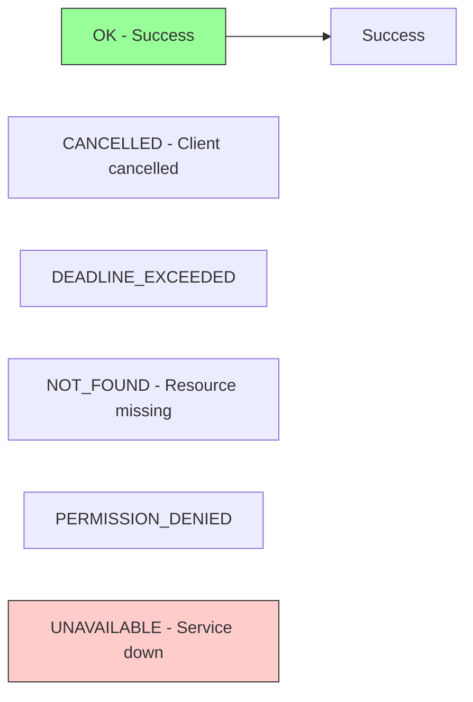

#grpc #rpc #protobuf #http2 #microservices #distributed-systems #google

==gRPC== (gRPC Remote Procedure Call) is a high-performance, open-source RPC framework developed by Google. It uses Protocol Buffers for serialization and HTTP/2 for transport, enabling efficient communication in distributed systems and microservices architectures.
## Architecture



Both client and server share ==Protocol Buffer== definitions (.proto files) that define service contracts. Code generation creates language-specific stubs for type-safe communication.

## Protocol Buffers

### Service Definition

```protobuf
syntax = "proto3";

package order;

service OrderService {
  rpc CreateOrder (CreateOrderRequest) returns (OrderResponse);
  rpc GetOrder (GetOrderRequest) returns (OrderResponse);
  rpc ListOrders (ListOrdersRequest) returns (stream OrderResponse);
  rpc ProcessOrders (stream ProcessOrderRequest) returns (ProcessOrderResponse);
  rpc ManageOrders (stream ManageOrderRequest) returns (stream OrderResponse);
}

message CreateOrderRequest {
  string user_id = 1;
  repeated OrderItem items = 2;
  double total_amount = 3;
}

message OrderResponse {
  string order_id = 1;
  string status = 2;
  int64 created_at = 3;
}

message OrderItem {
  string product_id = 1;
  int32 quantity = 2;
  double price = 3;
}
```

### Code Generation

```Shell
protoc --java_out=src/main/java \
       --grpc-java_out=src/main/java \
       --plugin=protoc-gen-grpc-java=protoc-gen-grpc-java.exe \
       order.proto
```

Generates:
- Message classes for request/response types
- Service interface for server implementation
- Stub classes for client invocation

## Communication Patterns

### Unary RPC



Single request, single response. Most common pattern for simple operations.

```Java
// Client
OrderServiceBlockingStub stub = OrderServiceGrpc.newBlockingStub(channel);
CreateOrderRequest request = CreateOrderRequest.newBuilder()
    .setUserId("user-123")
    .setTotalAmount(99.99)
    .build();
OrderResponse response = stub.createOrder(request);

// Server
@Override
public void createOrder(CreateOrderRequest request,
                        StreamObserver<OrderResponse> responseObserver) {
    OrderResponse response = OrderResponse.newBuilder()
        .setOrderId(UUID.randomUUID().toString())
        .setStatus("CREATED")
        .build();
    responseObserver.onNext(response);
    responseObserver.onCompleted();
}
```

### Server Streaming RPC



Single request, multiple responses. Useful for pagination or continuous data feeds.

```Java
// Client
Iterator<OrderResponse> orders = stub.listOrders(request);
while (orders.hasNext()) {
    OrderResponse order = orders.next();
    processOrder(order);
}

// Server
@Override
public void listOrders(ListOrdersRequest request,
                       StreamObserver<OrderResponse> responseObserver) {
    for (Order order : fetchOrders()) {
        OrderResponse response = buildResponse(order);
        responseObserver.onNext(response);
    }
    responseObserver.onCompleted();
}
```

### Client Streaming RPC



Multiple requests, single response. Efficient for batch uploads or aggregations.

```Java
// Client
StreamObserver<ProcessOrderResponse> responseObserver = new StreamObserver<>() {
    @Override
    public void onNext(ProcessOrderResponse response) {
        log.info("Processed: {}", response.getCount());
    }
    @Override
    public void onCompleted() { }
    @Override
    public void onError(Throwable t) { }
};

StreamObserver<ProcessOrderRequest> requestObserver =
    stub.processOrders(responseObserver);

for (Order order : orders) {
    requestObserver.onNext(buildRequest(order));
}
requestObserver.onCompleted();

// Server
@Override
public StreamObserver<ProcessOrderRequest> processOrders(
        StreamObserver<ProcessOrderResponse> responseObserver) {
    return new StreamObserver<ProcessOrderRequest>() {
        int count = 0;
        @Override
        public void onNext(ProcessOrderRequest request) {
            processOrder(request);
            count++;
        }
        @Override
        public void onCompleted() {
            responseObserver.onNext(
                ProcessOrderResponse.newBuilder().setCount(count).build());
            responseObserver.onCompleted();
        }
        @Override
        public void onError(Throwable t) { }
    };
}
```

### Bidirectional Streaming RPC



Both sides send streams independently. Enables chat-like or real-time collaborative applications.

```Java
// Client and Server implement StreamObserver for full-duplex communication
```

## HTTP/2 Features

### Multiplexing
Multiple RPC calls share single TCP connection without head-of-line blocking. Reduces connection overhead and improves performance.

### Header Compression
HPACK algorithm compresses HTTP headers, reducing bandwidth for repeated metadata.

### Flow Control
Prevents sender from overwhelming receiver with backpressure mechanism.

### Server Push
Server can send additional responses proactively (limited use in gRPC).

## Stub Types

### Blocking Stub
Synchronous calls that block until response received.

```Java
OrderServiceBlockingStub blockingStub = OrderServiceGrpc.newBlockingStub(channel);
OrderResponse response = blockingStub.createOrder(request);
```

### Async Stub
Non-blocking calls with callback-based response handling.

```Java
OrderServiceStub asyncStub = OrderServiceGrpc.newStub(channel);
asyncStub.createOrder(request, new StreamObserver<OrderResponse>() {
    @Override
    public void onNext(OrderResponse response) {
        processResponse(response);
    }
    @Override
    public void onCompleted() { }
    @Override
    public void onError(Throwable t) { }
});
```

### Future Stub
Returns `ListenableFuture` for composition and chaining.

```Java
OrderServiceFutureStub futureStub = OrderServiceGrpc.newFutureStub(channel);
ListenableFuture<OrderResponse> future = futureStub.createOrder(request);
Futures.addCallback(future, callback, executor);
```

## Error Handling

### Status Codes



gRPC defines standard status codes:
- `OK`: Success
- `CANCELLED`: Client cancelled request
- `UNKNOWN`: Unknown error
- `INVALID_ARGUMENT`: Invalid request parameters
- `DEADLINE_EXCEEDED`: Timeout exceeded
- `NOT_FOUND`: Resource not found
- `ALREADY_EXISTS`: Resource exists
- `PERMISSION_DENIED`: Authorization failure
- `RESOURCE_EXHAUSTED`: Rate limit exceeded
- `FAILED_PRECONDITION`: Precondition check failed
- `ABORTED`: Concurrency conflict
- `OUT_OF_RANGE`: Invalid range
- `UNIMPLEMENTED`: Method not implemented
- `INTERNAL`: Internal server error
- `UNAVAILABLE`: Service unavailable
- `DATA_LOSS`: Data corruption
- `UNAUTHENTICATED`: Authentication required

### Error Propagation

```Java
// Server
@Override
public void getOrder(GetOrderRequest request,
                     StreamObserver<OrderResponse> responseObserver) {
    try {
        Order order = findOrder(request.getOrderId());
        if (order == null) {
            responseObserver.onError(Status.NOT_FOUND
                .withDescription("Order not found: " + request.getOrderId())
                .asRuntimeException());
            return;
        }
        responseObserver.onNext(buildResponse(order));
        responseObserver.onCompleted();
    } catch (Exception e) {
        responseObserver.onError(Status.INTERNAL
            .withDescription("Failed to retrieve order")
            .withCause(e)
            .asRuntimeException());
    }
}

// Client
try {
    OrderResponse response = stub.getOrder(request);
} catch (StatusRuntimeException e) {
    if (e.getStatus().getCode() == Status.Code.NOT_FOUND) {
        log.warn("Order not found");
    } else {
        log.error("RPC failed", e);
    }
}
```

## Metadata

Request and response headers for cross-cutting concerns.

```Java
// Client - Add metadata
Metadata metadata = new Metadata();
metadata.put(Metadata.Key.of("authorization", Metadata.ASCII_STRING_MARSHALLER),
    "Bearer " + token);
metadata.put(Metadata.Key.of("request-id", Metadata.ASCII_STRING_MARSHALLER),
    UUID.randomUUID().toString());

OrderServiceBlockingStub stubWithMetadata = stub.withInterceptors(
    MetadataUtils.newAttachHeadersInterceptor(metadata));

// Server - Read metadata
@Override
public void createOrder(CreateOrderRequest request,
                        StreamObserver<OrderResponse> responseObserver) {
    Metadata metadata = AUTH_CONTEXT_KEY.get();
    String authToken = metadata.get(
        Metadata.Key.of("authorization", Metadata.ASCII_STRING_MARSHALLER));
    // Use authToken for authentication
}
```

## Deadlines and Timeouts

```Java
// Client - Set deadline
OrderServiceBlockingStub stubWithDeadline =
    stub.withDeadlineAfter(5, TimeUnit.SECONDS);

// Server - Check deadline
@Override
public void createOrder(CreateOrderRequest request,
                        StreamObserver<OrderResponse> responseObserver) {
    Context ctx = Context.current();
    if (ctx.getDeadline() != null && ctx.getDeadline().isExpired()) {
        responseObserver.onError(Status.DEADLINE_EXCEEDED.asRuntimeException());
        return;
    }
    // Process request
}
```

Deadlines propagate through call chain, enabling coordinated timeout handling.

## Interceptors


### Client Interceptor

```Java
public class AuthInterceptor implements ClientInterceptor {
    @Override
    public <ReqT, RespT> ClientCall<ReqT, RespT> interceptCall(
            MethodDescriptor<ReqT, RespT> method,
            CallOptions callOptions,
            Channel next) {
        return new ForwardingClientCall.SimpleForwardingClientCall<>(
                next.newCall(method, callOptions)) {
            @Override
            public void start(Listener<RespT> responseListener, Metadata headers) {
                headers.put(AUTH_KEY, "Bearer " + getToken());
                super.start(responseListener, headers);
            }
        };
    }
}

// Register interceptor
Channel channel = ManagedChannelBuilder.forAddress("localhost", 8080)
    .intercept(new AuthInterceptor())
    .build();
```

### Server Interceptor

```Java
public class LoggingInterceptor implements ServerInterceptor {
    @Override
    public <ReqT, RespT> ServerCall.Listener<ReqT> interceptCall(
            ServerCall<ReqT, RespT> call,
            Metadata headers,
            ServerCallHandler<ReqT, RespT> next) {
        log.info("Method: {}", call.getMethodDescriptor().getFullMethodName());
        return next.startCall(call, headers);
    }
}

// Register interceptor
Server server = ServerBuilder.forPort(8080)
    .addService(ServerInterceptors.intercept(service, new LoggingInterceptor()))
    .build();
```

## Load Balancing

### Client-Side Load Balancing

```Java
ManagedChannel channel = ManagedChannelBuilder
    .forTarget("dns:///my-service.example.com")
    .defaultLoadBalancingPolicy("round_robin")
    .build();
```

Strategies:
- **pick_first**: Use first available address
- **round_robin**: Distribute evenly across backends
- **grpclb**: Server-side load balancer assistance

## Security

### TLS/SSL Encryption

```Java
// Client
SslContext sslContext = GrpcSslContexts.forClient()
    .trustManager(new File("ca.crt"))
    .build();

ManagedChannel channel = NettyChannelBuilder
    .forAddress("localhost", 8443)
    .sslContext(sslContext)
    .build();

// Server
SslContext sslContext = GrpcSslContexts.forServer(
    new File("server.crt"),
    new File("server.key"))
    .build();

Server server = NettyServerBuilder
    .forPort(8443)
    .sslContext(sslContext)
    .addService(service)
    .build();
```

### Mutual TLS (mTLS)

```Java
SslContext sslContext = GrpcSslContexts.forClient()
    .trustManager(new File("ca.crt"))
    .keyManager(new File("client.crt"), new File("client.key"))
    .build();
```

Both client and server authenticate using certificates.

## Framework Integration

### Java - Quarkus
Quarkus provides native gRPC support with GraalVM compilation for fast startup and low memory footprint.

- [[programming/java/quarkus/gRPC for Quarkus|gRPC for Quarkus]]

### Spring Boot

```Java
@GrpcService
public class OrderServiceImpl extends OrderServiceGrpc.OrderServiceImplBase {
    @Override
    public void createOrder(CreateOrderRequest request,
                            StreamObserver<OrderResponse> responseObserver) {
        // Implementation
    }
}
```

### Go

```Go
type server struct {
    pb.UnimplementedOrderServiceServer
}

func (s *server) CreateOrder(ctx context.Context,
                              req *pb.CreateOrderRequest) (*pb.OrderResponse, error) {
    return &pb.OrderResponse{OrderId: "123", Status: "CREATED"}, nil
}
```

## Performance Optimization

### Connection Pooling
Reuse channels across requests. Creating channels is expensive.

### Compression
Enable gzip compression for large payloads.

```Java
OrderServiceBlockingStub compressedStub =
    stub.withCompression("gzip");
```

### Keepalive Settings
Maintain connection health and detect failures.

```Java
ManagedChannel channel = ManagedChannelBuilder
    .forAddress("localhost", 8080)
    .keepAliveTime(30, TimeUnit.SECONDS)
    .keepAliveTimeout(10, TimeUnit.SECONDS)
    .build();
```

## Common Pitfalls

### Blocking Event Loop
Never block in async stub callbacks. Use separate thread pool for CPU-intensive work.

### Missing Error Handling
Always handle `onError` in `StreamObserver`. Unhandled errors leak resources.

### Not Closing Channels
Channels must be explicitly shut down to release resources.

```Java
channel.shutdown().awaitTermination(5, TimeUnit.SECONDS);
```

### Large Message Payloads
gRPC has 4MB default message size limit. Use streaming for large data transfers.

```Java
// Increase limit (not recommended for production)
ServerBuilder.forPort(8080)
    .maxInboundMessageSize(10 * 1024 * 1024) // 10MB
    .build();
```

***
# References
1. gRPC: Up and Running - Kasun Indrasiri, Danesh Kuruppu - 2020 - O'Reilly
   1. Chapter 2: Getting Started with gRPC
   2. Chapter 4: gRPC Under the Hood
2. https://grpc.io/docs/
3. https://github.com/grpc/grpc-java
4. Building Microservices with gRPC - Kasun Indrasiri - 2021 - O'Reilly
5. [[Remote Procedure Call|Back to RPC Overview]]
