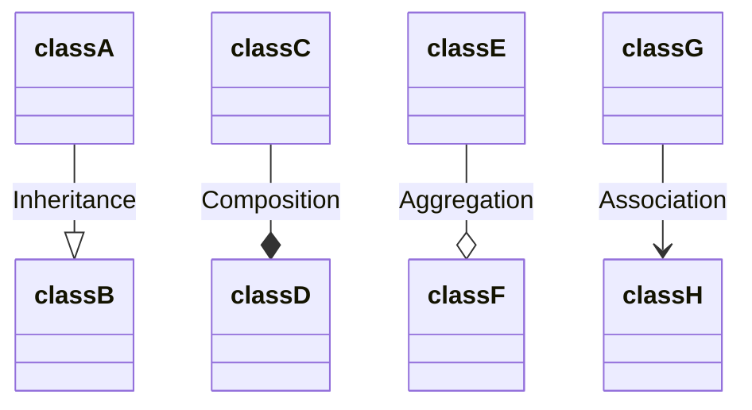
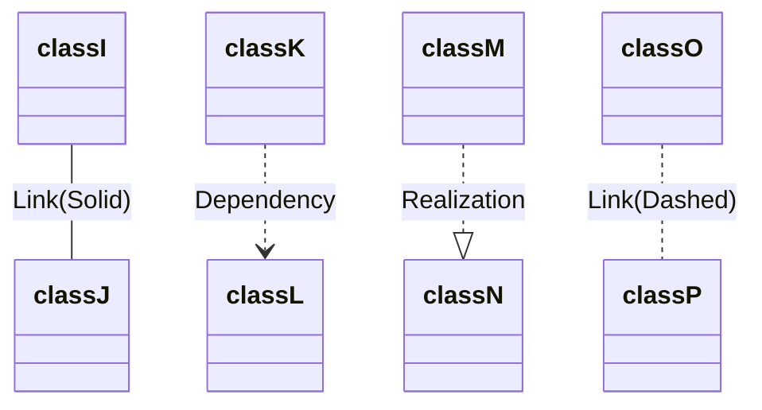

#oop #uml #class-diagram #software-engineering 

# UML Class diagram


# Inheritance
- `A` is a `B` 
```Java
class A extends B {

}
```

# Composition
- `B` is a part of `A`.
- Icon is on the owner's side.
- `B` cannot exist without `A` . (e.g: building has many rooms).
```Java
class A {
  B b;
}
```

# Aggregation
- `A` has a `B`.
- `B` still exists even if `A` is destroyed  (e.g: Car has many independent components: engine, driver, wire).


