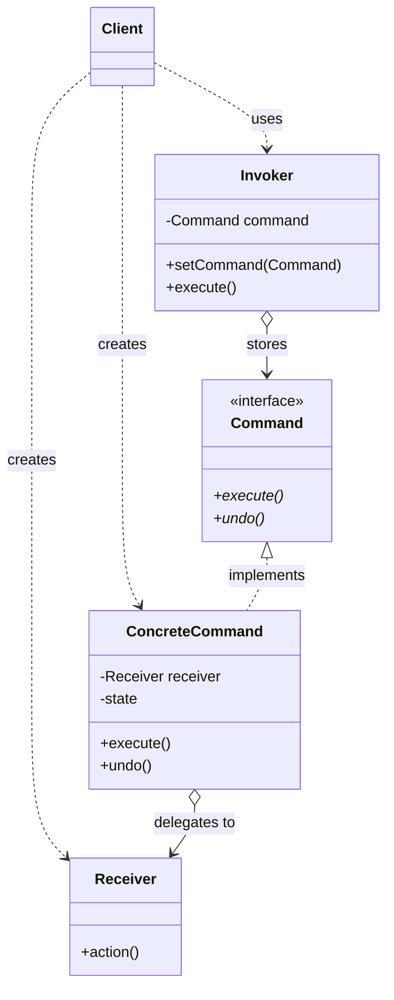
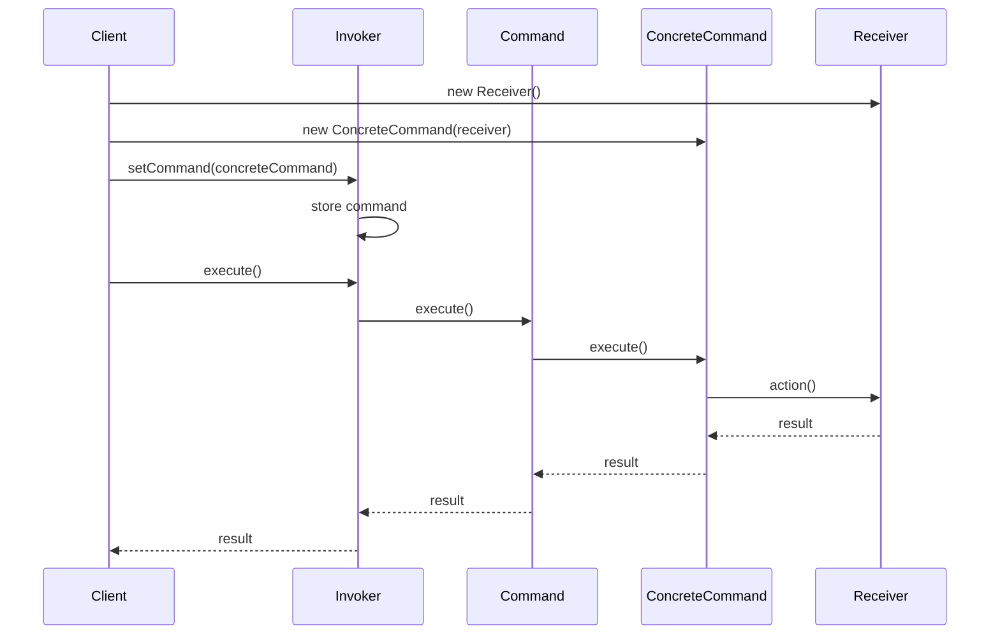
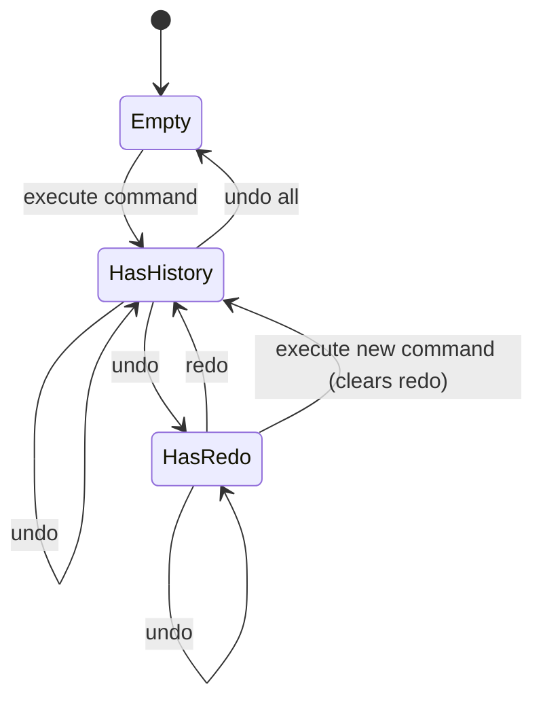

#design-pattern #software-engineering  #software-architecture #object-oriented-programming #behavioral-pattern  #solid #functional-programming #high-order-function #dbms #transaction #java #javascript 
# Intent
- Encapsulate a request as an object, thereby letting client ==parameterize requests==, queue or log requests, and support undoable operations.
- Decouple the object that invokes the operation from the object that knows how to perform it.
- Transform a request into a standalone object containing all information about the request $\implies$ enables ==parameterization of methods== with different requests, ==delayed execution==, ==queuing==, and ==reversible operations==.
# Motivation
- GUI applications need to support ==user actions== (button clicks, menu selections, keyboard shortcuts) that trigger operations.
- Hard-coding the action logic directly into UI components creates tight coupling between UI and business logic.
- Different UI elements (toolbar button, menu item, keyboard shortcut) may need to trigger the same operation.
- Applications require features like undo/redo, macro recording, transaction logging, and queued execution.
- Command pattern solves these problems by encapsulating requests as objects.
# Application
## Parameterization of actions
- Object-oriented replacement for callbacks $\equiv$ a Command is simply a ==high-order function==.
- ==Specify, queue and execute requests at different times== $\implies$ specification, queuing, execution are independent.
- Different UI components can share the same command object.
- Menu items, toolbar buttons, and keyboard shortcuts can all invoke the same command.
## Undo and redo operations
- Implement transaction by storing ==reversible commands== to reverse the effect of some specific commands.
- Each command stores the state needed to reverse its effect.
- Maintain a ==history stack== of executed commands for undo/redo functionality.
## Request logging and auditing
- Implement logging changes by recording all commands before execution.
- Log can be replayed to reconstruct system state.
- Support crash recovery by replaying logged commands.
## Transactional behavior
- Group multiple commands into a ==macro command== or ==composite command==.
- Execute all commands atomically $\implies$ all succeed or all fail.
- Similar to database transactions with commit/rollback semantics.
## Job queues and scheduling
- Commands can be serialized and stored for delayed execution.
- Thread pools can execute commands asynchronously.
- Priority queues can schedule commands based on priority.
## Remote execution
- Commands can be transmitted over network for remote execution.
- Client creates command, server executes it $\implies$ decouples client from server implementation.
# Structure

# Components
- General diagram 
- More readable diagram: 
## Command
- Declares a ==common interface== for Concrete Command $\implies$ exposes the `execute` method to the Invoker.
## Invoker
- ==Composes a Command object==, which actually refers to a Concrete Command in runtime execution.
- Exposes the `setCommand`
- Handles the request from Client by ==delegating responsibility to that Command object== (by calling `command.execute(...)`).
- Usually stores a group of commands to execute them as a transaction.
## Concrete Command
- ==Composes a Receiver object==.
- Has its own parameter and helper function to execute the request.
- Implements the `execute` method in Command interface by passing parameters ==deletegating responsibility to that Receiver object==.
## Receiver
- ==Implements the actual request on its own== $\equiv$ does not delegate to any other class.
- May be any class.
## Client
- Must know about Invoker and Receiver.
- ==Initiates a Concrete Command== and set the Command's ==Receiver==.
- Uses an Invoker object to execute that Command.
# Flow

- 
## Execution sequence
- Client instantiates a Receiver object.
- Client creates a Concrete Command and binds it to the Receiver.
- Client requests the Invoker to store that Concrete Command as an abstract Command.
- Client makes the Invoker execute a Command:
	- The Invoker calls `execute()` on the abstract Command interface.
	- The abstract Command delegates the responsibility to its Concrete Command implementation.
	- The Concrete Command delegates the responsibility to the Receiver.
	- The Receiver executes the command using its own implementation.
# Undo and redo implementation
## Basic approach
- Each command stores the ==previous state== needed to undo the operation.
- `Command` interface includes both `execute()` and `undo()` methods.
- Invoker maintains a ==history stack== of executed commands.
- Undo operation pops the last command from history and calls its `undo()` method.
- Redo operation maintains a separate ==redo stack== of undone commands.
## State management strategies
- ==Memento approach==: Store complete previous state in each command.
- ==Reverse operation approach==: Implement inverse operations (e.g., `add` vs `remove`).
- ==Compensating transaction==: Execute a new command that reverses the effect.
## Command history

# Examples
## Diagram
- 
## Components
- `class Television` is an Receiver. It implements the ==actual business logic== and does not delegate the responsibility to any other classes.
	- `turnOn`
	- `turnOff`
	- `increaseVolume`
	- `decreaseVolume`.

```java
public class Television {  
  
  private boolean isOn;  
  private int volume;  
  
  public Television() {  
    this.isOn = false;  
    this.volume = 20;  
  }  
  
  public void turnOff() {  
    this.isOn = false;  
    System.out.println("Turn off TV");  
  }  
  
  public void turnOn() {  
    this.isOn = true;  
    System.out.println("Turn on TV");  
  }  
  
  public void increaseVolume() {  
    this.volume += 1;  
    System.out.println("Increase volume");  
  }  
  
  public void decreaseVolume() {  
    this.volume -= 1;  
    System.out.println("Decrease volume");  
  }  
}
```

- `abstract class Command` is a Command interface. It declares abstract methods `execute` and `undo` for all children to implement. It also composes a `Television` object to allow Concrete Commands to delegate operations.
```Java
public abstract class Command {
  protected final Television television;

  public Command(Television television) {
    this.television = television;
  }

  public abstract void execute();

  public abstract void undo();
}
```

- `class TurnOnTelevisionCommand`, `class TurnOffTelevisionCommand`, `class IncreaseVolumeCommand`, `class DecreaseVolumeCommand` are the Concrete Commands. Each class implements both `execute` and `undo` methods by ==delegating the responsibility== to the `Television` instance.
```Java
public class TurnOffTelevisionCommand extends Command {
  public TurnOffTelevisionCommand(Television television) {
    super(television);
  }

  @Override
  public void execute() {
    this.television.turnOff();
  }

  @Override
  public void undo() {
    this.television.turnOn();
  }
}

public class TurnOnTelevisionCommand extends Command {
  public TurnOnTelevisionCommand(Television television) {
    super(television);
  }

  @Override
  public void execute() {
    this.television.turnOn();
  }

  @Override
  public void undo() {
    this.television.turnOff();
  }
}

public class DecreaseVolumeTelevisionCommand extends Command {
  public DecreaseVolumeTelevisionCommand(Television television) {
    super(television);
  }

  @Override
  public void execute() {
    this.television.decreaseVolume();
  }

  @Override
  public void undo() {
    this.television.increaseVolume();
  }
}

public class IncreaseVolumeTelevisionCommand extends Command {
  public IncreaseVolumeTelevisionCommand(Television television) {
    super(television);
  }

  @Override
  public void execute() {
    this.television.increaseVolume();
  }

  @Override
  public void undo() {
    this.television.decreaseVolume();
  }
}
```

- `class RemoteControl` is an Invoker. It composes a `Command` object and maintains command history for undo functionality.
```Java
public class RemoteControl {
  private Command command;
  private final Stack<Command> history;

  public RemoteControl() {
    this.history = new Stack<>();
  }

  public RemoteControl(Command command) {
    this.command = command;
    this.history = new Stack<>();
  }

  public void setCommand(Command command) {
    this.command = command;
  }

  public void execute() {
    this.command.execute();
    this.history.push(this.command);
  }

  public void undo() {
    if (!this.history.isEmpty()) {
      Command lastCommand = this.history.pop();
      lastCommand.undo();
    } else {
      System.out.println("No command to undo");
    }
  }
}
```

- `class Main`: is a Client. The Client instantiates an Invoker and Concrete Commands to execute operations and demonstrate undo functionality.
```Java
public class Main {
  public static void main(String[] args) {
    RemoteControl remoteControl = new RemoteControl();
    Television television = new Television();

    // Turn on TV
    remoteControl.setCommand(new TurnOnTelevisionCommand(television));
    remoteControl.execute(); // Output: "Turn on TV"

    // Increase volume twice
    remoteControl.setCommand(new IncreaseVolumeTelevisionCommand(television));
    remoteControl.execute(); // Output: "Increase volume"
    remoteControl.execute(); // Output: "Increase volume"

    // Undo last command (decrease volume)
    remoteControl.undo(); // Output: "Decrease volume"

    // Turn off TV
    remoteControl.setCommand(new TurnOffTelevisionCommand(television));
    remoteControl.execute(); // Output: "Turn off TV"

    // Undo turn off (turn on again)
    remoteControl.undo(); // Output: "Turn on TV"
  }
}
```

## Text editor with undo and redo
- This example demonstrates a text editor implementing undo/redo using Command pattern.
- The editor supports `JavaScript` operations: insert text, delete text, and replace text.
```JavaScript
// Receiver: TextDocument
class TextDocument {
  constructor() {
    this.content = '';
  }

  insert(text, position) {
    this.content =
      this.content.slice(0, position) +
      text +
      this.content.slice(position);
    console.log(`Inserted "${text}" at position ${position}`);
  }

  delete(position, length) {
    const deleted = this.content.slice(position, position + length);
    this.content =
      this.content.slice(0, position) +
      this.content.slice(position + length);
    console.log(`Deleted "${deleted}" at position ${position}`);
    return deleted;
  }

  getContent() {
    return this.content;
  }
}

// Command interface
class Command {
  execute() {
    throw new Error('execute() must be implemented');
  }

  undo() {
    throw new Error('undo() must be implemented');
  }
}

// Concrete Command: InsertTextCommand
class InsertTextCommand extends Command {
  constructor(document, text, position) {
    super();
    this.document = document;
    this.text = text;
    this.position = position;
  }

  execute() {
    this.document.insert(this.text, this.position);
  }

  undo() {
    this.document.delete(this.position, this.text.length);
  }
}

// Concrete Command: DeleteTextCommand
class DeleteTextCommand extends Command {
  constructor(document, position, length) {
    super();
    this.document = document;
    this.position = position;
    this.length = length;
    this.deletedText = null;
  }

  execute() {
    this.deletedText = this.document.delete(this.position, this.length);
  }

  undo() {
    this.document.insert(this.deletedText, this.position);
  }
}

// Invoker: TextEditor
class TextEditor {
  constructor(document) {
    this.document = document;
    this.history = [];
    this.redoStack = [];
  }

  executeCommand(command) {
    command.execute();
    this.history.push(command);
    this.redoStack = []; // Clear redo stack when new command executed
  }

  undo() {
    if (this.history.length === 0) {
      console.log('Nothing to undo');
      return;
    }
    const command = this.history.pop();
    command.undo();
    this.redoStack.push(command);
  }

  redo() {
    if (this.redoStack.length === 0) {
      console.log('Nothing to redo');
      return;
    }
    const command = this.redoStack.pop();
    command.execute();
    this.history.push(command);
  }

  getContent() {
    return this.document.getContent();
  }
}

// Client usage
const doc = new TextDocument();
const editor = new TextEditor(doc);

editor.executeCommand(new InsertTextCommand(doc, 'Hello', 0));
editor.executeCommand(new InsertTextCommand(doc, ' World', 5));
console.log(`Content: "${editor.getContent()}"`); // "Hello World"

editor.executeCommand(new DeleteTextCommand(doc, 5, 6));
console.log(`Content: "${editor.getContent()}"`); // "Hello"

editor.undo();
console.log(`Content: "${editor.getContent()}"`); // "Hello World"

editor.redo();
console.log(`Content: "${editor.getContent()}"`); // "Hello"
```
## Macro command
- Composite command that groups multiple commands into a single command.
- Executes all commands in sequence.
- Supports undo by reversing all commands in reverse order.
```Java
public class MacroCommand extends Command {
  private final List<Command> commands;

  public MacroCommand() {
    this.commands = new ArrayList<>();
  }

  public void addCommand(Command command) {
    this.commands.add(command);
  }

  @Override
  public void execute() {
    for (Command command : commands) {
      command.execute();
    }
  }

  @Override
  public void undo() {
    // Undo in reverse order
    for (int i = commands.size() - 1; i >= 0; i--) {
      commands.get(i).undo();
    }
  }
}

// Client usage
Television tv = new Television();
MacroCommand morningRoutine = new MacroCommand();
morningRoutine.addCommand(new TurnOnTelevisionCommand(tv));
morningRoutine.addCommand(new IncreaseVolumeTelevisionCommand(tv));

RemoteControl remote = new RemoteControl(morningRoutine);
remote.execute(); // Turn on TV and increase volume
remote.undo(); // Decrease volume and turn off TV
```
# Real world examples
## Java standard library
- `java.lang.Runnable`: Encapsulates a task to be executed by a thread.
- `javax.swing.Action`: Encapsulates GUI actions with support for enable/disable state.
- `java.util.concurrent.Callable`: Similar to `Runnable` but returns a result.
## JavaScript and TypeScript frameworks
- `Redux` actions: Plain objects describing state changes $\implies$ commands for state management.
- Event handlers in DOM: Functions attached to events are command objects.
- `JavaScript` `Promise` and async operations: Encapsulate deferred execution.
## Database systems
- SQL statements are commands sent to database server for execution.
- Transaction logs store commands for crash recovery and replication.
- Stored procedures encapsulate sequences of commands.
## Operating systems
- Shell commands: Each command-line instruction is a command object.
- System calls: Applications send command requests to OS kernel.
- Job scheduling: Cron jobs and scheduled tasks are commands.
## Design tools and editors
- Photoshop, Illustrator: Every tool operation is a command for undo/redo.
- IDEs (IntelliJ, VS Code): Refactoring operations, code formatting are commands.
- Git version control: Each commit is a command that can be reverted.
# Command pattern and functional programming
- Command pattern is the ==object-oriented equivalent of higher-order functions==.
- In functional programming, functions are first-class citizens and can be passed as arguments.
- Commands encapsulate behavior similar to how closures capture state and behavior.
## Functional approach with lambdas
```Java
// Traditional Command pattern
interface Command {
  void execute();
}

// Functional approach using lambda
Runnable command = () -> System.out.println("Execute");
command.run();

// With captured state (closure)
String message = "Hello";
Runnable commandWithState = () -> System.out.println(message);
commandWithState.run();
```
## Comparison
- ==Object-oriented approach==: Explicit Command classes with state and behavior.
	- Advantages: Type safety, undo support, complex state management.
	- Disadvantages: Verbose, requires class definition for each command.
- ==Functional approach==: Functions or lambdas with closures.
	- Advantages: Concise, less boilerplate code.
	- Disadvantages: Undo implementation is more complex, state management is implicit.
## When to use each approach
- Use Command pattern classes when:
	- Undo/redo functionality is required.
	- Commands need complex state management.
	- Commands require multiple methods (execute, undo, validate).
	- Serialization or persistence is needed.
- Use functional approach (lambdas/closures) when:
	- Simple one-time callbacks are needed.
	- No undo functionality required.
	- Minimal state needs to be captured.
	- Language supports first-class functions.
# Related patterns
## Memento pattern
- Often used together with Command for undo functionality.
- Memento stores the state of Receiver before command execution.
- Command uses Memento to restore previous state during undo.
## Composite pattern
- MacroCommand uses Composite to create hierarchies of commands.
- Composite commands contain child commands executed as a group.
- Both patterns support recursive composition.
## Prototype pattern
- Commands can be cloned to create similar commands with different parameters.
- Useful for creating command templates.
## Chain of Responsibility
- Commands can be organized in a chain for conditional execution.
- Each command decides whether to handle request or pass to next command.
## Strategy pattern
- Both encapsulate algorithms as objects.
- Command focuses on ==when and how== to execute $\implies$ supports queuing, logging, undo.
- Strategy focuses on ==which algorithm== to use $\implies$ interchangeable algorithms.
# Advantages
- ==Decoupling==: Ensure [Single responsibility principle](SOLID.md#Single%20responsibility%20principle) by decoupling classes that invoke operations from classes that perform operations.
- ==Extensibility==: Ensure [Open-closed principle](SOLID.md#Open-closed%20principle) because new concrete commands can be added without modifying client code.
- ==Flexible execution==: Schedule operations independently (specify $\neq$ queue $\neq$ execute).
- ==Undo and redo==: Easy to implement reversible operations by storing command history.
- ==Macro commands==: Combine multiple commands into composite commands.
- ==Logging and auditing==: All operations can be logged for debugging, auditing, or crash recovery.
- ==Remote execution==: Commands can be serialized and transmitted over network.
- ==Testability==: Commands can be tested independently from UI or business logic.
# Disadvantages
- ==Increased complexity==: Adds an additional layer between invocation and implementation.
- ==Class proliferation==: Each operation requires a separate command class $\implies$ many small classes.
- ==Memory overhead==: Storing command history for undo/redo consumes memory.
- ==Coupling to receiver==: Commands are tightly coupled to specific receiver implementations.
***
# References
1. Design Patterns: Elements of Reusable Object-Oriented Software - Erich Gamma, Richard Helm, Ralph Johnson, and John Vlissides:
	1. Command pattern.
2. Refactoring Guru: Command Pattern.
	1. https://refactoring.guru/design-patterns/command
3. Java API Documentation:
	1. `java.lang.Runnable` interface: http://docs.oracle.com/javase/8/docs/api/java/lang/Runnable.html
	2. `javax.swing.Action` interface for GUI commands.
	3. `java.util.concurrent.Callable` interface for result-returning commands.
