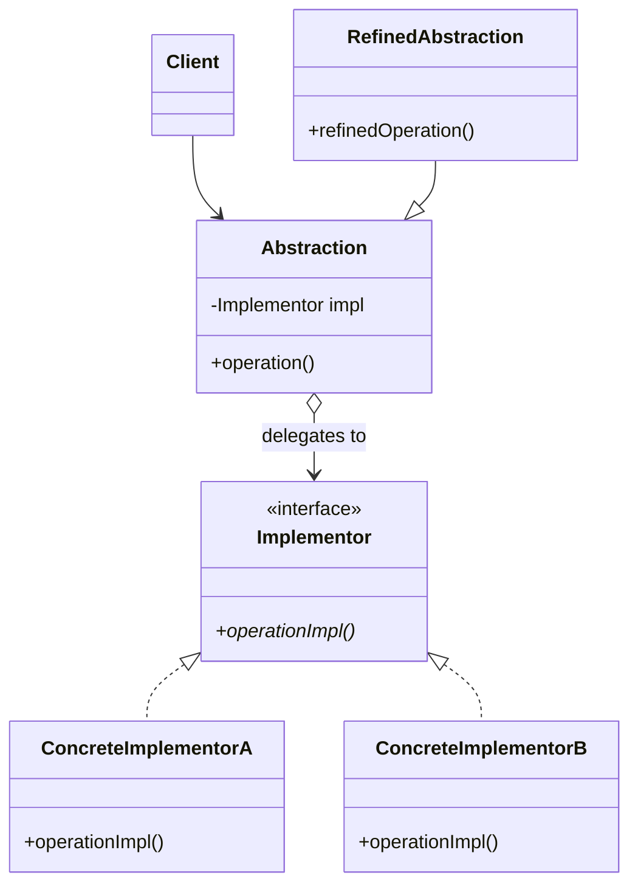
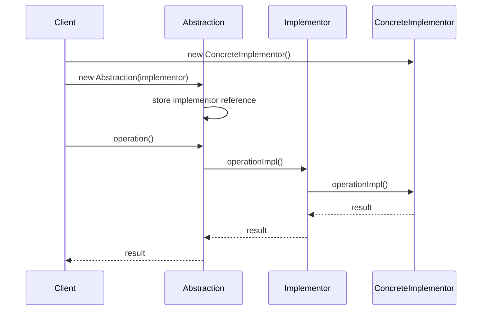

#structural-pattern  #design-pattern  #object-oriented-programming #software-engineering #software-architecture #composition #inheritance #interface-segregation
# Intent
- ==Decouple an abstraction from its implementation== so that the two can vary independently.
- Divide a class into two separate inheritance hierarchies: ==abstraction hierarchy== and ==implementation hierarchy==.
- Use composition over inheritance to achieve flexibility $\implies$ Abstraction contains a reference to Implementation.
- Bridge means that Abstraction methods are implemented using ==primitive methods declared in Implementor interface==.
# Problem
- Class hierarchies can grow exponentially when combining multiple independent dimensions.
- Example: Supporting $m$ abstractions across $n$ platforms requires $m \times n$ subclasses without Bridge pattern.
- Tight coupling between abstraction and implementation makes both difficult to extend independently.
- Changing platform-specific implementation requires modifying abstraction classes.
## Class explosion example
- Consider shapes (Circle, Rectangle, Triangle) that need to render on different platforms (Windows, Linux, MacOS).
- Without Bridge: $3 \times 3 = 9$ classes: `WindowsCircle`, `LinuxCircle`, `MacCircle`, `WindowsRectangle`, etc.
- With Bridge: $3 + 3 = 6$ classes: $3$ shapes + $3$ renderers $\implies$ linear growth instead of exponential.
# Solution
- Separate abstraction from implementation by creating two independent hierarchies.
- Abstraction hierarchy contains high-level control logic and delegates platform-specific work to Implementation hierarchy.
- Abstraction ==composes== Implementation object instead of inheriting from it.
- Both hierarchies can be extended independently without affecting each other.
# Motivation
- GUI frameworks need to support multiple platforms (Windows, Linux, MacOS) with platform-specific rendering.
- Database drivers need to support multiple database systems (MySQL, PostgreSQL, Oracle) with vendor-specific protocols.
- Device drivers need to support multiple hardware implementations with device-specific operations.
- Graphics libraries need to support multiple rendering backends (OpenGL, DirectX, Vulkan) with API-specific calls.
# Application
## Platform independence
- Divide a monolithic class that has ==variants of platform-specific functionalities== (e.g: database server, OS, hardware devices).
- Create abstraction layer that works across multiple platforms without code duplication.
## Runtime implementation switching
- Switch among many implementations (Concrete Implementors) at runtime.
- Change underlying implementation without modifying client code.
- Support dependency injection for different implementations.
## Multi-dimensional extension
- Extend a class ==in multiple independent dimensions==.
- Add new abstractions without creating new implementations.
- Add new implementations without creating new abstractions.
## Avoid permanent binding
- Prevent compile-time binding between abstraction and implementation.
- Allow implementation selection at runtime based on configuration or context.
- Support plugin architectures where implementations can be loaded dynamically.
# Structure

# Components
- 
## Abstraction
- Defines high-level control interface based on Implementor primitive operations.
- ==Composes an Implementor object== to delegate platform-specific operations.
- Maintains a reference to Implementor instance $\implies$ uses composition instead of inheritance.
- Provides operations that use Implementor methods as building blocks.
## Implementor
- ==Declares primitive operation interfaces== for Concrete Implementors to implement.
- Defines low-level operations that Abstraction uses to build high-level operations.
- Methods should be ==primitive and platform-specific== $\implies$ not high-level abstractions.
- Does not need to match Abstraction interface exactly.
## Refined Abstraction
- Extends Abstraction interface with additional high-level operations.
- Optional component $\implies$ used when abstraction needs specialization.
- Builds more complex operations using inherited Implementor reference.
- Can add state specific to the refined abstraction.
## Concrete Implementor
- Implements the Implementor interface with platform-specific or variant-specific code.
- Provides concrete implementation of primitive operations.
- Multiple Concrete Implementors represent different platforms, databases, devices, or algorithms.
- Can be selected and injected at runtime.
## Client
- Works only with Abstraction interface $\implies$ independent of implementation details.
- Creates Abstraction and Implementor objects and wires them together.
- Can change implementation at runtime by providing different Implementor.
# Collaboration

## Execution flow
- Client creates a Concrete Implementor instance (platform-specific implementation).
- Client creates an Abstraction instance and passes the Implementor to it.
- Abstraction stores the Implementor reference for later use.
- Client calls high-level operation on Abstraction.
- Abstraction translates high-level operation into one or more primitive operations.
- Abstraction delegates primitive operations to Implementor interface.
- Call is dispatched to Concrete Implementor through polymorphism.
- Concrete Implementor executes platform-specific code.
- Result flows back through the call chain to Client.
# Examples
## Remote control and devices
- 
- 
- This example demonstrates how different remote controls (abstractions) can work with different devices (implementations).
- `class Remote`: is an Abstraction class which composes a `Device` object and defines high-level operations `turnOn()`, `turnOff()` and `increaseVolume()`.
```Java
// Abstraction: defines high-level control interface
public class Remote {
  protected Device device;

  public Remote(Device device) {
    this.device = device;
  }

  public void turnOn() {
    if (!this.device.isActive()) {
      this.device.togglePower();
      System.out.println("Turn on " + this.device.toString());
    } else {
      System.out.println(this.device.toString() + " is already on");
    }
  }

  public void turnOff() {
    if (this.device.isActive()) {
      this.device.togglePower();
      System.out.println("Turn off " + this.device.toString());
    } else {
      System.out.println(this.device.toString() + " is already off");
    }
  }

  public void increaseVolume() {
    if (this.device.volumeUp()) {
      System.out.println("Successfully increase volume");
    } else {
      System.out.println("Volume has already reached maximum");
    }
  }
}

// Refined Abstraction: extends base remote with advanced features
public class AdvancedRemote extends Remote {
  public AdvancedRemote(Device device) {
    super(device);
  }

  public void mute() {
    System.out.println("Muting device");
    this.device.setVolume(0);
  }

  public void setChannel(int channel) {
    System.out.println("Setting channel to " + channel);
    // Uses device primitive operations
  }
}
```

- `interface Device` is an Implementor interface that declares primitive operations for Concrete Implementors to implement.
```Java
// Implementor: declares primitive operations
public interface Device {
  boolean isActive();
  boolean reachMaximumVolume();
  boolean volumeUp();
  void togglePower();
  void setVolume(int volume);
  int getVolume();
}
```

- `class Television` and `class Radio` are Concrete Implementors with different implementations of primitive operations.
```Java
// Concrete Implementor A: Television with specific behavior
public class Television implements Device {
  private boolean isActive;
  private int volume;

  public Television() {
    this.isActive = false;
    this.volume = 30;
  }

  @Override
  public boolean isActive() {
    return this.isActive;
  }

  @Override
  public boolean volumeUp() {
    if (this.reachMaximumVolume()) {
      return false;
    }
    this.volume += 10; // TV increments by 10
    return true;
  }

  @Override
  public void togglePower() {
    this.isActive = !this.isActive;
  }

  @Override
  public boolean reachMaximumVolume() {
    return this.volume >= 100;
  }

  @Override
  public void setVolume(int volume) {
    this.volume = Math.min(volume, 100);
  }

  @Override
  public int getVolume() {
    return this.volume;
  }

  @Override
  public String toString() {
    return "Television";
  }
}

// Concrete Implementor B: Radio with different behavior
public class Radio implements Device {
  private boolean isActive;
  private int volume;

  public Radio() {
    this.isActive = false;
    this.volume = 5;
  }

  @Override
  public boolean isActive() {
    return this.isActive;
  }

  @Override
  public boolean volumeUp() {
    if (this.reachMaximumVolume()) {
      return false;
    }
    this.volume += 1; // Radio increments by 1
    return true;
  }

  @Override
  public void togglePower() {
    this.isActive = !this.isActive;
  }

  @Override
  public boolean reachMaximumVolume() {
    return this.volume >= 10;
  }

  @Override
  public void setVolume(int volume) {
    this.volume = Math.min(volume, 10);
  }

  @Override
  public int getVolume() {
    return this.volume;
  }

  @Override
  public String toString() {
    return "Radio";
  }
}

// Client usage
public class Main {
  public static void main(String[] args) {
    // Same remote works with different devices
    Device tv = new Television();
    Remote tvRemote = new Remote(tv);
    tvRemote.turnOn();
    tvRemote.increaseVolume();

    Device radio = new Radio();
    Remote radioRemote = new Remote(radio);
    radioRemote.turnOn();
    radioRemote.increaseVolume();

    // Advanced remote with TV
    AdvancedRemote advancedTvRemote = new AdvancedRemote(tv);
    advancedTvRemote.mute();
  }
}
```
## Cross-platform graphics rendering
- This example demonstrates using Bridge pattern for platform-independent graphics rendering.
- Different shapes can render on different platforms without code duplication.
```TypeScript
// Implementor: defines primitive rendering operations
interface Renderer {
  renderCircle(x: number, y: number, radius: number): void;
  renderRectangle(x: number, y: number, width: number, height: number): void;
}

// Concrete Implementor A: Windows renderer
class WindowsRenderer implements Renderer {
  renderCircle(x: number, y: number, radius: number): void {
    console.log(`Windows: Drawing circle at (${x},${y}) with radius ${radius}`);
    // Windows-specific rendering API calls
  }

  renderRectangle(x: number, y: number, width: number, height: number): void {
    console.log(`Windows: Drawing rectangle at (${x},${y}) with size ${width}x${height}`);
    // Windows-specific rendering API calls
  }
}

// Concrete Implementor B: Linux renderer
class LinuxRenderer implements Renderer {
  renderCircle(x: number, y: number, radius: number): void {
    console.log(`Linux: Drawing circle at (${x},${y}) with radius ${radius}`);
    // Linux-specific rendering API calls
  }

  renderRectangle(x: number, y: number, width: number, height: number): void {
    console.log(`Linux: Drawing rectangle at (${x},${y}) with size ${width}x${height}`);
    // Linux-specific rendering API calls
  }
}

// Abstraction: defines high-level shape interface
abstract class Shape {
  protected renderer: Renderer;

  constructor(renderer: Renderer) {
    this.renderer = renderer;
  }

  abstract draw(): void;
}

// Refined Abstraction: Circle
class Circle extends Shape {
  private x: number;
  private y: number;
  private radius: number;

  constructor(x: number, y: number, radius: number, renderer: Renderer) {
    super(renderer);
    this.x = x;
    this.y = y;
    this.radius = radius;
  }

  draw(): void {
    this.renderer.renderCircle(this.x, this.y, this.radius);
  }
}

// Refined Abstraction: Rectangle
class Rectangle extends Shape {
  private x: number;
  private y: number;
  private width: number;
  private height: number;

  constructor(x: number, y: number, width: number, height: number, renderer: Renderer) {
    super(renderer);
    this.x = x;
    this.y = y;
    this.width = width;
    this.height = height;
  }

  draw(): void {
    this.renderer.renderRectangle(this.x, this.y, this.width, this.height);
  }
}

// Client code
const windowsRenderer = new WindowsRenderer();
const linuxRenderer = new LinuxRenderer();

// Same shape can use different renderers
const circle1 = new Circle(10, 10, 5, windowsRenderer);
circle1.draw(); // Windows: Drawing circle...

const circle2 = new Circle(10, 10, 5, linuxRenderer);
circle2.draw(); // Linux: Drawing circle...

const rect = new Rectangle(0, 0, 100, 50, windowsRenderer);
rect.draw(); // Windows: Drawing rectangle...
```
## Database abstraction layer
- This example shows how database drivers use Bridge pattern for vendor-independent database operations.
```Python
# Implementor: database connection interface
class DatabaseDriver:
    def connect(self, connection_string: str) -> None:
        raise NotImplementedError

    def execute_query(self, query: str) -> list:
        raise NotImplementedError

    def close(self) -> None:
        raise NotImplementedError

# Concrete Implementor A: MySQL driver
class MySQLDriver(DatabaseDriver):
    def connect(self, connection_string: str) -> None:
        print(f"MySQL: Connecting to {connection_string}")
        # MySQL-specific connection logic

    def execute_query(self, query: str) -> list:
        print(f"MySQL: Executing query: {query}")
        # MySQL-specific query execution
        return [{"id": 1, "name": "Result"}]

    def close(self) -> None:
        print("MySQL: Closing connection")

# Concrete Implementor B: PostgreSQL driver
class PostgreSQLDriver(DatabaseDriver):
    def connect(self, connection_string: str) -> None:
        print(f"PostgreSQL: Connecting to {connection_string}")
        # PostgreSQL-specific connection logic

    def execute_query(self, query: str) -> list:
        print(f"PostgreSQL: Executing query: {query}")
        # PostgreSQL-specific query execution
        return [{"id": 1, "name": "Result"}]

    def close(self) -> None:
        print("PostgreSQL: Closing connection")

# Abstraction: database connection
class DatabaseConnection:
    def __init__(self, driver: DatabaseDriver):
        self.driver = driver

    def open(self, connection_string: str) -> None:
        self.driver.connect(connection_string)

    def query(self, sql: str) -> list:
        return self.driver.execute_query(sql)

    def close(self) -> None:
        self.driver.close()

# Refined Abstraction: connection with transaction support
class TransactionalConnection(DatabaseConnection):
    def __init__(self, driver: DatabaseDriver):
        super().__init__(driver)

    def begin_transaction(self) -> None:
        print("Beginning transaction")
        self.driver.execute_query("BEGIN")

    def commit(self) -> None:
        print("Committing transaction")
        self.driver.execute_query("COMMIT")

    def rollback(self) -> None:
        print("Rolling back transaction")
        self.driver.execute_query("ROLLBACK")

# Client code
mysql_driver = MySQLDriver()
conn1 = DatabaseConnection(mysql_driver)
conn1.open("mysql://localhost:3306/mydb")
results = conn1.query("SELECT * FROM users")
conn1.close()

# Switch to PostgreSQL without changing client code
postgres_driver = PostgreSQLDriver()
conn2 = TransactionalConnection(postgres_driver)
conn2.open("postgresql://localhost:5432/mydb")
conn2.begin_transaction()
conn2.query("INSERT INTO users VALUES (1, 'John')")
conn2.commit()
conn2.close()
```
# Design considerations
## Identifying abstractions and implementations
- Determine and define ==common high-level operations== in Abstraction layer.
- Identify ==primitive platform-specific operations== for Implementor interface.
- Abstraction operations should be built from Implementor primitive operations.
- Implementor methods do not have to match Abstraction methods exactly.
## Interface design
- Keep Implementor interface minimal and primitive.
- Abstraction combines primitive operations to create high-level functionality.
- Avoid leaking implementation details through Abstraction interface.
## Object creation
- May employ [Abstract Factory pattern](software-engineering/software-architecture/design-pattern/fundamentals/creational-pattern/Abstract%20Factory%20pattern.md) to create Concrete Implementor objects.
- Use dependency injection to provide Implementor to Abstraction.
- Consider Builder pattern for complex Abstraction-Implementor wiring.
## Sharing implementors
- Multiple Abstraction objects can share the same Implementor instance if it is stateless.
- Use reference counting if Implementor needs cleanup when no longer used.
# Bridge vs Adapter
## Bridge pattern
- ==Designed upfront== to separate abstraction from implementation.
- Both hierarchies evolve independently from the start.
- Uses composition to connect two parallel hierarchies.
- Applied during initial design phase.
## Adapter pattern
- ==Applied to existing systems== to make incompatible interfaces work together.
- Wraps existing class to match expected interface.
- Typically used to integrate legacy code or third-party libraries.
- Applied during maintenance or integration phase.
## Key difference
- Bridge: ==Planned separation== $\implies$ "build correctly from the start".
- Adapter: ==Retroactive fix== $\implies$ "make it work with what we have".
# Bridge vs Strategy
## Bridge pattern
- Separates abstraction into two hierarchies.
- Both Abstraction and Implementor can have multiple subclasses.
- Focuses on ==structural decomposition==.
- Client typically chooses implementation once during construction.
## Strategy pattern
- Encapsulates algorithms as interchangeable objects.
- Usually has single context class with multiple strategy classes.
- Focuses on ==behavioral variation==.
- Client can change strategy dynamically during runtime.
## Similarity
- Both use composition and delegation.
- Both allow runtime selection of implementation.
- Both follow Open-Closed Principle.
# Real world examples
## Java standard library
- `JDBC API`: `java.sql.Driver` is Implementor, `java.sql.Connection` is Abstraction.
	- Database vendors provide Concrete Implementors: `com.mysql.jdbc.Driver`, `org.postgresql.Driver`.
	- Applications use Abstraction (`Connection`) without knowing vendor-specific details.
- `java.util.Collection.newSetFromMap()`: Creates `Set` abstraction backed by `Map` implementation.
- `AWT/Swing`: Abstract Window Toolkit provides abstraction, platform-specific peers are implementations.
## GUI frameworks
- `Qt framework`: Platform-independent API (abstraction) with platform-specific backends (Windows, Linux, macOS).
- `Electron`: Web technologies (abstraction) run on different platforms via native wrappers (implementation).
- `React Native`: React components (abstraction) render to native widgets on iOS and Android (implementations).
## Graphics and game engines
- `OpenGL/DirectX/Vulkan`: Graphics APIs (abstraction) with GPU driver implementations.
- `Unity/Unreal Engine`: Game engine API (abstraction) with platform-specific renderers (PC, console, mobile).
## Messaging and logging
- `SLF4J` (Simple Logging Facade for Java): Logging abstraction with multiple implementations (Logback, Log4j).
- Message queue abstractions: Application code (abstraction) works with different brokers (RabbitMQ, Kafka, ActiveMQ).
## Operating system APIs
- `POSIX API`: Standard interface (abstraction) implemented by different Unix-like systems (Linux, macOS, BSD).
- `File system APIs`: Abstract file operations with implementations for different file systems (ext4, NTFS, FAT32).
## Cloud services
- Cloud provider abstractions: Application uses storage interface (abstraction) backed by AWS S3, Azure Blob, or Google Cloud Storage (implementations).
- Container orchestration: Kubernetes API (abstraction) with different runtime implementations (Docker, containerd, CRI-O).
# Related patterns
## Adapter pattern
- Adapter makes existing interfaces compatible $\implies$ Bridge designs interfaces from scratch.
- Both use composition but serve different purposes.
## Abstract Factory pattern
- Often used together to create platform-specific Implementor objects.
- Factory creates correct Implementor based on platform or configuration.
## Strategy pattern
- Both use composition to vary behavior.
- Strategy focuses on algorithm variation, Bridge focuses on implementation separation.
- Strategy typically has flatter structure, Bridge has two hierarchies.
## State pattern
- Similar structure with context delegating to state object.
- State focuses on changing behavior based on internal state.
- Bridge separates dimensions that vary independently.
# Advantages
- ==Platform independence==: Abstraction code works across multiple platforms without modification.
- ==Independent variation==: Abstraction and Implementation hierarchies evolve independently.
- ==Reduced class explosion==: Linear growth $(m + n)$ instead of exponential growth $(m \times n)$.
- ==Runtime binding==: Implementation can be selected or changed at runtime.
- ==Separation of concerns==: Ensure [Single responsibility principle](SOLID.md#Single%20responsibility%20principle) because Abstraction is separate from Implementation.
- ==Extensibility==: Ensure [Open-Closed Principle](SOLID.md#Open-Closed%20Principle) because new Concrete Implementors can be added without modifying client code.
- ==Loose coupling==: Ensure [Dependency inversion principle](SOLID.md#Dependency%20inversion%20principle) because client depends only on Abstraction interface.
- ==Implementation hiding==: Client code does not know about implementation details.
- ==Modularity==: Each hierarchy can be tested, maintained, and deployed independently.
# Disadvantages
- ==Increased complexity==: Introduces additional classes and interfaces (Abstraction, Implementor hierarchies).
- ==Upfront design overhead==: Requires identifying dimensions of variation in advance.
- ==Difficult retrofitting==: Hard to apply Bridge pattern to existing legacy code without significant refactoring.
- ==Potential over-engineering==: May be overkill for simple systems with only one dimension of variation.
- ==Indirect relationships==: Extra indirection can make code harder to understand initially.
- ==More classes to maintain==: Total number of classes increases even though explosion is avoided.
***
# References
1. Design Patterns: Elements of Reusable Object-Oriented Software - Erich Gamma, Richard Helm, Ralph Johnson, and John Vlissides:
	1. Bridge pattern.
	2. Structural patterns discussion.
2. Refactoring Guru: Bridge Pattern.
	1. https://refactoring.guru/design-patterns/bridge
3. Java API Documentation:
	1. `java.sql.Driver` interface: JDBC bridge implementation.
	2. `java.sql.Connection` interface: Database abstraction.
4. Head First Design Patterns - Eric Freeman, Elisabeth Robson:
	1. Bridge pattern explanation with practical examples.
5. Pattern-Oriented Software Architecture - Frank Buschmann et al:
	1. Bridge pattern in large-scale systems.
