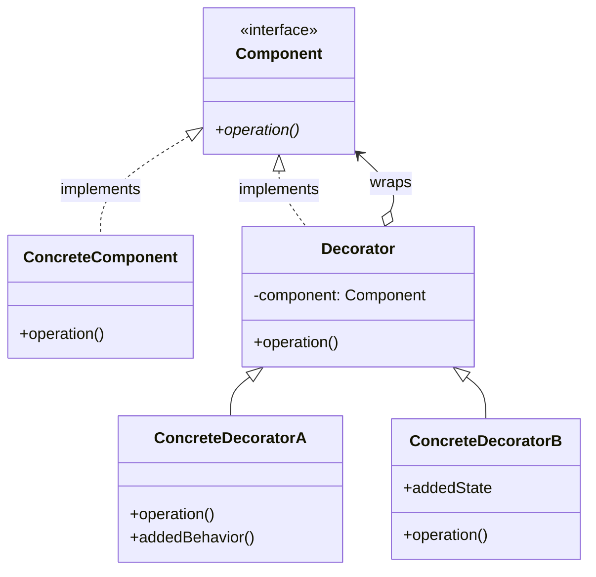
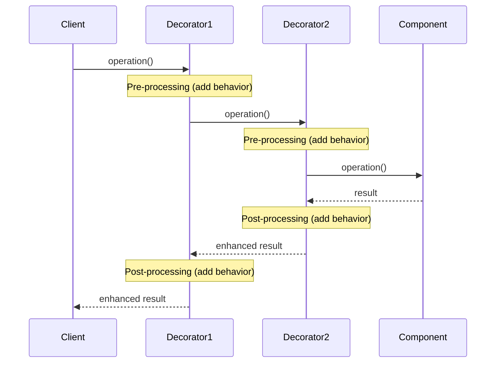

#design-pattern #object-oriented-programming #software-engineering #software-architecture #structural-pattern #java #csharp #typescript #python #composition #inheritance
# Intent
- Attach additional responsibilities to an object ==dynamically== at runtime.
- Provide a flexible alternative to subclassing for extending functionality.
- Wrap an object with decorator objects that add behavior without modifying the original object.
- Also known as ==Wrapper== because decorators wrap components.
# Problem
- Need to add functionality to individual objects without affecting other objects of the same class.
- Subclassing creates static inheritance hierarchy $\implies$ functionality fixed at compile time.
- Combining features through inheritance leads to ==class explosion== (exponential growth of subclasses).
- Extension by subclassing is impractical when class is sealed/final or when functionality needs to be added/removed dynamically.
- Multiple independent features need to be combined in various ways.
## Class explosion problem
```Java
// Without Decorator: exponential growth of subclasses
class Coffee { }
class Espresso extends Coffee { }
class Latte extends Coffee { }

// Need milk option: double the classes
class EspressoWithMilk extends Espresso { }
class LatteWithMilk extends Latte { }

// Need sugar option: double again
class EspressoWithSugar extends Espresso { }
class EspressoWithMilkAndSugar extends Espresso { }
class LatteWithSugar extends Latte { }
class LatteWithMilkAndSugar extends Latte { }

// Need whipped cream: exponential explosion!
// 2 base × 2^3 options = 16 classes
```
# Solution
- Define Component interface that both concrete components and decorators implement.
- Create Decorator base class that wraps a Component and delegates operations to it.
- Concrete Decorators extend Decorator base and add specific functionality before/after delegation.
- Stack multiple decorators to combine behaviors.
- Client works with Component interface $\implies$ transparent decoration.
## Solution with Decorator
```Java
// Component interface
interface Coffee {
  double cost();
  String description();
}

// Concrete Component
class Espresso implements Coffee {
  public double cost() { return 2.0; }
  public String description() { return "Espresso"; }
}

// Decorator base
abstract class CoffeeDecorator implements Coffee {
  protected Coffee coffee;
  public CoffeeDecorator(Coffee coffee) {
    this.coffee = coffee;
  }
}

// Concrete Decorators
class MilkDecorator extends CoffeeDecorator {
  public MilkDecorator(Coffee coffee) { super(coffee); }
  public double cost() { return coffee.cost() + 0.5; }
  public String description() { return coffee.description() + ", Milk"; }
}

class SugarDecorator extends CoffeeDecorator {
  public SugarDecorator(Coffee coffee) { super(coffee); }
  public double cost() { return coffee.cost() + 0.2; }
  public String description() { return coffee.description() + ", Sugar"; }
}

// Usage: stack decorators dynamically
Coffee coffee = new Espresso();
coffee = new MilkDecorator(coffee);
coffee = new SugarDecorator(coffee);
// Result: "Espresso, Milk, Sugar" - $2.70
// Linear growth: 2 base + 3 decorators = 5 classes instead of 16
```
# Motivation
- ==Flexibility==: Add/remove responsibilities at runtime rather than compile time.
- ==Avoid class explosion==: Combine features without creating subclass for every combination.
- ==Single Responsibility Principle==: Each decorator adds one specific feature.
- ==Open-Closed Principle==: Extend functionality without modifying existing code.
- ==Composition over inheritance==: Use object composition instead of inheritance.
# Application
## Dynamic feature combination
- Add optional features to objects based on runtime conditions.
- User selects features to enable (GUI themes, plugins, add-ons).
- Different combinations of features for different instances.
## Cross-cutting concerns
- Add logging, caching, validation, authorization transparently.
- Aspect-oriented programming concepts.
- Middleware pipeline in web frameworks.
## Graphical user interfaces
- Add borders, scrollbars, shadows to UI components.
- Style text with bold, italic, underline combinations.
- Layer visual effects on graphics objects.
## I/O streams
- Layer buffering, compression, encryption on data streams.
- Java I/O: `BufferedInputStream`, `GZIPInputStream`, etc.
## Pricing and discounts
- Apply multiple discounts, taxes, fees to base price.
- Stack promotional offers.
## Extending sealed classes
- Add functionality to final/sealed classes that cannot be subclassed.
- Wrap third-party library classes.
# Structure

# Components
## Component
- Defines interface for objects that can have responsibilities added dynamically.
- Declares operations that ConcreteComponent and Decorators must implement.
- Both wrapped object and decorators implement this interface $\implies$ transparent wrapping.
## ConcreteComponent
- Defines base object to which additional responsibilities can be attached.
- Implements basic behavior without decorations.
- Can be wrapped by zero or more decorators.
## Decorator
- Base class for all decorators.
- Maintains reference to Component object (the wrapped object).
- Implements Component interface by delegating to wrapped component.
- Provides common forwarding behavior for all decorators.
## ConcreteDecorator
- Adds specific responsibilities to the component.
- Extends Decorator base class.
- Overrides operations to add behavior before/after delegating to wrapped component.
- Can add new methods and state.
- Multiple concrete decorators can be stacked.
# Collaboration

## Execution flow
- Client calls operation on outermost decorator.
- Decorator1 performs pre-processing (adds its behavior).
- Decorator1 delegates to wrapped component (which is Decorator2).
- Decorator2 performs pre-processing (adds its behavior).
- Decorator2 delegates to wrapped component (which is ConcreteComponent).
- ConcreteComponent executes base operation and returns result.
- Control flows back through decorator chain.
- Each decorator performs post-processing on the way back.
- Final enhanced result returned to client.
# Examples
## Coffee shop with beverages
- Classic example demonstrating decorator pattern for combining beverage options.
```Java
// Component interface
interface Beverage {
  String getDescription();
  double cost();
}

// Concrete Component: base beverage
class Espresso implements Beverage {
  @Override
  public String getDescription() {
    return "Espresso";
  }

  @Override
  public double cost() {
    return 1.99;
  }
}

class DarkRoast implements Beverage {
  @Override
  public String getDescription() {
    return "Dark Roast Coffee";
  }

  @Override
  public double cost() {
    return 0.99;
  }
}

class Decaf implements Beverage {
  @Override
  public String getDescription() {
    return "Decaf Coffee";
  }

  @Override
  public double cost() {
    return 1.05;
  }
}

// Decorator base class
abstract class CondimentDecorator implements Beverage {
  protected Beverage beverage;

  public CondimentDecorator(Beverage beverage) {
    this.beverage = beverage;
  }

  @Override
  public abstract String getDescription();
}

// Concrete Decorator: Milk
class Milk extends CondimentDecorator {
  public Milk(Beverage beverage) {
    super(beverage);
  }

  @Override
  public String getDescription() {
    return beverage.getDescription() + ", Milk";
  }

  @Override
  public double cost() {
    return beverage.cost() + 0.10;
  }
}

// Concrete Decorator: Mocha
class Mocha extends CondimentDecorator {
  public Mocha(Beverage beverage) {
    super(beverage);
  }

  @Override
  public String getDescription() {
    return beverage.getDescription() + ", Mocha";
  }

  @Override
  public double cost() {
    return beverage.cost() + 0.20;
  }
}

// Concrete Decorator: Whipped Cream
class Whip extends CondimentDecorator {
  public Whip(Beverage beverage) {
    super(beverage);
  }

  @Override
  public String getDescription() {
    return beverage.getDescription() + ", Whip";
  }

  @Override
  public double cost() {
    return beverage.cost() + 0.15;
  }
}

// Concrete Decorator: Soy
class Soy extends CondimentDecorator {
  public Soy(Beverage beverage) {
    super(beverage);
  }

  @Override
  public String getDescription() {
    return beverage.getDescription() + ", Soy";
  }

  @Override
  public double cost() {
    return beverage.cost() + 0.12;
  }
}

// Usage
public class CoffeeShop {
  public static void main(String[] args) {
    // Order 1: Espresso with double mocha and whip
    Beverage beverage1 = new Espresso();
    beverage1 = new Mocha(beverage1);
    beverage1 = new Mocha(beverage1); // Double mocha
    beverage1 = new Whip(beverage1);

    System.out.println(beverage1.getDescription() + " $" + beverage1.cost());
    // Output: "Espresso, Mocha, Mocha, Whip $2.54"

    // Order 2: Dark Roast with soy and whip
    Beverage beverage2 = new DarkRoast();
    beverage2 = new Soy(beverage2);
    beverage2 = new Whip(beverage2);

    System.out.println(beverage2.getDescription() + " $" + beverage2.cost());
    // Output: "Dark Roast Coffee, Soy, Whip $1.26"

    // Order 3: Decaf with milk
    Beverage beverage3 = new Decaf();
    beverage3 = new Milk(beverage3);

    System.out.println(beverage3.getDescription() + " $" + beverage3.cost());
    // Output: "Decaf Coffee, Milk $1.15"
  }
}
```
## UI components with visual enhancements
- This example shows decorating UI components with borders, scrollbars, etc.
```TypeScript
// Component interface
interface UIComponent {
  render(): string;
  getWidth(): number;
  getHeight(): number;
}

// Concrete Component: basic text field
class TextField implements UIComponent {
  private text: string;
  private width: number = 200;
  private height: number = 30;

  constructor(text: string) {
    this.text = text;
  }

  render(): string {
    return `<input type="text" value="${this.text}" />`;
  }

  getWidth(): number {
    return this.width;
  }

  getHeight(): number {
    return this.height;
  }
}

// Concrete Component: text area
class TextArea implements UIComponent {
  private text: string;
  private width: number = 300;
  private height: number = 150;

  constructor(text: string) {
    this.text = text;
  }

  render(): string {
    return `<textarea>${this.text}</textarea>`;
  }

  getWidth(): number {
    return this.width;
  }

  getHeight(): number {
    return this.height;
  }
}

// Decorator base
abstract class ComponentDecorator implements UIComponent {
  protected component: UIComponent;

  constructor(component: UIComponent) {
    this.component = component;
  }

  render(): string {
    return this.component.render();
  }

  getWidth(): number {
    return this.component.getWidth();
  }

  getHeight(): number {
    return this.component.getHeight();
  }
}

// Concrete Decorator: Border
class BorderDecorator extends ComponentDecorator {
  private borderWidth: number = 2;

  render(): string {
    const inner = this.component.render();
    return `<div style="border: ${this.borderWidth}px solid black;">${inner}</div>`;
  }

  getWidth(): number {
    return this.component.getWidth() + this.borderWidth * 2;
  }

  getHeight(): number {
    return this.component.getHeight() + this.borderWidth * 2;
  }
}

// Concrete Decorator: Scrollbar
class ScrollbarDecorator extends ComponentDecorator {
  private scrollbarWidth: number = 15;

  render(): string {
    const inner = this.component.render();
    return `<div style="overflow: auto;">${inner}</div>`;
  }

  getWidth(): number {
    return this.component.getWidth() + this.scrollbarWidth;
  }

  getHeight(): number {
    return this.component.getHeight();
  }
}

// Concrete Decorator: Shadow
class ShadowDecorator extends ComponentDecorator {
  render(): string {
    const inner = this.component.render();
    return `<div style="box-shadow: 5px 5px 10px rgba(0,0,0,0.3);">${inner}</div>`;
  }
}

// Concrete Decorator: Tooltip
class TooltipDecorator extends ComponentDecorator {
  private tooltipText: string;

  constructor(component: UIComponent, tooltipText: string) {
    super(component);
    this.tooltipText = tooltipText;
  }

  render(): string {
    const inner = this.component.render();
    return `<div title="${this.tooltipText}">${inner}</div>`;
  }
}

// Usage
const basicField = new TextField("Enter name");
console.log("Basic:", basicField.render());

// Add border
const fieldWithBorder = new BorderDecorator(basicField);
console.log("With Border:", fieldWithBorder.render());
console.log("Width:", fieldWithBorder.getWidth()); // 200 + 4 = 204

// Add border, scrollbar, and shadow
let enhancedField: UIComponent = new TextArea("Long text...");
enhancedField = new BorderDecorator(enhancedField);
enhancedField = new ScrollbarDecorator(enhancedField);
enhancedField = new ShadowDecorator(enhancedField);
enhancedField = new TooltipDecorator(enhancedField, "This is a text area");

console.log("Enhanced:", enhancedField.render());
console.log("Width:", enhancedField.getWidth()); // 300 + 4 + 15 = 319
```
## I/O streams with compression and encryption
- Demonstrates layering functionality for data streams.
```Python
from abc import ABC, abstractmethod
import zlib
import base64

# Component interface
class DataStream(ABC):
    @abstractmethod
    def write(self, data: str) -> None:
        pass

    @abstractmethod
    def read(self) -> str:
        pass

# Concrete Component: File stream
class FileStream(DataStream):
    def __init__(self, filename: str):
        self.filename = filename
        self.data = ""

    def write(self, data: str) -> None:
        self.data = data
        print(f"[FileStream] Writing to {self.filename}: {data}")

    def read(self) -> str:
        print(f"[FileStream] Reading from {self.filename}")
        return self.data

# Decorator base
class StreamDecorator(DataStream):
    def __init__(self, stream: DataStream):
        self._stream = stream

    def write(self, data: str) -> None:
        self._stream.write(data)

    def read(self) -> str:
        return self._stream.read()

# Concrete Decorator: Compression
class CompressionDecorator(StreamDecorator):
    def write(self, data: str) -> None:
        compressed = zlib.compress(data.encode())
        encoded = base64.b64encode(compressed).decode()
        print(f"[Compression] Compressed: {len(data)} -> {len(compressed)} bytes")
        super().write(encoded)

    def read(self) -> str:
        encoded = super().read()
        compressed = base64.b64decode(encoded.encode())
        data = zlib.decompress(compressed).decode()
        print(f"[Compression] Decompressed: {len(compressed)} -> {len(data)} bytes")
        return data

# Concrete Decorator: Encryption
class EncryptionDecorator(StreamDecorator):
    def __init__(self, stream: DataStream, key: int = 13):
        super().__init__(stream)
        self.key = key

    def _caesar_cipher(self, text: str, encrypt: bool = True) -> str:
        shift = self.key if encrypt else -self.key
        result = []
        for char in text:
            if char.isalpha():
                base = ord('A') if char.isupper() else ord('a')
                shifted = (ord(char) - base + shift) % 26 + base
                result.append(chr(shifted))
            else:
                result.append(char)
        return ''.join(result)

    def write(self, data: str) -> None:
        encrypted = self._caesar_cipher(data, encrypt=True)
        print(f"[Encryption] Encrypted data")
        super().write(encrypted)

    def read(self) -> str:
        encrypted = super().read()
        decrypted = self._caesar_cipher(encrypted, encrypt=False)
        print(f"[Encryption] Decrypted data")
        return decrypted

# Concrete Decorator: Buffering
class BufferingDecorator(StreamDecorator):
    def __init__(self, stream: DataStream, buffer_size: int = 1024):
        super().__init__(stream)
        self.buffer_size = buffer_size
        self.buffer = []

    def write(self, data: str) -> None:
        print(f"[Buffer] Buffering data (size: {len(data)})")
        self.buffer.append(data)
        if sum(len(d) for d in self.buffer) >= self.buffer_size:
            self.flush()
        else:
            super().write(data)

    def flush(self) -> None:
        if self.buffer:
            combined = ''.join(self.buffer)
            print(f"[Buffer] Flushing buffer: {len(combined)} bytes")
            super().write(combined)
            self.buffer.clear()

    def read(self) -> str:
        print(f"[Buffer] Reading through buffer")
        return super().read()

# Concrete Decorator: Logging
class LoggingDecorator(StreamDecorator):
    def write(self, data: str) -> None:
        print(f"[Log] Writing data of length: {len(data)}")
        super().write(data)

    def read(self) -> str:
        print(f"[Log] Reading data")
        data = super().read()
        print(f"[Log] Read data of length: {len(data)}")
        return data

# Usage
print("=== Simple File Stream ===")
simple_stream = FileStream("data.txt")
simple_stream.write("Hello, World!")
print(f"Read: {simple_stream.read()}\n")

print("=== Compressed Stream ===")
compressed_stream = CompressionDecorator(FileStream("compressed.txt"))
compressed_stream.write("Hello, World! This is a long text that will be compressed.")
print(f"Read: {compressed_stream.read()}\n")

print("=== Encrypted and Compressed Stream ===")
secure_stream = EncryptionDecorator(
    CompressionDecorator(
        FileStream("secure.txt")
    ),
    key=13
)
secure_stream.write("Secret message that needs to be encrypted and compressed")
print(f"Read: {secure_stream.read()}\n")

print("=== Fully Decorated Stream ===")
full_stream = LoggingDecorator(
    EncryptionDecorator(
        CompressionDecorator(
            BufferingDecorator(
                FileStream("full.txt")
            )
        ),
        key=5
    )
)
full_stream.write("This data goes through all decorators: buffering, compression, encryption, and logging")
print(f"Read: {full_stream.read()}")
```
## Text formatting with multiple styles
- Shows combining text formatting options using decorator pattern.
```CSharp
// Component interface
public interface IText
{
    string GetContent();
    void SetContent(string content);
}

// Concrete Component
public class PlainText : IText
{
    private string content;

    public PlainText(string content)
    {
        this.content = content;
    }

    public string GetContent()
    {
        return content;
    }

    public void SetContent(string content)
    {
        this.content = content;
    }
}

// Decorator base
public abstract class TextDecorator : IText
{
    protected IText text;

    public TextDecorator(IText text)
    {
        this.text = text;
    }

    public virtual string GetContent()
    {
        return text.GetContent();
    }

    public virtual void SetContent(string content)
    {
        text.SetContent(content);
    }
}

// Concrete Decorator: Bold
public class BoldDecorator : TextDecorator
{
    public BoldDecorator(IText text) : base(text) { }

    public override string GetContent()
    {
        return $"<b>{text.GetContent()}</b>";
    }
}

// Concrete Decorator: Italic
public class ItalicDecorator : TextDecorator
{
    public ItalicDecorator(IText text) : base(text) { }

    public override string GetContent()
    {
        return $"<i>{text.GetContent()}</i>";
    }
}

// Concrete Decorator: Underline
public class UnderlineDecorator : TextDecorator
{
    public UnderlineDecorator(IText text) : base(text) { }

    public override string GetContent()
    {
        return $"<u>{text.GetContent()}</u>";
    }
}

// Concrete Decorator: Color
public class ColorDecorator : TextDecorator
{
    private string color;

    public ColorDecorator(IText text, string color) : base(text)
    {
        this.color = color;
    }

    public override string GetContent()
    {
        return $"<span style=\"color:{color}\">{text.GetContent()}</span>";
    }
}

// Concrete Decorator: Uppercase
public class UppercaseDecorator : TextDecorator
{
    public UppercaseDecorator(IText text) : base(text) { }

    public override string GetContent()
    {
        return text.GetContent().ToUpper();
    }
}

// Usage
class Program
{
    static void Main()
    {
        // Plain text
        IText text = new PlainText("Hello, Decorator Pattern!");
        Console.WriteLine("Plain: " + text.GetContent());

        // Bold text
        IText boldText = new BoldDecorator(new PlainText("Bold text"));
        Console.WriteLine("Bold: " + boldText.GetContent());

        // Bold and italic
        IText boldItalic = new BoldDecorator(
            new ItalicDecorator(
                new PlainText("Bold and Italic")
            )
        );
        Console.WriteLine("Bold & Italic: " + boldItalic.GetContent());

        // Bold, italic, underlined, and colored
        IText fullyStyled = new BoldDecorator(
            new ItalicDecorator(
                new UnderlineDecorator(
                    new ColorDecorator(
                        new PlainText("Fully styled text"),
                        "red"
                    )
                )
            )
        );
        Console.WriteLine("Fully styled: " + fullyStyled.GetContent());

        // Uppercase bold red
        IText uppercaseBoldRed = new UppercaseDecorator(
            new BoldDecorator(
                new ColorDecorator(
                    new PlainText("Uppercase Bold Red"),
                    "red"
                )
            )
        );
        Console.WriteLine("Uppercase: " + uppercaseBoldRed.GetContent());
    }
}
```
# Decorator vs Proxy
## Decorator pattern
- ==Adds responsibilities== to objects dynamically.
- Enhances or extends object's behavior.
- Object always exists before decoration.
- Multiple decorators can be stacked.
- Focus: Adding new functionality.
## Proxy pattern
- ==Controls access== to objects.
- May create object lazily or restrict access.
- May prevent creation entirely.
- Typically single proxy (not stacked).
- Focus: Access control, lazy loading, remote access.
## Key difference
- Decorator: "I add new behavior to the object".
- Proxy: "I control when and how you access the object".
## Similarities
- Both implement same interface as wrapped object.
- Both use composition to wrap another object.
- Both can be transparent to client.
## Example comparison
```Java
// Decorator: adds logging behavior
class LoggingDecorator implements Service {
  private Service service;

  public void operation() {
    log("Before operation");
    service.operation(); // Always delegates
    log("After operation");
  }
}

// Proxy: controls access
class LazyProxy implements Service {
  private Service service; // May be null

  public void operation() {
    if (service == null) {
      service = createExpensiveService(); // Lazy creation
    }
    service.operation(); // Delegates only after creation
  }
}
```
# Design considerations
## When to use Decorator
- Need to add responsibilities to individual objects dynamically.
- Extension by subclassing is impractical or impossible.
- Need to combine multiple features in various ways.
- Want to avoid class explosion from feature combinations.
## Decorator composition
- Decorators can be stacked in any order.
- Order may matter: `Encryption(Compression(data))` ≠ `Compression(Encryption(data))`.
- Design decorators to be composable and independent.
## Transparent decoration
- Decorator implements same interface as component $\implies$ client unaware of decoration.
- Preserves Liskov Substitution Principle.
- Decorated object can be used anywhere component is expected.
## Identity vs equality
- Decorator wraps component $\implies$ identity changes.
- Two decorated objects with same component are not identical.
- Override `equals()` and `hashCode()` carefully.
- Consider delegating equality to wrapped component.
## Decorator vs inheritance
- Decorator: Dynamic composition at runtime.
- Inheritance: Static relationship at compile time.
- Decorator more flexible but more complex.
- Use Decorator when features need runtime selection.
## Performance considerations
- Each decorator adds indirection $\implies$ small performance cost.
- Deep decorator chains may impact performance.
- Consider caching results if decorators are expensive.
# Real world examples
## Java I/O streams
- Classic example of Decorator pattern in standard library.
- `InputStream` (component), `FileInputStream` (concrete component).
- `FilterInputStream` (decorator base), `BufferedInputStream`, `DataInputStream`, etc.
```Java
InputStream input = new BufferedInputStream(
    new DataInputStream(
        new FileInputStream("file.txt")
    )
);
```
## Java Collections
- `Collections.unmodifiableList()`: Wraps list with read-only decorator.
- `Collections.synchronizedList()`: Adds thread-safety.
```Java
List<String> list = new ArrayList<>();
List<String> unmodifiable = Collections.unmodifiableList(list);
List<String> threadSafe = Collections.synchronizedList(list);
```
## .NET Framework
- `System.IO.Stream` hierarchy uses Decorator pattern.
- `StreamReader`, `StreamWriter` decorators.
- `CryptoStream` adds encryption.
## Web frameworks
- Express.js middleware: Decorates request/response handling.
- ASP.NET Core middleware pipeline.
- Servlet filters in Java web applications.
## GUI toolkits
- Swing borders: `BorderFactory.createCompoundBorder()`.
- WPF decorators for UI elements.
- Android View decorators.
## Logging frameworks
- Log4j, SLF4J: Decorator pattern for appenders.
- Winston (Node.js): Transport decorators.
## Caching
- Cache decorators wrap service calls.
- Spring Cache abstraction.
## Security
- Authentication/authorization decorators.
- Spring Security method security.
# Related patterns
## Adapter
- Adapter changes interface, Decorator keeps same interface.
- Adapter makes incompatible interfaces work together.
- Decorator adds responsibilities without changing interface.
## Composite
- Both involve recursive composition.
- Composite treats individual and composite objects uniformly.
- Decorator adds responsibilities, Composite represents part-whole hierarchies.
## Proxy
- Both wrap objects with same interface.
- Proxy controls access, Decorator adds functionality.
- Decorator can stack multiple wrappers, Proxy typically single wrapper.
## Strategy
- Both provide alternatives to subclassing.
- Strategy encapsulates algorithms, Decorator adds responsibilities.
- Strategy changes object's guts, Decorator changes object's skin.
## Chain of Responsibility
- Both involve delegating through chain of objects.
- Decorator always delegates to wrapped object.
- Chain of Responsibility may stop delegation if request is handled.
# Advantages
- ==Flexibility==: Add/remove responsibilities at runtime.
- ==Avoid class explosion==: Linear growth instead of exponential.
- ==Single Responsibility==: Each decorator has one specific purpose.
- ==Open-Closed Principle==: Extend without modifying existing code.
- ==Composability==: Combine decorators in various ways.
- ==Alternative to subclassing==: Use composition instead of inheritance.
- ==Transparent==: Client unaware of decoration.
- ==Fine-grained control==: Decorate individual objects, not all instances.
# Disadvantages
- ==Many small objects==: Can result in many similar small objects.
- ==Complexity==: Harder to understand and debug decorator chains.
- ==Instantiation complexity==: Creating deeply nested decorators can be verbose.
- ==Identity issues==: Decorated object not identical to original.
- ==Order dependency==: Decorator order may matter for correctness.
- ==Performance overhead==: Each decorator adds indirection.
***
# References
1. Design Patterns: Elements of Reusable Object-Oriented Software - Erich Gamma, Richard Helm, Ralph Johnson, and John Vlissides:
	1. Decorator pattern.
	2. Intent, motivation, applicability, structure.
2. Head First Design Patterns - Eric Freeman, Elisabeth Robson:
	1. Starbuzz Coffee example.
	2. Java I/O decorators.
3. Refactoring Guru:
	1. Decorator pattern: https://refactoring.guru/design-patterns/decorator
4. Java API Documentation:
	1. `java.io.FilterInputStream`: Base decorator for input streams.
	2. `java.io.FilterOutputStream`: Base decorator for output streams.
	3. `java.util.Collections`: Decorator factory methods.
5. Patterns of Enterprise Application Architecture - Martin Fowler:
	1. Decorator usage in enterprise applications.
6. Clean Architecture - Robert C. Martin:
	1. Decorator for cross-cutting concerns.
