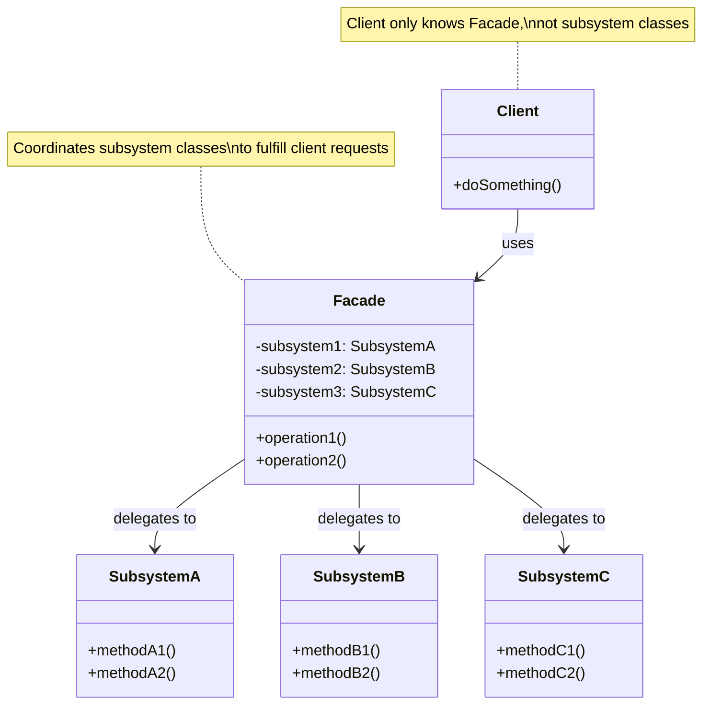
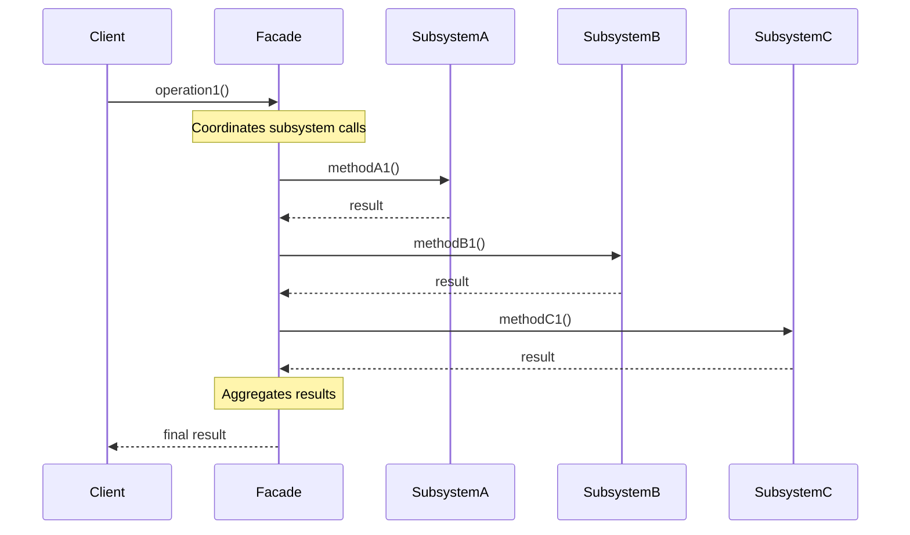

#design-pattern #object-oriented-programming #software-engineering #software-architecture #structural-pattern #java #csharp #typescript #python #api-design #simplification
# Intent
- Provide a ==unified, simplified interface== to a set of interfaces in a subsystem.
- Define a higher-level interface that makes the subsystem easier to use.
- Shield clients from subsystem complexity by providing a simple entry point.
- Facade means the ==front face of a building== $\implies$ presents a simple exterior while hiding complex interior.
# Problem
- Complex subsystems with many interdependent classes are difficult for clients to use.
- Clients must understand internal structure and dependencies of subsystem.
- Tight coupling between clients and subsystem classes makes system fragile.
- Common operations require multiple subsystem calls in specific order.
- Subsystem APIs expose low-level details that clients don't need.
- Code duplication when multiple clients perform same complex operations.
## Without Facade pattern
```Java
// Client must understand and manage complex subsystem
public class VideoConverter {
  public void convertVideo(String filename) {
    // Client must know about all these classes and their interactions
    VideoFile file = new VideoFile(filename);
    Codec codec = CodecFactory.extract(file);

    if (codec instanceof MPEG4CompressionCodec) {
      BitrateReader reader = new BitrateReader(filename, codec);
      AudioMixer mixer = new AudioMixer();

      // Complex interaction with multiple classes
      Buffer buffer = reader.read();
      buffer = mixer.fix(buffer);

      MPEG4CompressionCodec mpeg4 = (MPEG4CompressionCodec) codec;
      mpeg4.compress(buffer);
    } else if (codec instanceof OggCompressionCodec) {
      // Different complex workflow for different codec
      BitrateReader reader = new BitrateReader(filename, codec);
      AudioMixer mixer = new AudioMixer();
      Buffer buffer = reader.read();
      buffer = mixer.fix(buffer);

      OggCompressionCodec ogg = (OggCompressionCodec) codec;
      ogg.compress(buffer);
    }

    // Must know correct order of operations
    // Must handle different cases
    // Lots of boilerplate code
  }
}
```
# Solution
- Create Facade class that provides simple methods for common operations.
- Facade delegates to subsystem classes to perform actual work.
- Clients interact only with Facade, not subsystem classes directly.
- Facade encapsulates complex workflows and dependencies.
- Subsystem classes remain accessible for advanced clients if needed.
## Solution with Facade
```Java
// Facade provides simple interface
public class VideoConversionFacade {
  public File convertVideo(String filename, String format) {
    VideoFile file = new VideoFile(filename);
    Codec codec = CodecFactory.extract(file);

    BitrateReader reader = new BitrateReader(filename, codec);
    AudioMixer mixer = new AudioMixer();

    Buffer buffer = reader.read();
    buffer = mixer.fix(buffer);

    Codec targetCodec = CodecFactory.get(format);
    buffer = targetCodec.compress(buffer);

    return new File(buffer);
  }
}

// Client code is now simple
VideoConversionFacade facade = new VideoConversionFacade();
File mp4 = facade.convertVideo("youtube.ogg", "mp4");
// All complexity hidden behind simple method call
```
# Motivation
- ==Simplification==: Provide simple interface to complex subsystem.
- ==Decoupling==: Reduce dependencies between clients and subsystem classes.
- ==Layering==: Create clear separation between subsystem layers.
- ==Ease of use==: Make subsystem accessible to clients who don't need full power.
- ==Evolution==: Allow subsystem to evolve without affecting clients.
# Application
## Complex library or framework
- Simplify complex third-party library with many classes.
- Provide domain-specific API on top of generic library.
- Hide library-specific details from application code.
## Legacy system integration
- Provide modern interface to legacy code.
- Encapsulate messy legacy APIs behind clean facade.
- Gradual migration by redirecting facade implementation.
## Microservices and APIs
- Aggregate multiple service calls into single API endpoint.
- Provide coarse-grained operations from fine-grained services.
- Backend-for-Frontend (BFF) pattern.
## Subsystem simplification
- Hide complex initialization sequences.
- Provide common workflows as single method calls.
- Reduce learning curve for subsystem usage.
## Testing and mocking
- Provide simple interface that's easy to mock in tests.
- Reduce test dependencies on complex subsystem.
# Structure

# Components
## Facade
- Provides simple, unified interface to subsystem.
- Knows which subsystem classes are responsible for which operations.
- Delegates client requests to appropriate subsystem objects.
- May maintain references to subsystem objects.
- Does not contain business logic $\implies$ only coordinates subsystem calls.
- Optional: multiple facades can exist for different client needs.
## Subsystem Classes
- Implement subsystem functionality with complex interactions.
- Handle work assigned by Facade.
- Have no knowledge of Facade $\implies$ don't reference Facade.
- Can be used directly by clients if needed (Facade is optional).
- May interact with each other to fulfill requests.
## Client
- Uses Facade to access subsystem functionality.
- Avoids direct dependencies on subsystem classes.
- Can still access subsystem directly if needed for advanced operations.
- Benefits from simplified interface for common operations.
# Collaboration

## Execution flow
- Client calls high-level operation on Facade.
- Facade determines which subsystem classes are needed.
- Facade calls subsystem methods in correct order.
- Subsystem classes perform actual work.
- Subsystem classes may interact with each other.
- Facade aggregates results from subsystem calls.
- Facade returns unified result to Client.
- Client remains unaware of subsystem complexity.
# Examples
## Home theater system
- Classic example demonstrating facade for complex home entertainment system.
```Java
// Subsystem classes: complex components
class Amplifier {
  public void on() {
    System.out.println("Amplifier on");
  }

  public void setVolume(int level) {
    System.out.println("Amplifier volume set to " + level);
  }

  public void off() {
    System.out.println("Amplifier off");
  }
}

class DvdPlayer {
  public void on() {
    System.out.println("DVD Player on");
  }

  public void play(String movie) {
    System.out.println("DVD Player playing: " + movie);
  }

  public void stop() {
    System.out.println("DVD Player stopped");
  }

  public void off() {
    System.out.println("DVD Player off");
  }
}

class Projector {
  public void on() {
    System.out.println("Projector on");
  }

  public void wideScreenMode() {
    System.out.println("Projector in widescreen mode");
  }

  public void off() {
    System.out.println("Projector off");
  }
}

class Screen {
  public void down() {
    System.out.println("Screen going down");
  }

  public void up() {
    System.out.println("Screen going up");
  }
}

class TheaterLights {
  public void dim(int level) {
    System.out.println("Theater lights dimmed to " + level + "%");
  }

  public void on() {
    System.out.println("Theater lights on");
  }
}

class PopcornPopper {
  public void on() {
    System.out.println("Popcorn popper on");
  }

  public void pop() {
    System.out.println("Popcorn popping");
  }

  public void off() {
    System.out.println("Popcorn popper off");
  }
}

// Facade: simplified interface
class HomeTheaterFacade {
  private Amplifier amp;
  private DvdPlayer dvd;
  private Projector projector;
  private Screen screen;
  private TheaterLights lights;
  private PopcornPopper popper;

  public HomeTheaterFacade(Amplifier amp, DvdPlayer dvd,
                           Projector projector, Screen screen,
                           TheaterLights lights, PopcornPopper popper) {
    this.amp = amp;
    this.dvd = dvd;
    this.projector = projector;
    this.screen = screen;
    this.lights = lights;
    this.popper = popper;
  }

  // Simple method encapsulates complex workflow
  public void watchMovie(String movie) {
    System.out.println("\n=== Get ready to watch a movie ===");
    popper.on();
    popper.pop();
    lights.dim(10);
    screen.down();
    projector.on();
    projector.wideScreenMode();
    amp.on();
    amp.setVolume(5);
    dvd.on();
    dvd.play(movie);
  }

  public void endMovie() {
    System.out.println("\n=== Shutting movie theater down ===");
    popper.off();
    lights.on();
    screen.up();
    projector.off();
    amp.off();
    dvd.stop();
    dvd.off();
  }
}

// Client code: simple and clean
public class HomeTheaterTest {
  public static void main(String[] args) {
    // Setup
    Amplifier amp = new Amplifier();
    DvdPlayer dvd = new DvdPlayer();
    Projector projector = new Projector();
    Screen screen = new Screen();
    TheaterLights lights = new TheaterLights();
    PopcornPopper popper = new PopcornPopper();

    HomeTheaterFacade theater = new HomeTheaterFacade(
      amp, dvd, projector, screen, lights, popper
    );

    // Usage: complex operations made simple
    theater.watchMovie("Inception");

    // Later...
    theater.endMovie();
  }
}
```
## Computer system startup
- Shows facade for complex computer boot sequence.
```TypeScript
// Subsystem classes
class CPU {
  freeze(): void {
    console.log("CPU: Freezing processor");
  }

  jump(position: number): void {
    console.log(`CPU: Jumping to position ${position}`);
  }

  execute(): void {
    console.log("CPU: Executing instructions");
  }
}

class Memory {
  load(position: number, data: string): void {
    console.log(`Memory: Loading data "${data}" at position ${position}`);
  }
}

class HardDrive {
  read(sector: number, size: number): string {
    console.log(`HardDrive: Reading ${size} bytes from sector ${sector}`);
    return "boot_data";
  }
}

class BIOS {
  initialize(): void {
    console.log("BIOS: Initializing hardware");
  }

  performPowerOnSelfTest(): boolean {
    console.log("BIOS: Running POST (Power-On Self Test)");
    return true;
  }
}

class GraphicsCard {
  initialize(): void {
    console.log("Graphics: Initializing display");
  }

  displayBootScreen(): void {
    console.log("Graphics: Displaying boot screen");
  }
}

// Facade: simplified boot process
class ComputerFacade {
  private cpu: CPU;
  private memory: Memory;
  private hardDrive: HardDrive;
  private bios: BIOS;
  private graphics: GraphicsCard;

  private readonly BOOT_ADDRESS = 0x00;
  private readonly BOOT_SECTOR = 0;
  private readonly SECTOR_SIZE = 512;

  constructor() {
    this.cpu = new CPU();
    this.memory = new Memory();
    this.hardDrive = new HardDrive();
    this.bios = new BIOS();
    this.graphics = new GraphicsCard();
  }

  // Simple method hides complex boot sequence
  start(): void {
    console.log("=== Starting Computer ===\n");

    // Complex initialization sequence
    this.bios.initialize();

    if (!this.bios.performPowerOnSelfTest()) {
      throw new Error("POST failed");
    }

    this.graphics.initialize();
    this.graphics.displayBootScreen();

    this.cpu.freeze();

    const bootData = this.hardDrive.read(
      this.BOOT_SECTOR,
      this.SECTOR_SIZE
    );

    this.memory.load(this.BOOT_ADDRESS, bootData);

    this.cpu.jump(this.BOOT_ADDRESS);
    this.cpu.execute();

    console.log("\n=== Computer Started Successfully ===");
  }
}

// Client usage: simple one-line operation
const computer = new ComputerFacade();
computer.start();
```
## E-commerce order processing
- Demonstrates facade for complex multi-step business process.
```Python
from typing import Dict, List
from datetime import datetime

# Subsystem classes
class InventoryService:
    def check_stock(self, product_id: str, quantity: int) -> bool:
        print(f"[Inventory] Checking stock for {product_id}: {quantity} units")
        return True  # Simplified

    def reserve_items(self, product_id: str, quantity: int) -> str:
        print(f"[Inventory] Reserving {quantity} units of {product_id}")
        return f"RES-{product_id}-001"

    def release_reservation(self, reservation_id: str) -> None:
        print(f"[Inventory] Releasing reservation: {reservation_id}")

    def deduct_stock(self, reservation_id: str) -> None:
        print(f"[Inventory] Deducting stock for reservation: {reservation_id}")

class PaymentService:
    def validate_payment_method(self, payment_info: Dict) -> bool:
        print(f"[Payment] Validating payment method: {payment_info['type']}")
        return True

    def authorize_payment(self, amount: float, payment_info: Dict) -> str:
        print(f"[Payment] Authorizing ${amount} on {payment_info['card_number']}")
        return f"AUTH-{datetime.now().timestamp()}"

    def capture_payment(self, authorization_id: str) -> str:
        print(f"[Payment] Capturing payment: {authorization_id}")
        return f"TXN-{authorization_id}"

    def refund_payment(self, transaction_id: str) -> None:
        print(f"[Payment] Refunding transaction: {transaction_id}")

class ShippingService:
    def calculate_shipping(self, address: Dict, weight: float) -> float:
        print(f"[Shipping] Calculating shipping to {address['city']}")
        return 9.99

    def create_shipment(self, order_id: str, address: Dict) -> str:
        print(f"[Shipping] Creating shipment for order: {order_id}")
        return f"SHIP-{order_id}"

    def schedule_pickup(self, shipment_id: str) -> None:
        print(f"[Shipping] Scheduling pickup for: {shipment_id}")

class NotificationService:
    def send_order_confirmation(self, email: str, order_id: str) -> None:
        print(f"[Notification] Sending order confirmation to {email}")

    def send_shipping_notification(self, email: str, tracking: str) -> None:
        print(f"[Notification] Sending tracking {tracking} to {email}")

    def send_failure_notification(self, email: str, reason: str) -> None:
        print(f"[Notification] Sending failure notice to {email}: {reason}")

class OrderRepository:
    def create_order(self, order_data: Dict) -> str:
        print(f"[Database] Creating order record")
        return f"ORD-{datetime.now().timestamp()}"

    def update_order_status(self, order_id: str, status: str) -> None:
        print(f"[Database] Updating order {order_id} status to: {status}")

# Facade: simplified order processing
class OrderProcessingFacade:
    def __init__(self):
        self.inventory = InventoryService()
        self.payment = PaymentService()
        self.shipping = ShippingService()
        self.notification = NotificationService()
        self.repository = OrderRepository()

    def place_order(self, customer_email: str, product_id: str,
                   quantity: int, payment_info: Dict,
                   shipping_address: Dict) -> Dict:
        """
        Single method that orchestrates complex order process.
        Client doesn't need to know about subsystem interactions.
        """
        print("\n=== Processing Order ===\n")

        try:
            # Step 1: Check inventory
            if not self.inventory.check_stock(product_id, quantity):
                raise Exception("Insufficient stock")

            # Step 2: Reserve items
            reservation = self.inventory.reserve_items(product_id, quantity)

            # Step 3: Validate payment
            if not self.payment.validate_payment_method(payment_info):
                self.inventory.release_reservation(reservation)
                raise Exception("Invalid payment method")

            # Step 4: Calculate costs
            product_price = 29.99  # Simplified
            subtotal = product_price * quantity
            shipping_cost = self.shipping.calculate_shipping(
                shipping_address,
                quantity * 2.0
            )
            total = subtotal + shipping_cost

            # Step 5: Authorize payment
            auth_id = self.payment.authorize_payment(total, payment_info)

            # Step 6: Create order record
            order_id = self.repository.create_order({
                'customer': customer_email,
                'product': product_id,
                'quantity': quantity,
                'total': total
            })

            # Step 7: Capture payment
            transaction_id = self.payment.capture_payment(auth_id)

            # Step 8: Deduct inventory
            self.inventory.deduct_stock(reservation)

            # Step 9: Create shipment
            shipment_id = self.shipping.create_shipment(
                order_id,
                shipping_address
            )
            self.shipping.schedule_pickup(shipment_id)

            # Step 10: Update order status
            self.repository.update_order_status(order_id, "CONFIRMED")

            # Step 11: Send confirmation
            self.notification.send_order_confirmation(customer_email, order_id)
            self.notification.send_shipping_notification(
                customer_email,
                shipment_id
            )

            print(f"\n=== Order {order_id} Completed Successfully ===\n")

            return {
                'success': True,
                'order_id': order_id,
                'total': total,
                'tracking': shipment_id
            }

        except Exception as e:
            print(f"\n=== Order Failed: {e} ===\n")
            self.notification.send_failure_notification(
                customer_email,
                str(e)
            )
            return {
                'success': False,
                'error': str(e)
            }

# Client usage: simple interface to complex process
facade = OrderProcessingFacade()

result = facade.place_order(
    customer_email="customer@example.com",
    product_id="PROD-123",
    quantity=2,
    payment_info={
        'type': 'credit_card',
        'card_number': '**** **** **** 1234'
    },
    shipping_address={
        'street': '123 Main St',
        'city': 'New York',
        'zip': '10001'
    }
)

print(f"Result: {result}")
```
## Database connection management
- Shows facade for complex database operations.
```CSharp
// Subsystem classes
public class DatabaseConnection
{
    public void Open(string connectionString)
    {
        Console.WriteLine($"[DB] Opening connection: {connectionString}");
    }

    public void Close()
    {
        Console.WriteLine("[DB] Closing connection");
    }

    public void BeginTransaction()
    {
        Console.WriteLine("[DB] Beginning transaction");
    }

    public void CommitTransaction()
    {
        Console.WriteLine("[DB] Committing transaction");
    }

    public void RollbackTransaction()
    {
        Console.WriteLine("[DB] Rolling back transaction");
    }
}

public class QueryBuilder
{
    public string BuildSelectQuery(string table, string[] columns, string whereClause)
    {
        string cols = string.Join(", ", columns);
        return $"SELECT {cols} FROM {table} WHERE {whereClause}";
    }

    public string BuildInsertQuery(string table, Dictionary<string, object> values)
    {
        var columns = string.Join(", ", values.Keys);
        var placeholders = string.Join(", ", values.Keys.Select(k => "@" + k));
        return $"INSERT INTO {table} ({columns}) VALUES ({placeholders})";
    }

    public string BuildUpdateQuery(string table, Dictionary<string, object> values,
                                   string whereClause)
    {
        var setClause = string.Join(", ", values.Keys.Select(k => $"{k} = @{k}"));
        return $"UPDATE {table} SET {setClause} WHERE {whereClause}";
    }
}

public class ParameterBinder
{
    public void BindParameters(string query, Dictionary<string, object> parameters)
    {
        Console.WriteLine($"[Binder] Binding {parameters.Count} parameters");
        foreach (var param in parameters)
        {
            Console.WriteLine($"  @{param.Key} = {param.Value}");
        }
    }
}

public class ResultSetMapper
{
    public List<T> MapResults<T>(object resultSet) where T : new()
    {
        Console.WriteLine($"[Mapper] Mapping results to {typeof(T).Name}");
        // Simplified mapping
        return new List<T> { new T() };
    }
}

public class ConnectionPool
{
    public DatabaseConnection GetConnection()
    {
        Console.WriteLine("[Pool] Getting connection from pool");
        return new DatabaseConnection();
    }

    public void ReturnConnection(DatabaseConnection connection)
    {
        Console.WriteLine("[Pool] Returning connection to pool");
    }
}

// Facade: simplified database operations
public class DatabaseFacade
{
    private readonly ConnectionPool pool;
    private readonly QueryBuilder queryBuilder;
    private readonly ParameterBinder binder;
    private readonly ResultSetMapper mapper;
    private readonly string connectionString;

    public DatabaseFacade(string connectionString)
    {
        this.connectionString = connectionString;
        this.pool = new ConnectionPool();
        this.queryBuilder = new QueryBuilder();
        this.binder = new ParameterBinder();
        this.mapper = new ResultSetMapper();
    }

    // Simple query method hides complexity
    public List<T> Query<T>(string table, string[] columns,
                           string whereClause,
                           Dictionary<string, object> parameters) where T : new()
    {
        Console.WriteLine("\n=== Executing Query ===");

        var connection = pool.GetConnection();

        try
        {
            connection.Open(connectionString);

            string query = queryBuilder.BuildSelectQuery(table, columns, whereClause);
            Console.WriteLine($"[Query] {query}");

            binder.BindParameters(query, parameters);

            // Simulate query execution
            var results = mapper.MapResults<T>(new object());

            return results;
        }
        finally
        {
            connection.Close();
            pool.ReturnConnection(connection);
            Console.WriteLine("=== Query Complete ===\n");
        }
    }

    // Simple insert method
    public void Insert(string table, Dictionary<string, object> values)
    {
        Console.WriteLine("\n=== Executing Insert ===");

        var connection = pool.GetConnection();

        try
        {
            connection.Open(connectionString);
            connection.BeginTransaction();

            string query = queryBuilder.BuildInsertQuery(table, values);
            Console.WriteLine($"[Query] {query}");

            binder.BindParameters(query, values);

            connection.CommitTransaction();
            Console.WriteLine("[Success] Record inserted");
        }
        catch (Exception ex)
        {
            connection.RollbackTransaction();
            Console.WriteLine($"[Error] Insert failed: {ex.Message}");
            throw;
        }
        finally
        {
            connection.Close();
            pool.ReturnConnection(connection);
            Console.WriteLine("=== Insert Complete ===\n");
        }
    }
}

// Client usage: simple and clean
class Program
{
    static void Main()
    {
        var db = new DatabaseFacade("Server=localhost;Database=mydb");

        // Query - complex operation made simple
        var users = db.Query<User>(
            table: "users",
            columns: new[] { "id", "name", "email" },
            whereClause: "active = @active",
            parameters: new Dictionary<string, object>
            {
                { "active", true }
            }
        );

        // Insert - complex operation made simple
        db.Insert("users", new Dictionary<string, object>
        {
            { "name", "John Doe" },
            { "email", "john@example.com" },
            { "active", true }
        });
    }
}

class User
{
    public int Id { get; set; }
    public string Name { get; set; }
    public string Email { get; set; }
}
```
# Facade vs Adapter vs Proxy
## Facade pattern
- ==Simplifies== interface to subsystem.
- Provides new, higher-level interface.
- Works with multiple subsystem classes.
- Subsystem can still be used directly.
- Focus: Simplification and convenience.
## Adapter pattern
- ==Converts== one interface to another.
- Makes incompatible interfaces compatible.
- Typically works with single class.
- Wraps existing interface.
- Focus: Interface compatibility.
## Proxy pattern
- ==Controls access== to single object.
- Provides same interface as real object.
- Adds behavior (lazy loading, caching, access control).
- Wraps single object transparently.
- Focus: Access control and lazy initialization.
## Comparison
| Aspect | Facade | Adapter | Proxy |
|--------|--------|---------|-------|
| Purpose | Simplify | Convert interface | Control access |
| Interface | New, simpler | Match target | Same as subject |
| Classes | Multiple subsystem | Single adaptee | Single subject |
| Transparency | Not transparent | Transparent | Transparent |
| Direct access | Allowed | Not applicable | May be restricted |
# Design considerations
## When to use Facade
- Complex subsystem with many interdependent classes.
- Want to provide simple interface for common use cases.
- Need to decouple clients from subsystem implementation.
- Layering system architecture.
- Wrapping poorly designed or legacy APIs.
## Facade granularity
- Create facades for coherent subsystems, not arbitrary class groups.
- Facade should represent meaningful abstraction.
- Avoid god object: split large facade into multiple focused facades.
## Subsystem accessibility
- Facade doesn't prevent direct subsystem access.
- Advanced clients can bypass facade when needed.
- Facade is convenience layer, not enforcement layer.
## Multiple facades
- Different facades can provide different views of same subsystem.
- Layer-specific facades (e.g., admin facade vs user facade).
- Version-specific facades for API evolution.
## Facade evolution
- Facade can evolve without changing subsystem.
- Subsystem can evolve if facade adapts.
- Use facade to isolate clients from subsystem changes.
## Stateless vs stateful
- Prefer stateless facades $\implies$ easier to use and test.
- If state needed, consider whether facade is right pattern.
- Stateful facades may indicate missing abstraction.
# Real world examples
## Web frameworks
- Express.js `app` object: Facade for HTTP server, routing, middleware.
- Laravel `$app`: Facade for various services (database, cache, mail).
- Spring Boot autoconfiguration: Facades for complex configurations.
## API gateways
- Netflix Zuul: Facade aggregating multiple microservices.
- AWS API Gateway: Single entry point for backend services.
- Backend-for-Frontend (BFF): UI-specific facade over multiple services.
## Database libraries
- JDBC: Facade for database-specific drivers.
- Hibernate: Facade over JDBC with object-relational mapping.
- Entity Framework: Facade for database operations in .NET.
## GUI frameworks
- jQuery: Simplified facade over complex DOM API.
- React: Facade abstracting browser differences.
## Build tools
- Maven: Facade over Java build lifecycle.
- Webpack: Facade for module bundling and transformation.
## Cloud SDKs
- AWS SDK: Facade simplifying AWS API calls.
- Azure SDK: Unified interface to Azure services.
## Logging frameworks
- SLF4J: Facade for various logging implementations.
- Commons Logging: Facade pattern for logging.
# Related patterns
## Adapter
- Adapter changes interface to match expected interface.
- Facade creates new simplified interface.
- Both wrap existing code, different purposes.
## Mediator
- Mediator centralizes complex communications.
- Facade simplifies interface to subsystem.
- Mediator colleagues know about mediator, subsystems don't know facade.
## Singleton
- Facade often implemented as singleton.
- Single facade instance provides access to subsystem.
## Abstract Factory
- Facade may use Abstract Factory to create subsystem objects.
- Both provide abstraction over complex creation.
# Advantages
- ==Simplification==: Provides simple interface to complex subsystem.
- ==Loose coupling==: Reduces dependencies between clients and subsystem.
- ==Layering==: Promotes good system architecture with clear layers.
- ==Ease of use==: Makes subsystem more accessible to clients.
- ==Flexibility==: Subsystem can change without affecting clients.
- ==Testing==: Easy to mock facade for testing clients.
- ==Multiple interfaces==: Different facades for different client needs.
# Disadvantages
- ==God object risk==: Facade can become overly complex and know too much.
- ==Limited flexibility==: Facade may not expose all subsystem capabilities.
- ==Indirection==: Adds extra layer that may impact performance slightly.
- ==Maintenance==: Facade must evolve with subsystem changes.
- ==Violation of SRP==: Large facades may have too many responsibilities.
***
# References
1. Design Patterns: Elements of Reusable Object-Oriented Software - Erich Gamma, Richard Helm, Ralph Johnson, and John Vlissides:
	1. Facade pattern.
	2. Intent, motivation, applicability.
2. Head First Design Patterns - Eric Freeman, Elisabeth Robson:
	1. Home theater facade example.
	2. Principle of Least Knowledge.
3. Refactoring Guru:
	1. Facade pattern: https://refactoring.guru/design-patterns/facade
	2. Real-world examples.
4. Patterns of Enterprise Application Architecture - Martin Fowler:
	1. Gateway pattern (similar to Facade).
	2. Service layer as facade.
5. Clean Architecture - Robert C. Martin:
	1. Facade for architectural boundaries.
	2. Interface adapters layer.
6. Building Microservices - Sam Newman:
	1. API Gateway as facade pattern.
	2. Backend-for-Frontend pattern.
