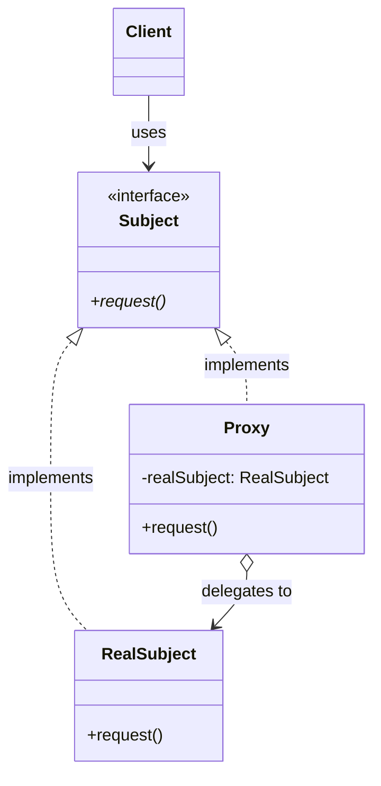
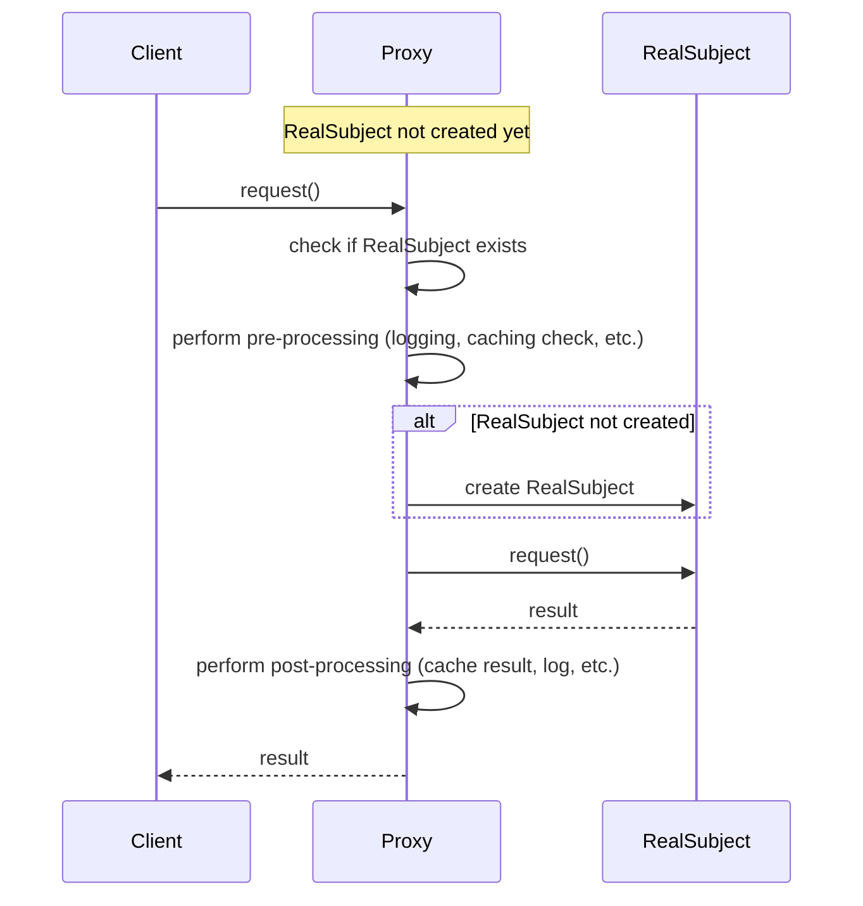

#design-pattern #object-oriented-programming #software-engineering #software-architecture #structural-pattern #computer-network #distributed-system #lazy-initialization #access-control #caching #java #csharp #typescript #python
# Intent
- Provide a ==surrogate or placeholder== for another object to control access to it.
- Act as an intermediary between client and real object $\implies$ adds functionality without modifying the real object.
- Control object creation, access, and lifecycle.
- Defer expensive operations until absolutely necessary.
# Problem
- Direct access to an object may be undesirable or impractical due to:
	- Object is expensive to create and rarely used $\implies$ wasteful to create upfront.
	- Object resides in remote location $\implies$ network communication required.
	- Access control needed $\implies$ different users have different permissions.
	- Additional functionality needed $\implies$ logging, caching, transaction management.
- Modifying the original object is not feasible or violates Single Responsibility Principle.
- Multiple cross-cutting concerns (logging, security, caching) scattered across codebase.
## Without Proxy pattern
```Java
// Client directly accesses expensive resource
public class ImageViewer {
  public void displayImage(String filename) {
    // Always loads image even if never displayed
    HighResolutionImage image = new HighResolutionImage(filename);
    image.display();
  }
}

// Expensive operation happens immediately
public class HighResolutionImage {
  private String filename;
  private byte[] imageData; // Large data

  public HighResolutionImage(String filename) {
    this.filename = filename;
    loadFromDisk(); // Expensive I/O operation
  }

  private void loadFromDisk() {
    System.out.println("Loading " + filename);
    // Simulating expensive disk I/O
    // imageData = Files.readAllBytes(Path.of(filename));
  }

  public void display() {
    System.out.println("Displaying " + filename);
  }
}
```
# Solution
- Introduce Proxy object with same interface as real object.
- Client interacts with Proxy instead of real object.
- Proxy controls access to real object and delegates when appropriate.
- Proxy can add functionality before/after delegation.
- Different proxy types for different purposes: Virtual, Remote, Protection, Cache, Smart Reference.
## Solution with Proxy
```Java
// Subject interface
interface Image {
  void display();
}

// RealSubject: expensive resource
class HighResolutionImage implements Image {
  private String filename;
  private byte[] imageData;

  public HighResolutionImage(String filename) {
    this.filename = filename;
    loadFromDisk(); // Expensive operation
  }

  private void loadFromDisk() {
    System.out.println("Loading " + filename);
    // Load actual image data
  }

  public void display() {
    System.out.println("Displaying " + filename);
  }
}

// Proxy: controls access and defers creation
class ImageProxy implements Image {
  private String filename;
  private HighResolutionImage realImage; // Lazy initialization

  public ImageProxy(String filename) {
    this.filename = filename;
  }

  public void display() {
    if (realImage == null) {
      realImage = new HighResolutionImage(filename); // Create only when needed
    }
    realImage.display();
  }
}

// Client uses proxy transparently
Image image = new ImageProxy("large_photo.jpg"); // No loading yet
// ... later ...
image.display(); // Loading happens now
```
# Motivation
- ==Lazy initialization==: Defer expensive object creation until actually needed.
- ==Access control==: Restrict access based on permissions or conditions.
- ==Remote access==: Hide complexity of network communication.
- ==Resource management==: Control scarce resources (database connections, files).
- ==Caching==: Store results to avoid repeated expensive operations.
- ==Logging and monitoring==: Track object usage without modifying object.
# Application
## Virtual proxy (Lazy initialization)
- Defer creation of expensive objects until first use.
- Example: Large images, videos, documents loaded on demand.
- Placeholder object exists immediately, real object created later.
## Remote proxy
- Represent object in different address space (different process, machine, network).
- Hide network communication details from client.
- Example: RMI (Remote Method Invocation), web service proxies, gRPC stubs.
## Protection proxy
- Control access to object based on access rights.
- Check permissions before delegating to real object.
- Example: Authentication, authorization, role-based access control.
## Cache proxy
- Cache results of expensive operations.
- Return cached results for repeated requests.
- Example: HTTP proxy caches, memoization, query result caching.
## Smart reference proxy
- Perform additional actions when object is accessed.
- Reference counting, logging, locking, copy-on-write.
- Example: Smart pointers in C++, garbage collection optimization.
## Logging proxy
- Log all method calls to real object.
- Track usage patterns, debugging, auditing.
## Transaction proxy
- Manage transactions transparently.
- Begin transaction before method, commit/rollback after.
# Structure

# Components
## Subject
- Defines common interface for RealSubject and Proxy.
- Allows Proxy to be used wherever RealSubject is expected.
- Declares operations that RealSubject implements.
- Client depends only on Subject interface $\implies$ transparent substitution.
## RealSubject
- Defines the real object that Proxy represents.
- Implements actual business logic or resource-intensive operations.
- May reside in different address space (remote proxy).
- May be expensive to create or access.
## Proxy
- Maintains reference to RealSubject $\implies$ controls access to it.
- Implements same interface as RealSubject.
- Performs additional operations before/after delegating to RealSubject.
- Controls RealSubject lifecycle (creation, destruction).
- Types: Virtual, Remote, Protection, Cache, Smart Reference.
## Client
- Works with objects through Subject interface.
- Unaware whether using Proxy or RealSubject.
- No code changes needed to introduce Proxy.
# Collaboration

## Execution flow
- Client calls operation on Proxy through Subject interface.
- Proxy performs pre-processing (check cache, validate permissions, log request).
- Proxy checks if RealSubject exists.
- If RealSubject doesn't exist, Proxy creates it (lazy initialization).
- Proxy delegates operation to RealSubject.
- RealSubject performs actual work and returns result.
- Proxy performs post-processing (cache result, log response, update statistics).
- Proxy returns result to Client.
# Examples
## Virtual Proxy for lazy loading
- This example demonstrates lazy initialization of expensive resources.
```Java
// Subject interface
interface Document {
  void display();
  String getContent();
}

// RealSubject: expensive to load
class RealDocument implements Document {
  private String filename;
  private String content;

  public RealDocument(String filename) {
    this.filename = filename;
    loadFromDisk(); // Expensive operation
  }

  private void loadFromDisk() {
    System.out.println("Loading document: " + filename);
    // Simulate expensive I/O operation
    try {
      Thread.sleep(2000); // Simulate delay
      this.content = "Content of " + filename;
    } catch (InterruptedException e) {
      e.printStackTrace();
    }
  }

  @Override
  public void display() {
    System.out.println("Displaying: " + filename);
  }

  @Override
  public String getContent() {
    return content;
  }
}

// Virtual Proxy: defers loading until needed
class DocumentProxy implements Document {
  private String filename;
  private RealDocument realDocument; // Lazy-loaded

  public DocumentProxy(String filename) {
    this.filename = filename;
    System.out.println("DocumentProxy created for: " + filename);
  }

  private RealDocument getRealDocument() {
    if (realDocument == null) {
      realDocument = new RealDocument(filename);
    }
    return realDocument;
  }

  @Override
  public void display() {
    getRealDocument().display();
  }

  @Override
  public String getContent() {
    return getRealDocument().getContent();
  }
}

// Client usage
public class VirtualProxyDemo {
  public static void main(String[] args) {
    System.out.println("Creating proxies...");
    Document doc1 = new DocumentProxy("report.pdf");
    Document doc2 = new DocumentProxy("presentation.pptx");
    Document doc3 = new DocumentProxy("data.xlsx");

    System.out.println("\nProxies created, no loading yet\n");

    // Only load when actually accessed
    System.out.println("Accessing doc1...");
    doc1.display(); // Loads now
    System.out.println(doc1.getContent()); // Already loaded

    System.out.println("\nAccessing doc2...");
    doc2.display(); // Loads now

    // doc3 never accessed, never loaded
  }
}
```
## Protection Proxy for access control
- This example shows how to control access based on user permissions.
```TypeScript
// Subject interface
interface BankAccount {
  getBalance(): number;
  withdraw(amount: number): void;
  deposit(amount: number): void;
}

// RealSubject
class RealBankAccount implements BankAccount {
  private balance: number;
  private accountNumber: string;

  constructor(accountNumber: string, initialBalance: number) {
    this.accountNumber = accountNumber;
    this.balance = initialBalance;
  }

  getBalance(): number {
    return this.balance;
  }

  withdraw(amount: number): void {
    if (amount > this.balance) {
      throw new Error('Insufficient funds');
    }
    this.balance -= amount;
    console.log(`Withdrew $${amount}. New balance: $${this.balance}`);
  }

  deposit(amount: number): void {
    this.balance += amount;
    console.log(`Deposited $${amount}. New balance: $${this.balance}`);
  }
}

// User with permissions
interface User {
  name: string;
  role: 'owner' | 'viewer' | 'accountant';
}

// Protection Proxy: controls access based on user role
class ProtectedBankAccount implements BankAccount {
  private realAccount: RealBankAccount;
  private user: User;

  constructor(realAccount: RealBankAccount, user: User) {
    this.realAccount = realAccount;
    this.user = user;
  }

  getBalance(): number {
    // All roles can view balance
    console.log(`${this.user.name} (${this.user.role}) viewing balance`);
    return this.realAccount.getBalance();
  }

  withdraw(amount: number): void {
    // Only owner can withdraw
    if (this.user.role !== 'owner') {
      throw new Error(`Access denied: ${this.user.role} cannot withdraw`);
    }
    console.log(`${this.user.name} withdrawing $${amount}`);
    this.realAccount.withdraw(amount);
  }

  deposit(amount: number): void {
    // Owner and accountant can deposit
    if (this.user.role !== 'owner' && this.user.role !== 'accountant') {
      throw new Error(`Access denied: ${this.user.role} cannot deposit`);
    }
    console.log(`${this.user.name} depositing $${amount}`);
    this.realAccount.deposit(amount);
  }
}

// Usage
const account = new RealBankAccount('123456', 1000);

const owner: User = { name: 'Alice', role: 'owner' };
const viewer: User = { name: 'Bob', role: 'viewer' };
const accountant: User = { name: 'Charlie', role: 'accountant' };

// Owner has full access
const ownerProxy = new ProtectedBankAccount(account, owner);
console.log(ownerProxy.getBalance()); // OK
ownerProxy.withdraw(100); // OK
ownerProxy.deposit(50); // OK

// Viewer can only view
const viewerProxy = new ProtectedBankAccount(account, viewer);
console.log(viewerProxy.getBalance()); // OK
// viewerProxy.withdraw(50); // Error: Access denied

// Accountant can view and deposit
const accountantProxy = new ProtectedBankAccount(account, accountant);
accountantProxy.deposit(200); // OK
// accountantProxy.withdraw(100); // Error: Access denied
```
## Cache Proxy for performance optimization
- This example demonstrates caching expensive operations.
```Python
from abc import ABC, abstractmethod
from typing import Dict, Optional
import time

# Subject interface
class DataService(ABC):
    @abstractmethod
    def get_user_data(self, user_id: int) -> Dict:
        pass

    @abstractmethod
    def get_order_history(self, user_id: int) -> list:
        pass

# RealSubject: expensive database operations
class DatabaseService(DataService):
    def get_user_data(self, user_id: int) -> Dict:
        print(f"[DB] Querying user data for user {user_id}...")
        time.sleep(1)  # Simulate slow database query
        return {
            'id': user_id,
            'name': f'User {user_id}',
            'email': f'user{user_id}@example.com'
        }

    def get_order_history(self, user_id: int) -> list:
        print(f"[DB] Querying order history for user {user_id}...")
        time.sleep(1.5)  # Simulate slow database query
        return [
            {'order_id': 1, 'amount': 100},
            {'order_id': 2, 'amount': 200}
        ]

# Cache Proxy: caches results to avoid repeated queries
class CachedDataService(DataService):
    def __init__(self, real_service: DataService, cache_ttl: int = 300):
        self.real_service = real_service
        self.cache_ttl = cache_ttl  # Time to live in seconds
        self.user_cache: Dict[int, tuple] = {}  # {user_id: (data, timestamp)}
        self.order_cache: Dict[int, tuple] = {}  # {user_id: (data, timestamp)}

    def _is_cache_valid(self, timestamp: float) -> bool:
        return (time.time() - timestamp) < self.cache_ttl

    def get_user_data(self, user_id: int) -> Dict:
        # Check cache first
        if user_id in self.user_cache:
            data, timestamp = self.user_cache[user_id]
            if self._is_cache_valid(timestamp):
                print(f"[CACHE HIT] Returning cached user data for user {user_id}")
                return data
            else:
                print(f"[CACHE EXPIRED] Cache expired for user {user_id}")

        # Cache miss or expired - fetch from real service
        print(f"[CACHE MISS] Fetching user data from database")
        data = self.real_service.get_user_data(user_id)

        # Store in cache
        self.user_cache[user_id] = (data, time.time())
        return data

    def get_order_history(self, user_id: int) -> list:
        # Check cache first
        if user_id in self.order_cache:
            data, timestamp = self.order_cache[user_id]
            if self._is_cache_valid(timestamp):
                print(f"[CACHE HIT] Returning cached order history for user {user_id}")
                return data

        # Cache miss - fetch from real service
        print(f"[CACHE MISS] Fetching order history from database")
        data = self.real_service.get_order_history(user_id)

        # Store in cache
        self.order_cache[user_id] = (data, time.time())
        return data

# Usage
if __name__ == '__main__':
    # Create real service and cache proxy
    db_service = DatabaseService()
    cached_service = CachedDataService(db_service, cache_ttl=5)

    print("=== First Request ===")
    user = cached_service.get_user_data(1)  # Cache miss, queries database
    print(f"Result: {user}\n")

    print("=== Second Request (within TTL) ===")
    user = cached_service.get_user_data(1)  # Cache hit, returns immediately
    print(f"Result: {user}\n")

    print("=== Third Request (after TTL) ===")
    time.sleep(6)  # Wait for cache to expire
    user = cached_service.get_user_data(1)  # Cache expired, queries database again
    print(f"Result: {user}\n")

    print("=== Order History ===")
    orders = cached_service.get_order_history(1)  # Cache miss
    print(f"Result: {orders}\n")

    orders = cached_service.get_order_history(1)  # Cache hit
    print(f"Result: {orders}")
```
## Remote Proxy for distributed systems
- This example shows a simplified remote proxy concept.
```CSharp
// Subject interface
public interface IPaymentService
{
    bool ProcessPayment(string cardNumber, decimal amount);
    string GetTransactionStatus(string transactionId);
}

// RealSubject: actual implementation on server
public class RealPaymentService : IPaymentService
{
    public bool ProcessPayment(string cardNumber, decimal amount)
    {
        Console.WriteLine($"[SERVER] Processing payment of ${amount}");
        // Actual payment processing logic
        Thread.Sleep(1000); // Simulate processing time
        return true;
    }

    public string GetTransactionStatus(string transactionId)
    {
        Console.WriteLine($"[SERVER] Getting status for transaction {transactionId}");
        return "Completed";
    }
}

// Remote Proxy: handles network communication
public class RemotePaymentServiceProxy : IPaymentService
{
    private readonly string serverUrl;
    private readonly HttpClient httpClient;

    public RemotePaymentServiceProxy(string serverUrl)
    {
        this.serverUrl = serverUrl;
        this.httpClient = new HttpClient();
    }

    public bool ProcessPayment(string cardNumber, decimal amount)
    {
        Console.WriteLine($"[PROXY] Sending payment request to {serverUrl}");

        // Serialize request
        var request = new
        {
            CardNumber = cardNumber,
            Amount = amount
        };

        // Send HTTP request (simplified)
        try
        {
            // In real scenario: httpClient.PostAsJsonAsync(...)
            Console.WriteLine("[PROXY] Waiting for server response...");
            Thread.Sleep(1500); // Simulate network latency

            // Deserialize response
            Console.WriteLine("[PROXY] Payment processed successfully");
            return true;
        }
        catch (Exception ex)
        {
            Console.WriteLine($"[PROXY] Error: {ex.Message}");
            return false;
        }
    }

    public string GetTransactionStatus(string transactionId)
    {
        Console.WriteLine($"[PROXY] Requesting transaction status from {serverUrl}");

        try
        {
            // In real scenario: httpClient.GetAsync(...)
            Thread.Sleep(500); // Simulate network latency
            return "Completed";
        }
        catch (Exception ex)
        {
            Console.WriteLine($"[PROXY] Error: {ex.Message}");
            return "Unknown";
        }
    }
}

// Smart Proxy: adds logging and retry logic
public class SmartPaymentProxy : IPaymentService
{
    private readonly IPaymentService realService;
    private readonly int maxRetries = 3;

    public SmartPaymentProxy(IPaymentService realService)
    {
        this.realService = realService;
    }

    public bool ProcessPayment(string cardNumber, decimal amount)
    {
        Console.WriteLine($"[SMART PROXY] Logging payment request: ${amount}");

        int attempt = 0;
        while (attempt < maxRetries)
        {
            try
            {
                attempt++;
                Console.WriteLine($"[SMART PROXY] Attempt {attempt}/{maxRetries}");

                bool result = realService.ProcessPayment(cardNumber, amount);

                Console.WriteLine($"[SMART PROXY] Payment result: {result}");
                return result;
            }
            catch (Exception ex)
            {
                Console.WriteLine($"[SMART PROXY] Attempt {attempt} failed: {ex.Message}");
                if (attempt >= maxRetries)
                {
                    Console.WriteLine("[SMART PROXY] Max retries reached");
                    throw;
                }
                Thread.Sleep(1000 * attempt); // Exponential backoff
            }
        }

        return false;
    }

    public string GetTransactionStatus(string transactionId)
    {
        Console.WriteLine($"[SMART PROXY] Getting status for: {transactionId}");
        return realService.GetTransactionStatus(transactionId);
    }
}

// Usage
class Program
{
    static void Main()
    {
        // Remote proxy for distributed system
        IPaymentService remoteProxy = new RemotePaymentServiceProxy("https://payment.api.com");

        // Smart proxy adds retry logic
        IPaymentService smartProxy = new SmartPaymentProxy(remoteProxy);

        // Client uses proxy transparently
        bool success = smartProxy.ProcessPayment("1234-5678-9012-3456", 99.99m);
        Console.WriteLine($"\nPayment successful: {success}");

        string status = smartProxy.GetTransactionStatus("TXN-12345");
        Console.WriteLine($"Transaction status: {status}");
    }
}
```
# Proxy vs Decorator
## Proxy pattern
- ==Controls access== to the object.
- May create object lazily or prevent access entirely.
- Typically manages object lifecycle.
- Same interface as real object $\implies$ transparent substitution.
- Focus: Access control, lazy initialization, remote access.
## Decorator pattern
- ==Adds responsibilities== to the object.
- Always wraps an existing object.
- Object must exist before decoration.
- Can stack multiple decorators.
- Focus: Adding new functionality dynamically.
## Key difference
- Proxy: "I control when and how you access the object".
- Decorator: "I add new behavior to the object".
## Similarities
- Both use composition and implement same interface.
- Both act as wrappers around another object.
- Client code remains unchanged.
# Design considerations
## When to use Proxy
- Object is expensive to create and may not be needed.
- Access control required based on permissions.
- Object resides in different address space.
- Additional operations needed before/after access (logging, caching).
- Resource management needed (connection pooling, reference counting).
## Lazy initialization strategy
- Create RealSubject only when first method is called.
- Use double-checked locking for thread-safety if needed.
- Consider trade-off between memory and initialization cost.
## Thread safety
- Virtual proxy needs synchronization if used in multi-threaded environment.
- Protection proxy may need locking for permission checks.
- Cache proxy requires thread-safe cache implementation.
## Proxy chain
- Multiple proxies can be chained: Client → CacheProxy → LoggingProxy → RemoteProxy → RealSubject.
- Each proxy adds specific functionality.
- Order matters: typically Cache → Security → Logging → Remote.
# Real world examples
## Java standard library
- `java.lang.reflect.Proxy`: Dynamic proxy for interfaces.
- JPA lazy loading: Hibernate uses proxies for lazy associations.
- RMI (Remote Method Invocation): Remote proxies for distributed objects.
## Spring Framework
- AOP proxies: JDK dynamic proxies or CGLIB for method interception.
- Transaction management: `@Transactional` creates proxy with transaction logic.
- Security: Method-level security uses proxies.
## .NET Framework
- `System.Runtime.Remoting.Proxies`: Remoting proxies.
- Entity Framework: Lazy loading with dynamic proxies.
- WCF service proxies: Client-side proxies for web services.
## Web technologies
- HTTP proxies: Forward proxy, reverse proxy (Nginx, Apache).
- Service workers: Act as proxies for web requests.
- GraphQL: Apollo client caching acts as proxy.
## ORM frameworks
- Hibernate: Lazy loading collections and associations.
- Entity Framework: Navigation property lazy loading.
- Django ORM: QuerySet lazy evaluation.
## Design tools
- Virtual proxies for large images in graphics editors.
- Document proxies in office applications for memory management.
# Related patterns
## Decorator
- Both wrap objects, but Decorator adds functionality, Proxy controls access.
- Proxy may prevent access, Decorator always delegates.
## Adapter
- Adapter changes interface, Proxy keeps same interface.
- Adapter makes incompatible interfaces work together.
## Facade
- Facade provides simplified interface to subsystem.
- Proxy provides same interface with controlled access.
## Singleton
- Virtual proxy can ensure only one instance created (lazy singleton).
- Protection proxy can implement singleton access control.
# Advantages
- ==Lazy initialization==: Defer expensive object creation until needed.
- ==Access control==: Centralized permission checking and security.
- ==Separation of concerns==: Cross-cutting concerns separated from business logic.
- ==Transparency==: Client unaware of proxy existence.
- ==Open-Closed Principle==: Add new proxies without modifying client or RealSubject.
- ==Performance==: Caching reduces repeated expensive operations.
- ==Remote access==: Hide network complexity from client.
- ==Resource management==: Control access to scarce resources.
# Disadvantages
- ==Complexity==: Additional layer of indirection.
- ==Performance overhead==: Extra method call for each operation.
- ==Response time==: May increase latency for first access (lazy loading).
- ==Memory overhead==: Proxy object consumes memory.
- ==Debugging difficulty==: Extra layer makes debugging more complex.
***
# References
1. Design Patterns: Elements of Reusable Object-Oriented Software - Erich Gamma, Richard Helm, Ralph Johnson, and John Vlissides:
	1. Proxy pattern.
	2. Virtual proxy, remote proxy, protection proxy.
2. Patterns of Enterprise Application Architecture - Martin Fowler:
	1. Lazy Load pattern.
	2. Remote Facade pattern.
3. Head First Design Patterns - Eric Freeman, Elisabeth Robson:
	1. Proxy pattern with virtual proxy example.
4. Refactoring Guru:
	1. Proxy pattern: https://refactoring.guru/design-patterns/proxy
5. Java Documentation:
	1. `java.lang.reflect.Proxy`: Dynamic proxy API.
	2. RMI documentation.
6. Spring Framework Documentation:
	1. AOP proxies.
	2. Transaction management with proxies.
