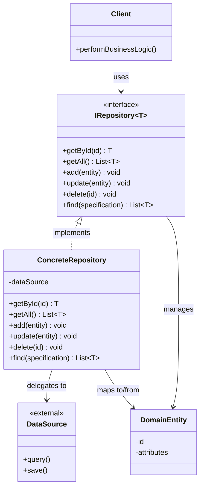
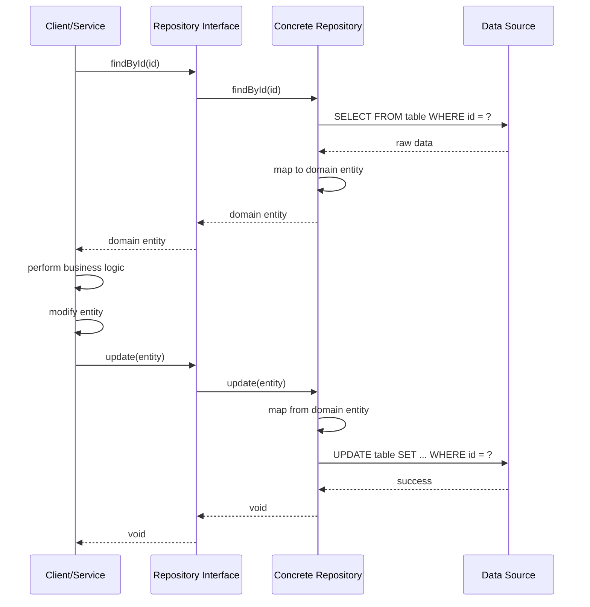

#enterprise-pattern #design-pattern #software-architecture #software-engineering #domain-driven-design #data-access #object-relational-mapping  #dbms #database #java #csharp #typescript #spring-framework #csharp 
#entity-framework
# Intent
- Mediate between the domain and data mapping layers using a ==collection-like interface== for accessing domain objects.
- Encapsulate the logic required to access data sources $\implies$ centralize common data access functionality.
- Provide a ==domain-oriented== abstraction over data access $\implies$ clients work with domain concepts, not database concepts.
- Decouple business logic from data access concerns.
# Problem
- Domain logic scattered across data access code makes it hard to understand business rules.
- Direct database access in business logic creates tight coupling to persistence infrastructure.
- Duplicated queries and data access logic across multiple places.
- Testing business logic requires complex database setup and fixtures.
- Switching between different data sources requires changing business logic code.
- SQL queries mixed with business logic violates separation of concerns.
## Without Repository pattern
```Java
// Business logic mixed with data access
public class OrderService {
  private Connection connection;

  public Order getOrderById(Long id) {
    // SQL query in business logic
    String sql = "SELECT * FROM orders WHERE id = ?";
    try (PreparedStatement stmt = connection.prepareStatement(sql)) {
      stmt.setLong(1, id);
      ResultSet rs = stmt.executeQuery();
      if (rs.next()) {
        // Manual object mapping
        Order order = new Order();
        order.setId(rs.getLong("id"));
        order.setCustomerId(rs.getLong("customer_id"));
        order.setTotal(rs.getBigDecimal("total"));
        return order;
      }
    } catch (SQLException e) {
      throw new RuntimeException(e);
    }
    return null;
  }

  // Duplicated data access logic
  public List<Order> getOrdersByCustomer(Long customerId) {
    // Same mapping logic repeated
    String sql = "SELECT * FROM orders WHERE customer_id = ?";
    // ... duplicated code
  }
}
```
# Solution
- Introduce Repository objects that encapsulate data access logic.
- Repository provides a ==collection-like interface== (add, remove, find) for domain objects.
- Business logic works with domain objects through Repository interface.
- Repository translates domain queries into data source queries.
- Multiple implementations of Repository interface support different data sources.
# Motivation
- ==Separation of concerns==: Domain logic focuses on business rules, not database operations.
- ==Testability==: Business logic can be tested with in-memory Repository implementations.
- ==Flexibility==: Easy to switch between different data sources (SQL, NoSQL, in-memory, web services).
- ==Maintainability==: Centralized data access logic is easier to maintain and modify.
- ==Domain-driven design==: Repository aligns with DDD principles by using domain language.
# Application
## Domain-driven design
- Align data access with domain model $\implies$ use domain terminology, not database terminology.
- Aggregate roots are accessed through Repositories.
- Repository interface defined in domain layer, implementation in infrastructure layer.
## Complex querying
- Encapsulate complex queries behind simple Repository methods.
- Hide query construction details from business logic.
- Support specification pattern for dynamic query building.
## Multiple data sources
- Abstract away differences between SQL databases, NoSQL, caching layers, external APIs.
- Switch implementations without changing business logic.
## Testing strategy
- Provide in-memory implementations for unit testing.
- Avoid database dependencies in fast unit tests.
- Use real implementations only in integration tests.
## Caching layer
- Repository can implement caching transparently.
- Business logic remains unaware of caching strategy.
# Structure

# Components
## Repository Interface
- Defines contract for data access operations using domain terminology.
- Typically defined in domain layer or application layer.
- Uses domain objects as parameters and return types.
- Methods represent domain operations: `findActiveOrders()`, `getUsersByRole()`.
- ==Collection-like interface==: `add()`, `remove()`, `findById()`, `findAll()`.
## Concrete Repository
- Implements Repository interface with specific data access technology.
- Located in infrastructure layer or data access layer.
- Translates domain operations into data source operations (SQL queries, NoSQL operations, API calls).
- Handles object-relational mapping or data transformation.
- May use ORM frameworks (Hibernate, Entity Framework), query builders, or raw queries.
## Domain Entity
- Business object managed by Repository.
- Represents core domain concept (Customer, Order, Product).
- Contains business logic and invariants.
- Independent of persistence concerns (no database annotations in pure DDD).
## Specification
- Optional component for dynamic query building.
- Encapsulates query criteria as objects.
- Allows composing complex queries from simple specifications.
- Supports `and()`, `or()`, `not()` operations.
## Unit of Work
- Often used together with Repository pattern.
- Maintains list of objects affected by business transaction.
- Coordinates writing changes and resolving concurrency problems.
# Collaboration

## Execution flow
- Client requests domain entity from Repository using domain language.
- Repository interface delegates to Concrete Repository implementation.
- Concrete Repository translates request into data source query.
- Data source returns raw data (database rows, JSON, XML).
- Concrete Repository maps raw data to domain entity.
- Domain entity returned to client through Repository interface.
- Client performs business logic using domain entity.
- Client requests Repository to persist changes.
- Concrete Repository translates domain entity to data source format.
- Data source persists changes.
# Examples
## Basic Repository implementation in Java
- This example demonstrates a simple Repository for managing User entities with Spring Data JPA.
```Java
// Domain Entity
public class User {
  private Long id;
  private String username;
  private String email;
  private UserRole role;
  private boolean active;

  // Constructors, getters, setters, business logic

  public void deactivate() {
    this.active = false;
  }

  public boolean canAccessAdminPanel() {
    return this.role == UserRole.ADMIN && this.active;
  }
}

// Repository Interface (domain layer)
public interface UserRepository {
  User findById(Long id);
  List<User> findAll();
  List<User> findByRole(UserRole role);
  List<User> findActiveUsers();
  void save(User user);
  void delete(Long id);
}

// Concrete Repository Implementation (infrastructure layer)
@Repository
public class JpaUserRepository implements UserRepository {

  @PersistenceContext
  private EntityManager entityManager;

  @Override
  public User findById(Long id) {
    return entityManager.find(User.class, id);
  }

  @Override
  public List<User> findAll() {
    return entityManager
      .createQuery("SELECT u FROM User u", User.class)
      .getResultList();
  }

  @Override
  public List<User> findByRole(UserRole role) {
    return entityManager
      .createQuery("SELECT u FROM User u WHERE u.role = :role", User.class)
      .setParameter("role", role)
      .getResultList();
  }

  @Override
  public List<User> findActiveUsers() {
    return entityManager
      .createQuery("SELECT u FROM User u WHERE u.active = true", User.class)
      .getResultList();
  }

  @Override
  @Transactional
  public void save(User user) {
    if (user.getId() == null) {
      entityManager.persist(user);
    } else {
      entityManager.merge(user);
    }
  }

  @Override
  @Transactional
  public void delete(Long id) {
    User user = findById(id);
    if (user != null) {
      entityManager.remove(user);
    }
  }
}

// Service using Repository (application layer)
@Service
public class UserService {

  private final UserRepository userRepository;

  @Autowired
  public UserService(UserRepository userRepository) {
    this.userRepository = userRepository;
  }

  public void deactivateUser(Long userId) {
    // Clean business logic without database concerns
    User user = userRepository.findById(userId);
    if (user != null) {
      user.deactivate();
      userRepository.save(user);
    }
  }

  public List<User> getAdminUsers() {
    return userRepository.findByRole(UserRole.ADMIN);
  }
}
```
## Generic Repository with Specification pattern
- This example shows a generic Repository base class with the Specification pattern for flexible querying.
```Java
// Specification interface
public interface Specification<T> {
  boolean isSatisfiedBy(T entity);
  Predicate toPredicate(Root<T> root, CriteriaQuery<?> query, CriteriaBuilder cb);
}

// Example specification
public class ActiveUserSpecification implements Specification<User> {

  @Override
  public boolean isSatisfiedBy(User entity) {
    return entity.isActive();
  }

  @Override
  public Predicate toPredicate(Root<User> root, CriteriaQuery<?> query,
                                CriteriaBuilder cb) {
    return cb.isTrue(root.get("active"));
  }
}

// Generic Repository interface
public interface Repository<T, ID> {
  T findById(ID id);
  List<T> findAll();
  List<T> find(Specification<T> specification);
  void save(T entity);
  void delete(ID id);
}

// Generic Repository implementation
public abstract class JpaRepository<T, ID> implements Repository<T, ID> {

  @PersistenceContext
  protected EntityManager entityManager;

  private final Class<T> entityClass;

  public JpaRepository(Class<T> entityClass) {
    this.entityClass = entityClass;
  }

  @Override
  public T findById(ID id) {
    return entityManager.find(entityClass, id);
  }

  @Override
  public List<T> findAll() {
    CriteriaBuilder cb = entityManager.getCriteriaBuilder();
    CriteriaQuery<T> query = cb.createQuery(entityClass);
    Root<T> root = query.from(entityClass);
    query.select(root);
    return entityManager.createQuery(query).getResultList();
  }

  @Override
  public List<T> find(Specification<T> specification) {
    CriteriaBuilder cb = entityManager.getCriteriaBuilder();
    CriteriaQuery<T> query = cb.createQuery(entityClass);
    Root<T> root = query.from(entityClass);

    Predicate predicate = specification.toPredicate(root, query, cb);
    query.where(predicate);

    return entityManager.createQuery(query).getResultList();
  }

  @Override
  @Transactional
  public void save(T entity) {
    entityManager.merge(entity);
  }

  @Override
  @Transactional
  public void delete(ID id) {
    T entity = findById(id);
    if (entity != null) {
      entityManager.remove(entity);
    }
  }
}

// Specific Repository extending generic base
@Repository
public class UserJpaRepository extends JpaRepository<User, Long>
    implements UserRepository {

  public UserJpaRepository() {
    super(User.class);
  }

  @Override
  public List<User> findActiveUsers() {
    return find(new ActiveUserSpecification());
  }

  @Override
  public List<User> findByRole(UserRole role) {
    return find(new UserRoleSpecification(role));
  }
}
```
## TypeScript Repository with MongoDB
- This example demonstrates Repository pattern with NoSQL database using TypeScript and MongoDB.
```TypeScript
// Domain Entity
interface User {
  id?: string;
  username: string;
  email: string;
  role: UserRole;
  active: boolean;
  createdAt: Date;
}

enum UserRole {
  ADMIN = 'ADMIN',
  USER = 'USER',
  GUEST = 'GUEST'
}

// Repository Interface
interface IUserRepository {
  findById(id: string): Promise<User | null>;
  findAll(): Promise<User[]>;
  findByEmail(email: string): Promise<User | null>;
  findByRole(role: UserRole): Promise<User[]>;
  findActiveUsers(): Promise<User[]>;
  save(user: User): Promise<User>;
  delete(id: string): Promise<void>;
}

// MongoDB implementation
import { Collection, MongoClient, ObjectId } from 'mongodb';

class MongoUserRepository implements IUserRepository {
  private collection: Collection;

  constructor(client: MongoClient, dbName: string) {
    this.collection = client.db(dbName).collection('users');
  }

  async findById(id: string): Promise<User | null> {
    const doc = await this.collection.findOne({ _id: new ObjectId(id) });
    return doc ? this.mapToEntity(doc) : null;
  }

  async findAll(): Promise<User[]> {
    const docs = await this.collection.find({}).toArray();
    return docs.map(doc => this.mapToEntity(doc));
  }

  async findByEmail(email: string): Promise<User | null> {
    const doc = await this.collection.findOne({ email });
    return doc ? this.mapToEntity(doc) : null;
  }

  async findByRole(role: UserRole): Promise<User[]> {
    const docs = await this.collection.find({ role }).toArray();
    return docs.map(doc => this.mapToEntity(doc));
  }

  async findActiveUsers(): Promise<User[]> {
    const docs = await this.collection.find({ active: true }).toArray();
    return docs.map(doc => this.mapToEntity(doc));
  }

  async save(user: User): Promise<User> {
    if (user.id) {
      // Update existing
      const { id, ...userData } = user;
      await this.collection.updateOne(
        { _id: new ObjectId(id) },
        { $set: userData }
      );
      return user;
    } else {
      // Create new
      const result = await this.collection.insertOne(user);
      return { ...user, id: result.insertedId.toString() };
    }
  }

  async delete(id: string): Promise<void> {
    await this.collection.deleteOne({ _id: new ObjectId(id) });
  }

  private mapToEntity(doc: any): User {
    return {
      id: doc._id.toString(),
      username: doc.username,
      email: doc.email,
      role: doc.role,
      active: doc.active,
      createdAt: doc.createdAt
    };
  }
}

// In-memory implementation for testing
class InMemoryUserRepository implements IUserRepository {
  private users: Map<string, User> = new Map();
  private idCounter = 1;

  async findById(id: string): Promise<User | null> {
    return this.users.get(id) || null;
  }

  async findAll(): Promise<User[]> {
    return Array.from(this.users.values());
  }

  async findByEmail(email: string): Promise<User | null> {
    return Array.from(this.users.values())
      .find(u => u.email === email) || null;
  }

  async findByRole(role: UserRole): Promise<User[]> {
    return Array.from(this.users.values())
      .filter(u => u.role === role);
  }

  async findActiveUsers(): Promise<User[]> {
    return Array.from(this.users.values())
      .filter(u => u.active);
  }

  async save(user: User): Promise<User> {
    if (!user.id) {
      user.id = (this.idCounter++).toString();
    }
    this.users.set(user.id, { ...user });
    return user;
  }

  async delete(id: string): Promise<void> {
    this.users.delete(id);
  }
}

// Service using Repository
class UserService {
  constructor(private userRepository: IUserRepository) {}

  async registerUser(username: string, email: string): Promise<User> {
    // Business logic without database concerns
    const existingUser = await this.userRepository.findByEmail(email);
    if (existingUser) {
      throw new Error('Email already registered');
    }

    const user: User = {
      username,
      email,
      role: UserRole.USER,
      active: true,
      createdAt: new Date()
    };

    return await this.userRepository.save(user);
  }

  async promoteToAdmin(userId: string): Promise<void> {
    const user = await this.userRepository.findById(userId);
    if (!user) {
      throw new Error('User not found');
    }

    user.role = UserRole.ADMIN;
    await this.userRepository.save(user);
  }
}

// Usage
const mongoClient = new MongoClient('mongodb://localhost:27017');
const repository = new MongoUserRepository(mongoClient, 'myapp');
const service = new UserService(repository);

// For testing, use in-memory implementation
const testRepository = new InMemoryUserRepository();
const testService = new UserService(testRepository);
```
## C# Repository with Entity Framework
- This example shows Repository pattern implementation in C# with Entity Framework Core.
```CSharp
// Domain Entity
public class Order
{
    public long Id { get; set; }
    public long CustomerId { get; set; }
    public DateTime OrderDate { get; set; }
    public decimal TotalAmount { get; set; }
    public OrderStatus Status { get; set; }
    public List<OrderItem> Items { get; set; }

    // Business logic
    public void AddItem(OrderItem item)
    {
        if (Status != OrderStatus.Draft)
            throw new InvalidOperationException("Cannot modify submitted order");

        Items.Add(item);
        RecalculateTotal();
    }

    public void Submit()
    {
        if (Items.Count == 0)
            throw new InvalidOperationException("Cannot submit empty order");

        Status = OrderStatus.Submitted;
        OrderDate = DateTime.UtcNow;
    }

    private void RecalculateTotal()
    {
        TotalAmount = Items.Sum(i => i.Price * i.Quantity);
    }
}

public enum OrderStatus
{
    Draft,
    Submitted,
    Processing,
    Shipped,
    Delivered,
    Cancelled
}

// Repository Interface
public interface IOrderRepository
{
    Task<Order> GetByIdAsync(long id);
    Task<IEnumerable<Order>> GetAllAsync();
    Task<IEnumerable<Order>> GetByCustomerAsync(long customerId);
    Task<IEnumerable<Order>> GetByStatusAsync(OrderStatus status);
    Task<IEnumerable<Order>> GetOrdersInDateRangeAsync(DateTime start, DateTime end);
    Task AddAsync(Order order);
    Task UpdateAsync(Order order);
    Task DeleteAsync(long id);
}

// Concrete Repository with Entity Framework
public class EfOrderRepository : IOrderRepository
{
    private readonly ApplicationDbContext _context;

    public EfOrderRepository(ApplicationDbContext context)
    {
        _context = context;
    }

    public async Task<Order> GetByIdAsync(long id)
    {
        return await _context.Orders
            .Include(o => o.Items)
            .FirstOrDefaultAsync(o => o.Id == id);
    }

    public async Task<IEnumerable<Order>> GetAllAsync()
    {
        return await _context.Orders
            .Include(o => o.Items)
            .ToListAsync();
    }

    public async Task<IEnumerable<Order>> GetByCustomerAsync(long customerId)
    {
        return await _context.Orders
            .Include(o => o.Items)
            .Where(o => o.CustomerId == customerId)
            .OrderByDescending(o => o.OrderDate)
            .ToListAsync();
    }

    public async Task<IEnumerable<Order>> GetByStatusAsync(OrderStatus status)
    {
        return await _context.Orders
            .Include(o => o.Items)
            .Where(o => o.Status == status)
            .ToListAsync();
    }

    public async Task<IEnumerable<Order>> GetOrdersInDateRangeAsync(
        DateTime start, DateTime end)
    {
        return await _context.Orders
            .Include(o => o.Items)
            .Where(o => o.OrderDate >= start && o.OrderDate <= end)
            .ToListAsync();
    }

    public async Task AddAsync(Order order)
    {
        await _context.Orders.AddAsync(order);
        await _context.SaveChangesAsync();
    }

    public async Task UpdateAsync(Order order)
    {
        _context.Orders.Update(order);
        await _context.SaveChangesAsync();
    }

    public async Task DeleteAsync(long id)
    {
        var order = await GetByIdAsync(id);
        if (order != null)
        {
            _context.Orders.Remove(order);
            await _context.SaveChangesAsync();
        }
    }
}

// Service using Repository
public class OrderService
{
    private readonly IOrderRepository _orderRepository;

    public OrderService(IOrderRepository orderRepository)
    {
        _orderRepository = orderRepository;
    }

    public async Task<Order> CreateOrderAsync(long customerId)
    {
        var order = new Order
        {
            CustomerId = customerId,
            Status = OrderStatus.Draft,
            Items = new List<OrderItem>()
        };

        await _orderRepository.AddAsync(order);
        return order;
    }

    public async Task AddItemToOrderAsync(long orderId, OrderItem item)
    {
        var order = await _orderRepository.GetByIdAsync(orderId);
        if (order == null)
            throw new ArgumentException("Order not found");

        order.AddItem(item); // Business logic in entity
        await _orderRepository.UpdateAsync(order);
    }

    public async Task SubmitOrderAsync(long orderId)
    {
        var order = await _orderRepository.GetByIdAsync(orderId);
        if (order == null)
            throw new ArgumentException("Order not found");

        order.Submit(); // Business logic in entity
        await _orderRepository.UpdateAsync(order);
    }

    public async Task<IEnumerable<Order>> GetCustomerOrderHistoryAsync(long customerId)
    {
        return await _orderRepository.GetByCustomerAsync(customerId);
    }
}
```
# Repository vs Data Access Object (DAO)
## Repository pattern
- ==Domain-centric==: Uses domain language and domain objects.
- ==Collection-oriented==: Provides collection-like interface (add, remove, find).
- Part of Domain-Driven Design $\implies$ repository per aggregate root.
- Focused on domain model persistence.
- Typically coarse-grained operations aligned with business use cases.
- Interface defined in domain layer, implementation in infrastructure layer.
## DAO pattern
- ==Data-centric==: Uses database terminology and table-oriented operations.
- ==CRUD-oriented==: Provides create, read, update, delete operations.
- One DAO per database table or view.
- Focused on data access abstraction.
- Typically fine-grained operations matching database structure.
- Both interface and implementation in data access layer.
## Key differences
- Repository: "Get all active customers" $\implies$ domain language.
- DAO: "Select from customer table where status = 1" $\implies$ database language.
- Repository manages aggregate roots, DAO manages tables.
- Repository may use multiple DAOs internally to load aggregate.
# Design considerations
## Interface design
- Define Repository interface in domain layer using ==ubiquitous language==.
- Methods should reflect business operations, not database operations.
- Return domain objects, not data transfer objects or database entities.
- Use meaningful method names: `findOverdueOrders()` instead of `findByDateLessThan()`.
## Granularity
- Create Repository per ==aggregate root==, not per entity.
- Aggregate root manages its internal entities $\implies$ no separate repositories for child entities.
- Example: `OrderRepository` manages both `Order` and `OrderItem`, no `OrderItemRepository`.
## Query flexibility
- Balance between specific query methods and generic query capabilities.
- Specific methods: `findActiveCustomers()`, `findOrdersByDateRange()`.
- Generic approach: Use Specification pattern, LINQ, or query objects.
- Avoid query methods explosion $\implies$ use specifications for complex queries.
## Transaction management
- Repository should not manage transactions.
- Use Unit of Work pattern to coordinate transactions across multiple repositories.
- Let application layer or service layer control transaction boundaries.
## Caching strategy
- Repository can implement caching internally.
- Cache at Repository level $\implies$ transparent to clients.
- Consider cache invalidation strategy when implementing updates.
## Testing
- Provide in-memory implementation for unit tests.
- Use real implementation only in integration tests.
- Mock or stub Repository interface in service tests.
# Repository pattern in frameworks
## Spring Data JPA
- Provides Repository abstraction out of the box.
- `CrudRepository` interface with basic CRUD operations.
- `JpaRepository` extends with JPA-specific operations.
- Query derivation from method names: `findByEmailAndActiveTrue()`.
- Custom queries with `@Query` annotation.
```Java
public interface UserRepository extends JpaRepository<User, Long> {
  List<User> findByRole(UserRole role);

  @Query("SELECT u FROM User u WHERE u.active = true AND u.createdAt > :date")
  List<User> findRecentActiveUsers(@Param("date") LocalDateTime date);
}
```
## Entity Framework Core
- `DbContext` acts as Unit of Work and Repository combined.
- `DbSet<T>` provides collection-like interface.
- LINQ for query composition.
- Can wrap DbContext with custom Repository for additional abstraction.
```CSharp
public class ApplicationDbContext : DbContext
{
    public DbSet<User> Users { get; set; }
    public DbSet<Order> Orders { get; set; }
}

// Custom repository wrapper
public class EfRepository<T> : IRepository<T> where T : class
{
    private readonly DbContext _context;
    private readonly DbSet<T> _dbSet;

    public EfRepository(DbContext context)
    {
        _context = context;
        _dbSet = context.Set<T>();
    }

    public IQueryable<T> Query() => _dbSet.AsQueryable();
    // ... other methods
}
```
## TypeORM (TypeScript)
- Repository pattern built into ORM.
- `Repository<Entity>` class provides data access methods.
- Custom repositories extend base repository.
```TypeScript
@EntityRepository(User)
export class UserRepository extends Repository<User> {
  findActiveUsers(): Promise<User[]> {
    return this.find({ where: { active: true } });
  }

  findByEmail(email: string): Promise<User | undefined> {
    return this.findOne({ where: { email } });
  }
}
```
# Real world examples
## E-commerce platforms
- `OrderRepository`: Manages orders and order items as aggregate.
- `ProductRepository`: Manages products and inventory.
- `CustomerRepository`: Manages customer data and preferences.
## Content management systems
- `ArticleRepository`: Manages articles, comments, tags.
- `MediaRepository`: Manages images, videos, attachments.
- `UserRepository`: Manages users, roles, permissions.
## Banking systems
- `AccountRepository`: Manages bank accounts and transactions.
- `CustomerRepository`: Manages customer profiles and KYC data.
- `TransactionRepository`: Manages financial transactions.
## Healthcare systems
- `PatientRepository`: Manages patient records and medical history.
- `AppointmentRepository`: Manages appointments and schedules.
- `PrescriptionRepository`: Manages prescriptions and medications.
## Enterprise applications
- Spring Framework: Core data access abstraction.
- ASP.NET Core: Repository pattern over Entity Framework.
- Django ORM: Model managers act as repositories.
- Ruby on Rails: ActiveRecord repositories.
# Related patterns
## Unit of Work
- Often used together with Repository.
- Coordinates changes across multiple repositories.
- Maintains transaction boundary and change tracking.
- Repositories register changes, Unit of Work commits them.
## Specification
- Encapsulates query criteria as objects.
- Allows building complex queries compositionally.
- Repository uses specifications to filter results.
## Data Mapper
- Repository often uses Data Mapper internally.
- Data Mapper handles object-relational mapping.
- Repository provides collection interface, Data Mapper handles persistence.
## Factory
- Factory pattern can create Repository instances.
- Abstract Factory creates repository families for different data sources.
## Strategy
- Different Repository implementations represent different strategies.
- Strategy pattern for selecting appropriate implementation.
# Advantages
- ==Separation of concerns==: Domain logic separated from data access logic.
- ==Testability==: Easy to test business logic with in-memory repositories.
- ==Flexibility==: Easy to switch between data sources without changing business logic.
- ==Centralization==: Data access logic centralized in one place.
- ==Domain-oriented==: Uses domain language instead of database language.
- ==Maintainability==: Changes to data access isolated from business logic.
- ==Reusability==: Common queries defined once and reused across application.
- ==Abstraction==: Hides persistence infrastructure from domain layer.
# Disadvantages
- ==Abstraction overhead==: Additional layer between business logic and database.
- ==Potential duplication==: Similar methods across different repositories.
- ==Query limitations==: Generic interface may not support all query capabilities.
- ==Learning curve==: Requires understanding of pattern and best practices.
- ==Over-abstraction risk==: May hide too much, making optimization difficult.
- ==Performance concerns==: Abstraction may introduce performance overhead if not implemented carefully.
***
# References
1. Patterns of Enterprise Application Architecture - Martin Fowler:
	1. Repository pattern.
	2. Data Mapper pattern.
	3. Unit of Work pattern.
2. Domain-Driven Design: Tackling Complexity in the Heart of Software - Eric Evans:
	1. Repository as part of DDD.
	2. Aggregate roots and repositories.
3. Implementing Domain-Driven Design - Vaughn Vernon:
	1. Repository implementation strategies.
	2. Repository and aggregate design.
4. Microsoft .NET Documentation:
	1. Repository pattern in ASP.NET Core.
	2. https://docs.microsoft.com/en-us/dotnet/architecture/microservices/microservice-ddd-cqrs-patterns/infrastructure-persistence-layer-design
5. Spring Data JPA Documentation:
	1. Repository abstraction.
	2. https://spring.io/projects/spring-data-jpa
6. Entity Framework Core Documentation:
	1. DbContext and repositories.
	2. https://docs.microsoft.com/en-us/ef/core/
