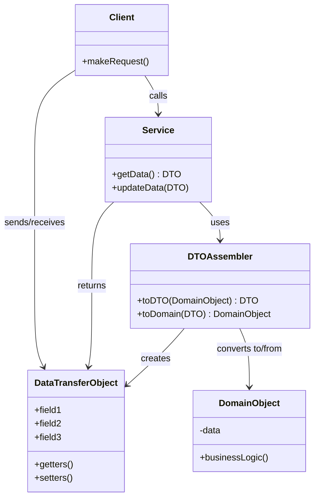
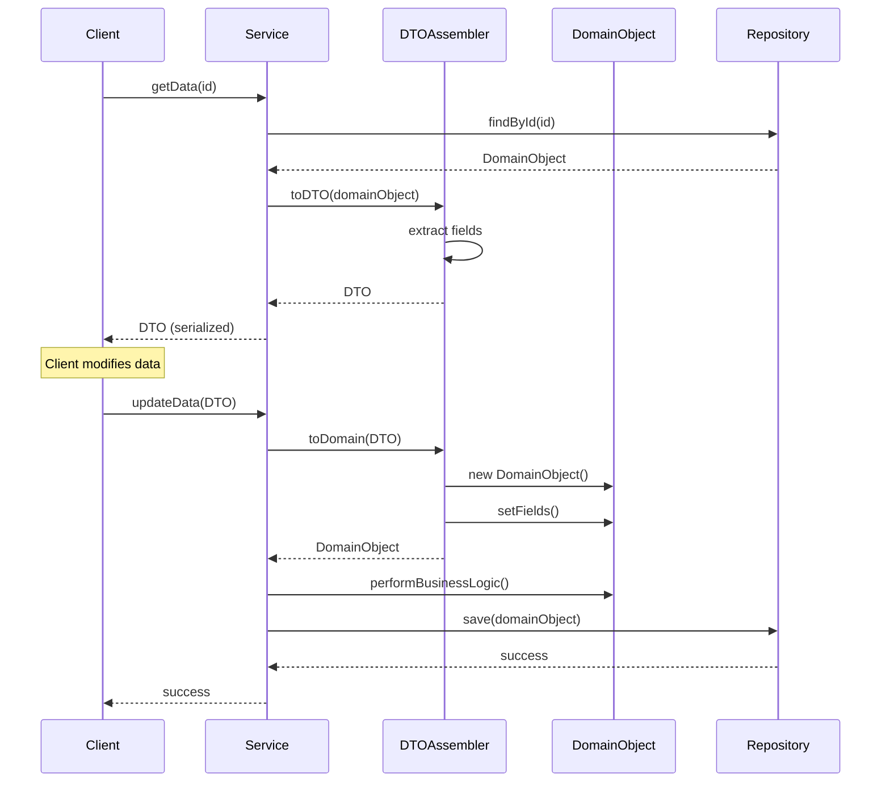

#enterprise-pattern #design-pattern #software-architecture #software-engineering #distributed-system #serialization #network-programming #web-service #java #csharp #typescript #python 
# Intent
- Transfer data between processes or layers using a ==simple serializable object== that carries multiple data fields.
- Reduce the number of remote calls by ==batching multiple data items== into a single transfer.
- Encapsulate serialization logic and separate data transfer structure from domain model.
- Provide a ==contract== for data exchange between client and server.
# Problem
- Remote method calls are expensive due to network latency.
- Making multiple fine-grained calls to retrieve related data causes performance issues.
- Domain objects may contain business logic, circular references, or lazy-loaded collections $\implies$ not suitable for serialization.
- Exposing internal domain model structure to external clients creates tight coupling.
- Different layers or services may need different views of the same data.
- Security concerns: Domain entities may contain sensitive data that should not be exposed.
## Chatty interface problem
```Java
// Chatty interface: multiple remote calls
public interface UserService {
  String getUserName(Long userId);
  String getUserEmail(Long userId);
  String getUserPhone(Long userId);
  Address getUserAddress(Long userId);
}

// Client makes 4 remote calls
String name = userService.getUserName(1L);      // Remote call 1
String email = userService.getUserEmail(1L);    // Remote call 2
String phone = userService.getUserPhone(1L);    // Remote call 3
Address address = userService.getUserAddress(1L); // Remote call 4
// Total: 4 network round trips
```
## Domain model exposure problem
```Java
// Domain entity with business logic and JPA annotations
@Entity
@Table(name = "users")
public class User {
  @Id
  private Long id;
  private String username;
  private String passwordHash; // Sensitive data
  private String email;

  @OneToMany(mappedBy = "user", fetch = FetchType.LAZY)
  private List<Order> orders; // Lazy-loaded collection

  @ManyToOne
  private Role role;

  // Business logic
  public void changePassword(String newPassword) {
    this.passwordHash = hash(newPassword);
  }

  // Problem: Serializing this directly exposes:
  // - Password hash (security risk)
  // - Lazy collections (lazy loading exceptions)
  // - Business logic methods (not needed for transfer)
  // - JPA annotations (coupling to persistence layer)
}
```
# Solution
- Introduce Data Transfer Objects that contain only data fields needed for transfer.
- DTOs are simple, serializable objects without business logic.
- Assemble DTO from one or more domain objects before sending.
- Convert DTO back to domain objects after receiving.
- Use separate DTOs for different use cases (create, update, view).
## Solution with DTO
```Java
// DTO: simple serializable object
public class UserDTO {
  private Long id;
  private String username;
  private String email;
  private String phone;
  private AddressDTO address;

  // Only getters and setters, no business logic
}

// Chunky interface: single remote call
public interface UserService {
  UserDTO getUser(Long userId);
}

// Client makes 1 remote call
UserDTO user = userService.getUser(1L); // Single remote call
// All data retrieved in one network round trip
```
# Motivation
- ==Performance optimization==: Reduce network round trips by batching data.
- ==Layer separation==: Decouple presentation layer from domain layer.
- ==API stability==: Changes to domain model don't affect API contract.
- ==Security==: Control exactly what data is exposed to clients.
- ==Versioning==: Support multiple API versions with different DTOs.
- ==Serialization control==: DTOs designed specifically for serialization.
# Application
## Remote communication
- Transfer data between client and server in distributed systems.
- Web services (REST APIs, SOAP, GraphQL) use DTOs for request/response.
- Microservices communication between services.
## Layer boundaries
- Transfer data between presentation and business logic layers.
- Pass data from business layer to persistence layer.
- Transfer data between bounded contexts in DDD.
## API design
- Define clear contracts for API endpoints.
- Support API versioning with different DTO versions.
- Provide stable interfaces independent of internal implementation.
## Performance optimization
- Batch multiple fine-grained data items into single transfer.
- Reduce serialization overhead by including only necessary fields.
- Support projection to select specific fields.
## Security and privacy
- Filter sensitive data before sending to clients.
- Create different DTOs for different user roles.
- Implement field-level security through DTO composition.
# Structure

# Components
## Data Transfer Object
- Simple object containing only data fields (no business logic).
- Implements `Serializable` or uses serialization framework (JSON, XML, Protocol Buffers).
- Contains getters and setters (or public fields in some languages).
- May contain nested DTOs for complex data structures.
- Should be immutable when possible for thread safety.
## Service Layer
- Exposes operations that accept and return DTOs.
- Receives DTOs from clients and converts to domain objects.
- Converts domain objects to DTOs before sending to clients.
- Defines API contract in terms of DTOs.
## DTO Assembler / Mapper
- Responsible for converting between domain objects and DTOs.
- Encapsulates mapping logic in one place.
- May use mapping libraries (MapStruct, AutoMapper, Jackson).
- Handles complex transformations and data aggregation.
## Domain Object
- Contains business logic and domain rules.
- Not designed for serialization or transfer.
- May have complex object graphs and circular references.
- Used only within service boundary.
# Collaboration

## Execution flow
- Client initiates request to Service with DTO (optional).
- Service retrieves domain objects from Repository or other services.
- Service delegates to DTO Assembler to convert domain objects to DTOs.
- DTO Assembler extracts necessary fields from domain objects.
- DTO Assembler creates and populates DTO.
- Service returns DTO to Client.
- DTO is serialized for network transfer (JSON, XML, binary).
- Client deserializes DTO and uses data.
- For updates, client sends modified DTO to Service.
- Service converts DTO back to domain object via Assembler.
- Domain object performs business logic validation.
- Service persists changes through Repository.
# Examples
## Basic DTO pattern in Java with REST API
- This example demonstrates DTOs for a user management system with Spring Boot.
```Java
// Domain Entity (not exposed directly)
@Entity
@Table(name = "users")
public class User {
  @Id
  @GeneratedValue(strategy = GenerationType.IDENTITY)
  private Long id;

  private String username;
  private String email;
  private String passwordHash;
  private LocalDateTime createdAt;
  private LocalDateTime lastLogin;
  private boolean active;

  @ManyToOne
  @JoinColumn(name = "role_id")
  private Role role;

  @OneToMany(mappedBy = "user", fetch = FetchType.LAZY)
  private List<Order> orders;

  // Business logic
  public void activate() {
    this.active = true;
  }

  public void updateLastLogin() {
    this.lastLogin = LocalDateTime.now();
  }

  public boolean canAccessAdminPanel() {
    return this.active && this.role.getName().equals("ADMIN");
  }

  // Getters and setters
}

// DTO for user creation (input)
public class CreateUserDTO {
  @NotBlank(message = "Username is required")
  private String username;

  @Email(message = "Invalid email format")
  @NotBlank(message = "Email is required")
  private String email;

  @NotBlank(message = "Password is required")
  @Size(min = 8, message = "Password must be at least 8 characters")
  private String password;

  private Long roleId;

  // Getters and setters
}

// DTO for user details (output)
public class UserDetailsDTO {
  private Long id;
  private String username;
  private String email;
  private String roleName;
  private LocalDateTime createdAt;
  private LocalDateTime lastLogin;
  private boolean active;

  // Getters and setters
}

// DTO for user list (output - minimal data)
public class UserSummaryDTO {
  private Long id;
  private String username;
  private String email;
  private boolean active;

  // Getters and setters
}

// DTO for user update (input)
public class UpdateUserDTO {
  @Email(message = "Invalid email format")
  private String email;

  private Long roleId;
  private Boolean active;

  // Getters and setters (nullable for partial updates)
}

// DTO Assembler/Mapper
@Component
public class UserMapper {

  public UserDetailsDTO toDetailsDTO(User user) {
    UserDetailsDTO dto = new UserDetailsDTO();
    dto.setId(user.getId());
    dto.setUsername(user.getUsername());
    dto.setEmail(user.getEmail());
    dto.setRoleName(user.getRole().getName());
    dto.setCreatedAt(user.getCreatedAt());
    dto.setLastLogin(user.getLastLogin());
    dto.setActive(user.isActive());
    return dto;
  }

  public UserSummaryDTO toSummaryDTO(User user) {
    UserSummaryDTO dto = new UserSummaryDTO();
    dto.setId(user.getId());
    dto.setUsername(user.getUsername());
    dto.setEmail(user.getEmail());
    dto.setActive(user.isActive());
    return dto;
  }

  public User toEntity(CreateUserDTO dto, Role role, String hashedPassword) {
    User user = new User();
    user.setUsername(dto.getUsername());
    user.setEmail(dto.getEmail());
    user.setPasswordHash(hashedPassword);
    user.setRole(role);
    user.setCreatedAt(LocalDateTime.now());
    user.setActive(true);
    return user;
  }

  public void updateEntity(User user, UpdateUserDTO dto, Role role) {
    if (dto.getEmail() != null) {
      user.setEmail(dto.getEmail());
    }
    if (dto.getRoleId() != null && role != null) {
      user.setRole(role);
    }
    if (dto.getActive() != null) {
      user.setActive(dto.getActive());
    }
  }
}

// REST Controller using DTOs
@RestController
@RequestMapping("/api/users")
public class UserController {

  private final UserService userService;

  @Autowired
  public UserController(UserService userService) {
    this.userService = userService;
  }

  @GetMapping
  public ResponseEntity<List<UserSummaryDTO>> getAllUsers() {
    List<UserSummaryDTO> users = userService.getAllUsers();
    return ResponseEntity.ok(users);
  }

  @GetMapping("/{id}")
  public ResponseEntity<UserDetailsDTO> getUser(@PathVariable Long id) {
    UserDetailsDTO user = userService.getUserById(id);
    return ResponseEntity.ok(user);
  }

  @PostMapping
  public ResponseEntity<UserDetailsDTO> createUser(
      @Valid @RequestBody CreateUserDTO dto) {
    UserDetailsDTO user = userService.createUser(dto);
    return ResponseEntity.status(HttpStatus.CREATED).body(user);
  }

  @PutMapping("/{id}")
  public ResponseEntity<UserDetailsDTO> updateUser(
      @PathVariable Long id,
      @Valid @RequestBody UpdateUserDTO dto) {
    UserDetailsDTO user = userService.updateUser(id, dto);
    return ResponseEntity.ok(user);
  }

  @DeleteMapping("/{id}")
  public ResponseEntity<Void> deleteUser(@PathVariable Long id) {
    userService.deleteUser(id);
    return ResponseEntity.noContent().build();
  }
}

// Service layer
@Service
@Transactional
public class UserService {

  private final UserRepository userRepository;
  private final RoleRepository roleRepository;
  private final UserMapper userMapper;
  private final PasswordEncoder passwordEncoder;

  @Autowired
  public UserService(UserRepository userRepository,
                     RoleRepository roleRepository,
                     UserMapper userMapper,
                     PasswordEncoder passwordEncoder) {
    this.userRepository = userRepository;
    this.roleRepository = roleRepository;
    this.userMapper = userMapper;
    this.passwordEncoder = passwordEncoder;
  }

  public List<UserSummaryDTO> getAllUsers() {
    return userRepository.findAll().stream()
        .map(userMapper::toSummaryDTO)
        .collect(Collectors.toList());
  }

  public UserDetailsDTO getUserById(Long id) {
    User user = userRepository.findById(id)
        .orElseThrow(() -> new ResourceNotFoundException("User not found"));
    return userMapper.toDetailsDTO(user);
  }

  public UserDetailsDTO createUser(CreateUserDTO dto) {
    Role role = roleRepository.findById(dto.getRoleId())
        .orElseThrow(() -> new ResourceNotFoundException("Role not found"));

    String hashedPassword = passwordEncoder.encode(dto.getPassword());
    User user = userMapper.toEntity(dto, role, hashedPassword);

    User savedUser = userRepository.save(user);
    return userMapper.toDetailsDTO(savedUser);
  }

  public UserDetailsDTO updateUser(Long id, UpdateUserDTO dto) {
    User user = userRepository.findById(id)
        .orElseThrow(() -> new ResourceNotFoundException("User not found"));

    Role role = null;
    if (dto.getRoleId() != null) {
      role = roleRepository.findById(dto.getRoleId())
          .orElseThrow(() -> new ResourceNotFoundException("Role not found"));
    }

    userMapper.updateEntity(user, dto, role);
    User savedUser = userRepository.save(user);
    return userMapper.toDetailsDTO(savedUser);
  }

  public void deleteUser(Long id) {
    if (!userRepository.existsById(id)) {
      throw new ResourceNotFoundException("User not found");
    }
    userRepository.deleteById(id);
  }
}
```
## TypeScript DTOs with validation
- This example shows DTOs with class-validator for type-safe data transfer in TypeScript.
```TypeScript
// Domain Entity
class Product {
  id: string;
  name: string;
  description: string;
  price: number;
  cost: number; // Internal data, should not be exposed
  stockQuantity: number;
  categoryId: string;
  supplierId: string;
  createdAt: Date;
  updatedAt: Date;

  // Business logic
  calculateProfit(): number {
    return this.price - this.cost;
  }

  isInStock(): boolean {
    return this.stockQuantity > 0;
  }

  canFulfillOrder(quantity: number): boolean {
    return this.stockQuantity >= quantity;
  }
}

// DTOs with validation decorators
import { IsString, IsNumber, IsPositive, Min, MaxLength, IsOptional } from 'class-validator';

// DTO for creating product
export class CreateProductDTO {
  @IsString()
  @MaxLength(100)
  name: string;

  @IsString()
  @MaxLength(500)
  description: string;

  @IsNumber()
  @IsPositive()
  price: number;

  @IsNumber()
  @IsPositive()
  cost: number;

  @IsNumber()
  @Min(0)
  stockQuantity: number;

  @IsString()
  categoryId: string;

  @IsString()
  supplierId: string;
}

// DTO for updating product
export class UpdateProductDTO {
  @IsOptional()
  @IsString()
  @MaxLength(100)
  name?: string;

  @IsOptional()
  @IsString()
  @MaxLength(500)
  description?: string;

  @IsOptional()
  @IsNumber()
  @IsPositive()
  price?: number;

  @IsOptional()
  @IsNumber()
  @Min(0)
  stockQuantity?: number;
}

// DTO for product details (public view)
export class ProductDetailsDTO {
  id: string;
  name: string;
  description: string;
  price: number;
  inStock: boolean;
  categoryId: string;

  constructor(product: Product) {
    this.id = product.id;
    this.name = product.name;
    this.description = product.description;
    this.price = product.price;
    this.inStock = product.isInStock();
    this.categoryId = product.categoryId;
  }
}

// DTO for product list (minimal data)
export class ProductSummaryDTO {
  id: string;
  name: string;
  price: number;
  inStock: boolean;

  constructor(product: Product) {
    this.id = product.id;
    this.name = product.name;
    this.price = product.price;
    this.inStock = product.isInStock();
  }
}

// DTO for admin view (includes internal data)
export class ProductAdminDTO {
  id: string;
  name: string;
  description: string;
  price: number;
  cost: number;
  profit: number;
  stockQuantity: number;
  categoryId: string;
  supplierId: string;
  createdAt: Date;
  updatedAt: Date;

  constructor(product: Product) {
    this.id = product.id;
    this.name = product.name;
    this.description = product.description;
    this.price = product.price;
    this.cost = product.cost;
    this.profit = product.calculateProfit();
    this.stockQuantity = product.stockQuantity;
    this.categoryId = product.categoryId;
    this.supplierId = product.supplierId;
    this.createdAt = product.createdAt;
    this.updatedAt = product.updatedAt;
  }
}

// Mapper class
export class ProductMapper {
  static toDetailsDTO(product: Product): ProductDetailsDTO {
    return new ProductDetailsDTO(product);
  }

  static toSummaryDTO(product: Product): ProductSummaryDTO {
    return new ProductSummaryDTO(product);
  }

  static toAdminDTO(product: Product): ProductAdminDTO {
    return new ProductAdminDTO(product);
  }

  static toEntity(dto: CreateProductDTO): Product {
    const product = new Product();
    product.id = generateId();
    product.name = dto.name;
    product.description = dto.description;
    product.price = dto.price;
    product.cost = dto.cost;
    product.stockQuantity = dto.stockQuantity;
    product.categoryId = dto.categoryId;
    product.supplierId = dto.supplierId;
    product.createdAt = new Date();
    product.updatedAt = new Date();
    return product;
  }

  static updateEntity(product: Product, dto: UpdateProductDTO): void {
    if (dto.name !== undefined) product.name = dto.name;
    if (dto.description !== undefined) product.description = dto.description;
    if (dto.price !== undefined) product.price = dto.price;
    if (dto.stockQuantity !== undefined) product.stockQuantity = dto.stockQuantity;
    product.updatedAt = new Date();
  }
}

// Express controller using DTOs
import { Router, Request, Response } from 'express';
import { validate } from 'class-validator';

const router = Router();

router.get('/products', async (req: Request, res: Response) => {
  const products = await productRepository.findAll();
  const dtos = products.map(p => ProductMapper.toSummaryDTO(p));
  res.json(dtos);
});

router.get('/products/:id', async (req: Request, res: Response) => {
  const product = await productRepository.findById(req.params.id);
  if (!product) {
    return res.status(404).json({ error: 'Product not found' });
  }
  const dto = ProductMapper.toDetailsDTO(product);
  res.json(dto);
});

router.post('/products', async (req: Request, res: Response) => {
  const dto = Object.assign(new CreateProductDTO(), req.body);

  const errors = await validate(dto);
  if (errors.length > 0) {
    return res.status(400).json({ errors });
  }

  const product = ProductMapper.toEntity(dto);
  const savedProduct = await productRepository.save(product);
  const responseDto = ProductMapper.toDetailsDTO(savedProduct);

  res.status(201).json(responseDto);
});

router.put('/products/:id', async (req: Request, res: Response) => {
  const product = await productRepository.findById(req.params.id);
  if (!product) {
    return res.status(404).json({ error: 'Product not found' });
  }

  const dto = Object.assign(new UpdateProductDTO(), req.body);
  const errors = await validate(dto);
  if (errors.length > 0) {
    return res.status(400).json({ errors });
  }

  ProductMapper.updateEntity(product, dto);
  const savedProduct = await productRepository.save(product);
  const responseDto = ProductMapper.toDetailsDTO(savedProduct);

  res.json(responseDto);
});
```
# DTO vs Domain Entity vs Value Object
## Data Transfer Object (DTO)
- ==Purpose==: Transfer data between processes or layers.
- ==Location==: API layer, presentation layer.
- ==Contains==: Data fields only, no business logic.
- ==Mutability==: Can be mutable or immutable.
- ==Serialization==: Designed for serialization.
- ==Lifetime==: Short-lived, exists during transfer.
## Domain Entity
- ==Purpose==: Represent core business concepts with identity.
- ==Location==: Domain layer.
- ==Contains==: Business logic, invariants, validation rules.
- ==Identity==: Has unique identifier (ID).
- ==Mutability==: Usually mutable.
- ==Serialization==: Not designed for serialization.
- ==Lifetime==: Persists across transactions.
## Value Object
- ==Purpose==: Represent descriptive aspects without identity.
- ==Location==: Domain layer.
- ==Contains==: Business logic, self-validation.
- ==Identity==: No unique identifier, equality by value.
- ==Mutability==: Immutable.
- ==Serialization==: May be serialized but not primary purpose.
- ==Lifetime==: Exists as part of entities or as temporary values.
## Comparison table
| Aspect | DTO | Domain Entity | Value Object |
|--------|-----|---------------|--------------|
| Business Logic | No | Yes | Yes |
| Identity | No | Yes (ID) | No (value equality) |
| Mutability | Variable | Mutable | Immutable |
| Serialization | Primary purpose | Not intended | Incidental |
| Layer | API/Presentation | Domain | Domain |
| Example | `UserDTO` | `User` | `Money`, `Address` |
# Design considerations
## DTO granularity
- Create specific DTOs for different use cases instead of one-size-fits-all.
- `CreateUserDTO`, `UpdateUserDTO`, `UserDetailsDTO`, `UserSummaryDTO` $\implies$ each serves specific purpose.
- Avoid DTOs that are too coarse (include unnecessary data) or too fine-grained (require multiple calls).
## Immutability
- Make DTOs immutable when possible $\implies$ thread-safe and prevents accidental modification.
- Use final fields in Java, readonly in C#, or immutable data classes.
- For update DTOs, use optional fields to distinguish between "not provided" and "set to null".
## Validation
- Validate DTOs at API boundary before converting to domain objects.
- Use validation frameworks: Bean Validation (Java), FluentValidation (C#), class-validator (TypeScript), Pydantic (Python).
- Separate validation rules from domain validation $\implies$ DTO validation is format/structure, domain validation is business rules.
## Mapping strategy
- Use mapping libraries for simple mappings: MapStruct (Java), AutoMapper (C#).
- Write custom mappers for complex transformations or when aggregating from multiple sources.
- Keep mapping logic separate from domain and DTOs $\implies$ use dedicated mapper classes.
## Versioning
- Support API versioning with different DTO versions: `UserDTOV1`, `UserDTOV2`.
- Use content negotiation or URL versioning.
- Maintain backward compatibility by supporting multiple DTO versions.
## Nested DTOs
- Use nested DTOs for complex object graphs: `OrderDTO` contains `OrderItemDTO[]`.
- Balance between flattening (simple structure) and nesting (mirrors domain structure).
- Avoid deep nesting $\implies$ makes serialization slow and DTOs hard to understand.
## Null handling
- Decide on null handling strategy: use Optional<T>, nullable types, or omit null fields from serialization.
- Document null semantics clearly in API documentation.
- For update DTOs, distinguish between "no value provided" (null/absent) and "set to null" (explicit null).
## Serialization format
- Choose appropriate serialization: JSON (REST APIs), XML (SOAP), Protocol Buffers (gRPC), MessagePack (binary).
- Configure serialization: snake_case vs camelCase, date formats, enum representation.
- Use serialization annotations: `@JsonProperty`, `[JsonPropertyName]`, decorators.
# Real world examples
## REST APIs
- Almost all REST APIs use DTOs for request/response.
- JSON serialization of DTOs.
- Different DTOs for GET, POST, PUT operations.
## Microservices communication
- DTOs define contracts between microservices.
- Versioned DTOs for backward compatibility.
- Service A sends DTO to Service B via HTTP, message queue, or gRPC.
## Mobile applications
- Mobile apps receive DTOs from backend APIs.
- Lightweight DTOs reduce bandwidth usage.
- Offline-first apps sync DTOs with local storage.
## GraphQL
- GraphQL queries return custom DTOs based on client selection.
- DTOs are shaped by query structure.
## gRPC services
- Protocol Buffers define DTOs for gRPC.
- Strongly-typed binary serialization.
- Efficient for inter-service communication.
## Enterprise frameworks
- Spring Boot: DTOs in REST controllers.
- ASP.NET Core: DTOs with model binding and validation.
- Django REST Framework: Serializers act as DTOs.
- NestJS: DTOs with class-validator decorators.
# Related patterns
## Mapper / Assembler
- Responsible for converting between DTOs and domain objects.
- Encapsulates mapping logic.
- Can be manual or use mapping libraries.
## Repository
- Repository returns domain objects, service layer converts to DTOs.
- Repositories work with entities, APIs work with DTOs.
## Service Layer
- Service layer is natural place for DTO-Entity conversion.
- Services receive DTOs from controllers, work with entities, return DTOs.
## Value Object
- Value objects can be embedded in DTOs.
- DTOs may represent value objects for transfer.
## Facade
- Facade can aggregate multiple domain operations and return composite DTO.
- Provides coarse-grained interface using DTOs.
# Advantages
- ==Performance==: Reduces number of remote calls by batching data.
- ==Decoupling==: Separates API contract from internal domain model.
- ==Security==: Controls exactly what data is exposed to clients.
- ==Versioning==: Supports multiple API versions without changing domain.
- ==Serialization==: Designed specifically for efficient serialization.
- ==Testability==: Easy to create test DTOs without complex domain setup.
- ==Clarity==: Clear contract definition for data exchange.
- ==Flexibility==: Different DTOs for different client needs.
# Disadvantages
- ==Boilerplate code==: Requires creating many similar classes and mapping code.
- ==Maintenance overhead==: Changes to domain model may require updating multiple DTOs.
- ==Mapping complexity==: Complex mappings can be error-prone and hard to maintain.
- ==Duplication==: Data structure duplicated between entity and DTO.
- ==Learning curve==: Developers need to understand when and how to use DTOs.
- ==Over-engineering risk==: May be overkill for simple applications.
***
# References
1. Patterns of Enterprise Application Architecture - Martin Fowler:
	1. Data Transfer Object pattern.
	2. Remote Facade pattern.
	3. Assembler pattern.
2. Core J2EE Patterns - Deepak Alur, John Crupi, Dan Malks:
	1. Transfer Object pattern (original name for DTO).
	2. Value Object pattern.
3. Domain-Driven Design - Eric Evans:
	1. Distinction between entities, value objects, and DTOs.
	2. Anti-corruption layer with DTOs.
4. Microsoft .NET Documentation:
	1. DTOs in ASP.NET Core Web API.
	2. https://docs.microsoft.com/en-us/aspnet/web-api/overview/data/using-web-api-with-entity-framework/part-5
5. Martin Fowler's blog:
	1. DTO discussion: https://martinfowler.com/eaaCatalog/dataTransferObject.html
	2. Local DTO antipattern.
6. Spring Framework Documentation:
	1. DTOs with Spring MVC.
	2. ModelMapper and MapStruct integration.
