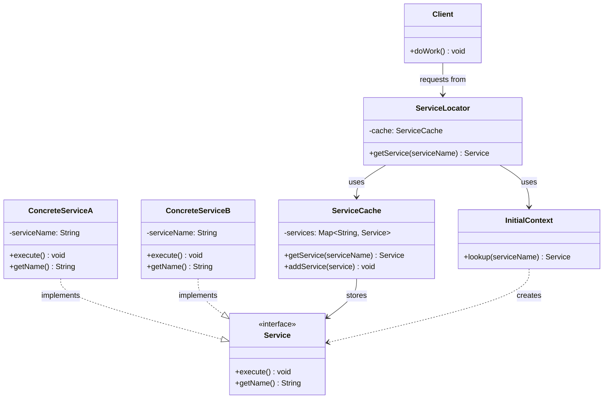

#java #software-engineering #software-architecture #software-testing #design-pattern #quarkus #micronaut #jakarta-ee #inversion-of-control #spring-boot #spring-framework
#object-oriented-programming #integration-pattern #enterprise-pattern 
- Also known as Service Registry.
# Purpose
- Decouples clients from service dependencies by using a *central service registry*.
# Application

# Components

## Service Interface
- Defines the *contract* that all concrete service implementations must follow including common methods such as `getName()`, `getId()`, and `execute()`.
- Specifies the *operations* that services must provide to clients.
## Concrete Service
- Implements the Service interface methods with *actual business logic*.
- Provide *unique identification* through `getName()` and `getId()`.
- Execute specific operations when `execute()` is called.
## Service Locator
- Is the central *orchestrator* and the main entry point for clients.
- Provide a single, unified interface for clients to *request services by name*.
- Checks the Service Cache first to see whether the requested service already exists or not. If not cached, delegate to Initial Context to either create or lookup the service.
## Service cache
- Is in-memory registry that stores service instances once they've been created.
- Retrieves cached services when requested or added new services to the internal storage.
## Client
- Requests services from the Service Locator by name and uses the returned service to perform business services.
- Remains completely decoupled from how services are created or located.
# Flowchart
- ![[assets/Pasted image 20251211200737.png]]
1. Client requests a service from Service Locator.
2. Service Locator first checks Service Cache whether the service exists or not.
3. If the service is cached, it is immediately returned to Service Locator; otherwise, Service Locator looks up the service from Initial Context. When the service is found, it is stored in Service Cache for further retrieval.
4. The Concrete Service is finally instantiated on the Client.
# Design

# Consequences

***
# References
1. https://java-design-patterns.com/patterns/service-locator/ for Service Locator pattern tutorial.
2. 
