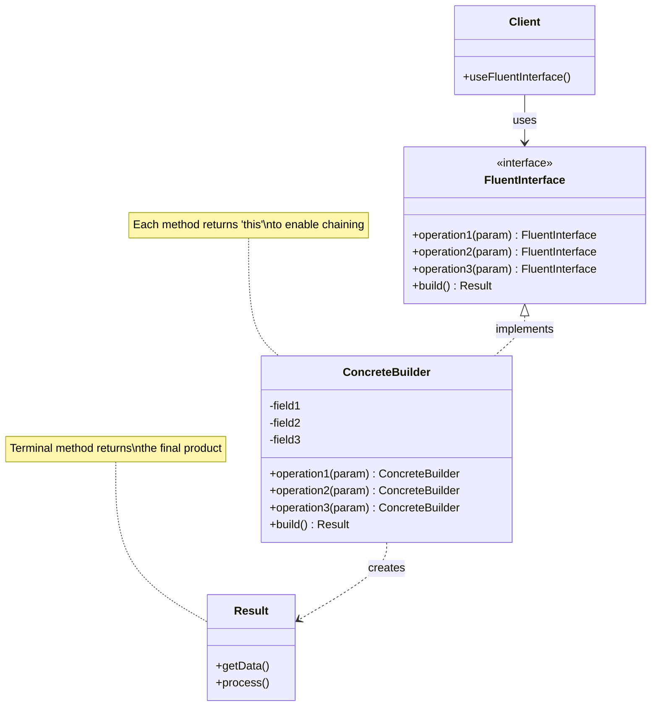
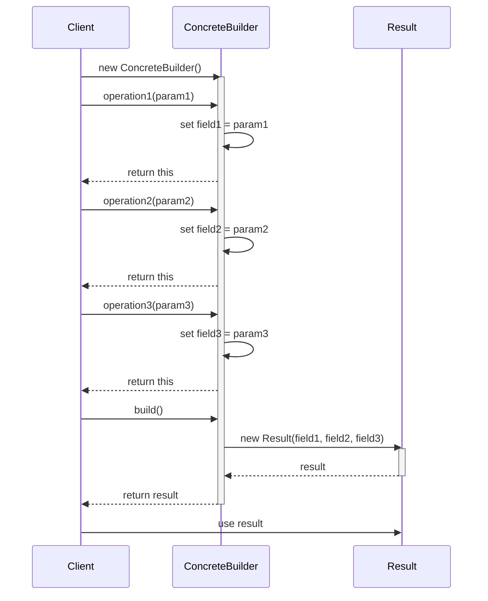

#design-pattern #software-engineering #software-architecture #object-oriented-programming #functional-programming #api-design #java #csharp #typescript #python
# Intent
- Provide object-oriented API that is ==readable and expressive== by allowing ==method chaining==.
- Create domain-specific language (DSL) embedded in host programming language.
- Improve code readability by making API flow naturally, similar to natural language.
- Reduce boilerplate code and intermediate variables by chaining operations together.
# Problem
## Without Fluent Interface
- Setting up objects requires multiple statements with repeated variable references.
- Code reads like series of disconnected instructions rather than coherent narrative.
- Complex operations require storing intermediate results, cluttering code.
- Without IDE support, developers struggle to discover available operations at each step.
```Java
QueryBuilder query = new QueryBuilder();
query.setTable("users");
query.setColumns(Arrays.asList("id", "name", "email"));
query.setWhereClause("age > 18");
query.setOrderBy("name");
query.setLimit(10);
String sql = query.build();
```
```TypeScript
const request = new HttpRequest();
request.setUrl("https://api.example.com/users");
request.setMethod("POST");
request.addHeader("Content-Type", "application/json");
request.addHeader("Authorization", "Bearer token123");
request.setBody({name: "John", email: "john@example.com"});
const response = request.send();
```
## With Fluent Interface
- Method chaining enables natural, readable API flow.
- Eliminates intermediate variables and repetitive object references.
- Operations read like domain-specific language.
```Java
String sql = new QueryBuilder()
    .select("id", "name", "email")
    .from("users")
    .where("age > 18")
    .orderBy("name")
    .limit(10)
    .build();
```
```TypeScript
const response = await new HttpRequestBuilder()
    .url("https://api.example.com/users")
    .post()
    .header("Content-Type", "application/json")
    .header("Authorization", "Bearer token123")
    .body({name: "John", email: "john@example.com"})
    .send();
```
# Solution
- Design methods that return object itself (typically `this` or `self`) $\implies$ enabling method chaining.
- **Method chaining**: Each method returns `this` to allow calling another method on same object.
- **Expressive naming**: Use verb-based method names that describe actions clearly.
- **Terminal methods**: Provide methods that complete chain and return different type (`build()`, `execute()`, `send()`).
- **Immutability option**: Return new instances instead of modifying original object for safer concurrent usage.
- **Type safety**: Use generics or type parameters to ensure compile-time checking of valid method sequences.
# Motivation
- Transform imperative sequences of setter calls into declarative, expressive statements.
- Reduce cognitive load by eliminating intermediate variables.
- Make code flow read like natural language sentence $\implies$ communicate intent clearly.
- Particularly valuable for:
	- ==Complex configuration==: Objects require multiple configuration steps before use.
	- ==Domain-specific operations==: API represents sequence of domain operations that read naturally.
	- ==Builder scenarios==: Constructing complex objects with many optional parameters.
	- ==Query construction==: Building queries, filters, or search criteria programmatically.
	- ==Testing==: Creating readable assertions and test setup code.
# Application
## Configuration and initialization
- Build complex objects with multiple optional parameters and configurations.
```Java
Server server = new ServerBuilder()
    .host("localhost")
    .port(8080)
    .ssl(true)
    .certificatePath("/etc/ssl/cert.pem")
    .threadPool(50)
    .timeout(30000)
    .build();
```
## Query and filter construction
- Create database queries, search criteria, or filtering operations.
```TypeScript
const users = await userRepository
    .query()
    .where("status", "active")
    .where("age", ">", 18)
    .orderBy("createdAt", "desc")
    .limit(20)
    .offset(40)
    .execute();
```
## Data transformation pipelines
- Process data through series of transformations and operations.
```Python
result = (stream.from_list(numbers)
    .filter(lambda x: x > 0)
    .map(lambda x: x * 2)
    .sort()
    .take(10)
    .to_list())
```
## API request building
- Construct HTTP requests with various headers, parameters, and body content.
```C#
var response = await new ApiRequestBuilder()
    .Get("https://api.example.com/products")
    .QueryParam("category", "electronics")
    .QueryParam("inStock", "true")
    .Header("Accept", "application/json")
    .Timeout(TimeSpan.FromSeconds(30))
    .SendAsync();
```
## Testing and assertions
- Create readable test setups and assertions.
```Java
assertThat(user)
    .isNotNull()
    .hasName("John Doe")
    .hasAge(30)
    .hasEmail("john@example.com")
    .isActive();
```
## Document generation
- Build documents, reports, or structured output.
```TypeScript
const document = new DocumentBuilder()
    .title("Annual Report 2024")
    .author("Finance Team")
    .section("Executive Summary")
    .paragraph("This report presents...")
    .section("Financial Performance")
    .table()
        .header(["Quarter", "Revenue", "Profit"])
        .row(["Q1", "$1M", "$200K"])
        .row(["Q2", "$1.2M", "$250K"])
    .endTable()
    .build();
```
# Structure

# Components
## FluentInterface
- Defines interface for fluent operations.
- Each method returns interface type to enable chaining.
- May include terminal methods that return different types.
## ConcreteBuilder
- Implements fluent interface with concrete behavior.
- Stores internal state modified by each fluent method.
- Returns `this` from each method to enable chaining.
- Implements terminal methods that produce final result.
## Result
- Final product created by fluent interface.
- Returned by terminal methods like `build()`, `execute()`, or `send()`.
- Contains configured or processed data.
## Client
- Uses fluent interface to perform operations.
- Chains method calls together to create readable, expressive code.
- Calls terminal methods to obtain final result.
# Collaboration

- Client creates new builder instance.
- Client chains multiple operations, each returning `this`.
- Each operation modifies builder's internal state.
- Client calls terminal method (`build()`) to obtain result.
- Builder constructs and returns final product.
- Client uses result for further processing.
# Implementation
## Java: SQL Query Builder
- Fluent interface for building SQL queries with type-safe method chaining.
- Supports `select()`, `from()`, `where()`, `join()`, `orderBy()`, `limit()`, `offset()` operations.
- Terminal method `build()` constructs final SQL string.
```Java title="SQL Query Builder with Fluent Interface"
import java.util.*;
import java.util.stream.Collectors;
// Query builder with fluent interface
public class QueryBuilder {
    private String table;
    private List<String> columns;
    private List<String> whereClauses;
    private List<String> joinClauses;
    private String orderByClause;
    private Integer limitValue;
    private Integer offsetValue;
    public QueryBuilder() {
        this.columns = new ArrayList<>();
        this.whereClauses = new ArrayList<>();
        this.joinClauses = new ArrayList<>();
    }
    public QueryBuilder select(String... columns) {
        if (columns.length == 0) {
            this.columns.add("*");
        } else {
            this.columns.addAll(Arrays.asList(columns));
        }
        return this;
    }
    public QueryBuilder from(String table) {
        this.table = table;
        return this;
    }
    public QueryBuilder where(String condition) {
        this.whereClauses.add(condition);
        return this;
    }
    public QueryBuilder and(String condition) {
        if (this.whereClauses.isEmpty()) {
            throw new IllegalStateException("Cannot use AND without WHERE clause");
        }
        this.whereClauses.add(condition);
        return this;
    }
    public QueryBuilder join(String table, String condition) {
        this.joinClauses.add("INNER JOIN " + table + " ON " + condition);
        return this;
    }
    public QueryBuilder leftJoin(String table, String condition) {
        this.joinClauses.add("LEFT JOIN " + table + " ON " + condition);
        return this;
    }
    public QueryBuilder orderBy(String column) {
        return orderBy(column, "ASC");
    }
    public QueryBuilder orderBy(String column, String direction) {
        this.orderByClause = column + " " + direction.toUpperCase();
        return this;
    }
    public QueryBuilder limit(int limit) {
        this.limitValue = limit;
        return this;
    }
    public QueryBuilder offset(int offset) {
        this.offsetValue = offset;
        return this;
    }
    // Terminal method
    public String build() {
        if (table == null) {
            throw new IllegalStateException("Table must be specified");
        }
        StringBuilder sql = new StringBuilder();
        // SELECT clause
        sql.append("SELECT ");
        sql.append(String.join(", ", columns));
        // FROM clause
        sql.append(" FROM ").append(table);
        // JOIN clauses
        if (!joinClauses.isEmpty()) {
            sql.append(" ");
            sql.append(String.join(" ", joinClauses));
        }
        // WHERE clause
        if (!whereClauses.isEmpty()) {
            sql.append(" WHERE ");
            sql.append(String.join(" AND ", whereClauses));
        }
        // ORDER BY clause
        if (orderByClause != null) {
            sql.append(" ORDER BY ").append(orderByClause);
        }
        // LIMIT clause
        if (limitValue != null) {
            sql.append(" LIMIT ").append(limitValue);
        }
        // OFFSET clause
        if (offsetValue != null) {
            sql.append(" OFFSET ").append(offsetValue);
        }
        return sql.toString();
    }
    // Alternative terminal method for parameterized queries
    public PreparedQuery buildPrepared() {
        return new PreparedQuery(build(), new ArrayList<>());
    }
}
// Result class for prepared queries
class PreparedQuery {
    private final String sql;
    private final List<Object> parameters;
    public PreparedQuery(String sql, List<Object> parameters) {
        this.sql = sql;
        this.parameters = parameters;
    }
    public String getSql() {
        return sql;
    }
    public List<Object> getParameters() {
        return parameters;
    }
}
// Usage example
class QueryBuilderDemo {
    public static void main(String[] args) {
        // Simple query
        String simpleQuery = new QueryBuilder()
            .select("id", "name", "email")
            .from("users")
            .where("status = 'active'")
            .orderBy("name")
            .limit(10)
            .build();
        System.out.println("Simple query:");
        System.out.println(simpleQuery);
        // Output: SELECT id, name, email FROM users WHERE status = 'active' ORDER BY name ASC LIMIT 10
        // Complex query with joins
        String complexQuery = new QueryBuilder()
            .select("u.id", "u.name", "o.order_id", "o.total")
            .from("users u")
            .join("orders o", "u.id = o.user_id")
            .leftJoin("addresses a", "u.id = a.user_id")
            .where("u.status = 'active'")
            .and("o.total > 100")
            .orderBy("o.created_at", "DESC")
            .limit(20)
            .offset(40)
            .build();
        System.out.println("\nComplex query:");
        System.out.println(complexQuery);
        // Report query
        String reportQuery = new QueryBuilder()
            .select("department", "COUNT(*) as employee_count", "AVG(salary) as avg_salary")
            .from("employees")
            .where("hire_date >= '2020-01-01'")
            .orderBy("avg_salary", "DESC")
            .build();
        System.out.println("\nReport query:");
        System.out.println(reportQuery);
    }
}
```
## TypeScript: HTTP Request Builder
- Fluent interface for constructing HTTP requests with headers, query parameters, body content.
- Supports HTTP methods: `get()`, `post()`, `put()`, `patch()`, `delete()`.
- Includes authentication helpers: `auth()`, `basicAuth()`.
- Terminal method `send()` executes request asynchronously with retry logic.
```TypeScript title="HTTP Request Builder with Fluent Interface"
// HTTP method types
type HttpMethod = 'GET' | 'POST' | 'PUT' | 'PATCH' | 'DELETE';
// Response wrapper
interface HttpResponse<T = any> {
    status: number;
    statusText: string;
    data: T;
    headers: Record<string, string>;
}
// Request builder with fluent interface
class HttpRequestBuilder {
    private _url: string = '';
    private _method: HttpMethod = 'GET';
    private _headers: Map<string, string> = new Map();
    private _queryParams: Map<string, string> = new Map();
    private _body: any = null;
    private _timeout: number = 30000;
    private _retries: number = 0;
    url(url: string): this {
        this._url = url;
        return this;
    }
    method(method: HttpMethod): this {
        this._method = method;
        return this;
    }
    get(): this {
        return this.method('GET');
    }
    post(): this {
        return this.method('POST');
    }
    put(): this {
        return this.method('PUT');
    }
    patch(): this {
        return this.method('PATCH');
    }
    delete(): this {
        return this.method('DELETE');
    }
    header(key: string, value: string): this {
        this._headers.set(key, value);
        return this;
    }
    headers(headers: Record<string, string>): this {
        Object.entries(headers).forEach(([key, value]) => {
            this._headers.set(key, value);
        });
        return this;
    }
    queryParam(key: string, value: string | number | boolean): this {
        this._queryParams.set(key, String(value));
        return this;
    }
    queryParams(params: Record<string, string | number | boolean>): this {
        Object.entries(params).forEach(([key, value]) => {
            this._queryParams.set(key, String(value));
        });
        return this;
    }
    body(data: any): this {
        this._body = data;
        return this;
    }
    json(data: any): this {
        this.header('Content-Type', 'application/json');
        this._body = JSON.stringify(data);
        return this;
    }
    timeout(milliseconds: number): this {
        this._timeout = milliseconds;
        return this;
    }
    retry(attempts: number): this {
        this._retries = attempts;
        return this;
    }
    auth(token: string): this {
        return this.header('Authorization', `Bearer ${token}`);
    }
    basicAuth(username: string, password: string): this {
        const credentials = btoa(`${username}:${password}`);
        return this.header('Authorization', `Basic ${credentials}`);
    }
    // Terminal method - builds URL with query params
    private buildUrl(): string {
        if (!this._url) {
            throw new Error('URL is required');
        }
        if (this._queryParams.size === 0) {
            return this._url;
        }
        const queryString = Array.from(this._queryParams.entries())
            .map(([key, value]) => `${encodeURIComponent(key)}=${encodeURIComponent(value)}`)
            .join('&');
        const separator = this._url.includes('?') ? '&' : '?';
        return `${this._url}${separator}${queryString}`;
    }
    // Terminal method - executes the request
    async send<T = any>(): Promise<HttpResponse<T>> {
        const url = this.buildUrl();
        const headers: Record<string, string> = {};
        this._headers.forEach((value, key) => {
            headers[key] = value;
        });
        const options: RequestInit = {
            method: this._method,
            headers,
            body: this._body
        };
        let lastError: Error | null = null;
        const maxAttempts = this._retries + 1;
        for (let attempt = 0; attempt < maxAttempts; attempt++) {
            try {
                const controller = new AbortController();
                const timeoutId = setTimeout(() => controller.abort(), this._timeout);
                const response = await fetch(url, {
                    ...options,
                    signal: controller.signal
                });
                clearTimeout(timeoutId);
                const responseHeaders: Record<string, string> = {};
                response.headers.forEach((value, key) => {
                    responseHeaders[key] = value;
                });
                const contentType = response.headers.get('content-type');
                let data: any;
                if (contentType?.includes('application/json')) {
                    data = await response.json();
                } else {
                    data = await response.text();
                }
                return {
                    status: response.status,
                    statusText: response.statusText,
                    data,
                    headers: responseHeaders
                };
            } catch (error) {
                lastError = error as Error;
                if (attempt < maxAttempts - 1) {
                    // Wait before retry (exponential backoff)
                    await new Promise(resolve => setTimeout(resolve, Math.pow(2, attempt) * 1000));
                }
            }
        }
        throw lastError || new Error('Request failed');
    }
}
// Usage examples
async function demonstrateHttpBuilder() {
    // Simple GET request
    const users = await new HttpRequestBuilder()
        .url('https://api.example.com/users')
        .get()
        .header('Accept', 'application/json')
        .timeout(5000)
        .send();
    console.log('Users:', users.data);
    // POST request with JSON body
    const newUser = await new HttpRequestBuilder()
        .url('https://api.example.com/users')
        .post()
        .json({
            name: 'John Doe',
            email: 'john@example.com',
            age: 30
        })
        .auth('eyJhbGciOiJIUzI1NiIsInR5cCI6IkpXVCJ9...')
        .send();
    console.log('Created user:', newUser.data);
    // GET request with query parameters
    const searchResults = await new HttpRequestBuilder()
        .url('https://api.example.com/products')
        .get()
        .queryParams({
            category: 'electronics',
            minPrice: 100,
            maxPrice: 1000,
            inStock: true
        })
        .header('Accept', 'application/json')
        .timeout(10000)
        .retry(3)
        .send();
    console.log('Products:', searchResults.data);
    // PUT request with custom headers
    const updated = await new HttpRequestBuilder()
        .url('https://api.example.com/users/123')
        .put()
        .headers({
            'Content-Type': 'application/json',
            'X-API-Version': '2.0',
            'X-Request-ID': crypto.randomUUID()
        })
        .body(JSON.stringify({ name: 'Jane Doe' }))
        .basicAuth('admin', 'password123')
        .send();
    console.log('Updated:', updated.data);
}
```
## Python: Data Processing Pipeline
- Fluent interface for data transformation pipelines with filtering, mapping, aggregation.
- Intermediate operations: `filter()`, `map()`, `flat_map()`, `distinct()`, `sort()`, `take()`, `skip()`, `reverse()`, `group_by()`, `peek()`.
- Terminal operations: `to_list()`, `to_set()`, `first()`, `last()`, `count()`, `any()`, `all()`, `reduce()`, `sum()`, `average()`, `min()`, `max()`, `execute()`.
```Python title="Data Processing Pipeline with Fluent Interface"
from typing import Callable, Any, List, Optional, TypeVar, Generic
from functools import reduce
from dataclasses import dataclass
import statistics
T = TypeVar('T')
R = TypeVar('R')
@dataclass
class ProcessingResult:
    """Result of a data processing pipeline"""
    data: List[Any]
    operations: List[str]
    def summary(self) -> str:
        return f"Processed {len(self.data)} items through {len(self.operations)} operations"
class DataPipeline(Generic[T]):
    """Fluent interface for data processing pipelines"""
    def __init__(self, data: Optional[List[T]] = None):
        self._data: List[T] = data if data is not None else []
        self._operations: List[str] = []
    def from_list(self, data: List[T]) -> 'DataPipeline[T]':
        """Set the source data"""
        self._data = data.copy()
        self._operations.append(f"from_list({len(data)} items)")
        return self
    def from_range(self, start: int, end: int, step: int = 1) -> 'DataPipeline[int]':
        """Create pipeline from a range"""
        self._data = list(range(start, end, step))
        self._operations.append(f"from_range({start}, {end}, {step})")
        return self
    def filter(self, predicate: Callable[[T], bool]) -> 'DataPipeline[T]':
        """Filter elements based on predicate"""
        original_count = len(self._data)
        self._data = [item for item in self._data if predicate(item)]
        self._operations.append(f"filter({original_count} -> {len(self._data)} items)")
        return self
    def map(self, transform: Callable[[T], R]) -> 'DataPipeline[R]':
        """Transform each element"""
        self._data = [transform(item) for item in self._data]
        self._operations.append(f"map({len(self._data)} items)")
        return self
    def flat_map(self, transform: Callable[[T], List[R]]) -> 'DataPipeline[R]':
        """Transform and flatten results"""
        self._data = [item for sublist in self._data for item in transform(sublist)]
        self._operations.append(f"flat_map({len(self._data)} items)")
        return self
    def distinct(self) -> 'DataPipeline[T]':
        """Remove duplicates while preserving order"""
        seen = set()
        result = []
        for item in self._data:
            if item not in seen:
                seen.add(item)
                result.append(item)
        original_count = len(self._data)
        self._data = result
        self._operations.append(f"distinct({original_count} -> {len(self._data)} items)")
        return self
    def sort(self, key: Optional[Callable[[T], Any]] = None, reverse: bool = False) -> 'DataPipeline[T]':
        """Sort elements"""
        self._data = sorted(self._data, key=key, reverse=reverse)
        direction = "descending" if reverse else "ascending"
        self._operations.append(f"sort({direction})")
        return self
    def take(self, n: int) -> 'DataPipeline[T]':
        """Take first n elements"""
        self._data = self._data[:n]
        self._operations.append(f"take({n})")
        return self
    def skip(self, n: int) -> 'DataPipeline[T]':
        """Skip first n elements"""
        self._data = self._data[n:]
        self._operations.append(f"skip({n})")
        return self
    def reverse(self) -> 'DataPipeline[T]':
        """Reverse the order of elements"""
        self._data = list(reversed(self._data))
        self._operations.append("reverse()")
        return self
    def group_by(self, key_func: Callable[[T], Any]) -> 'DataPipeline[tuple]':
        """Group elements by key function"""
        groups = {}
        for item in self._data:
            key = key_func(item)
            if key not in groups:
                groups[key] = []
            groups[key].append(item)
        self._data = list(groups.items())
        self._operations.append(f"group_by({len(groups)} groups)")
        return self
    def peek(self, action: Callable[[T], None]) -> 'DataPipeline[T]':
        """Execute action on each element without modifying the stream"""
        for item in self._data:
            action(item)
        self._operations.append("peek()")
        return self
    # Terminal operations
    def to_list(self) -> List[T]:
        """Convert to list (terminal operation)"""
        return self._data.copy()
    def to_set(self) -> set:
        """Convert to set (terminal operation)"""
        return set(self._data)
    def first(self) -> Optional[T]:
        """Get first element (terminal operation)"""
        return self._data[0] if self._data else None
    def last(self) -> Optional[T]:
        """Get last element (terminal operation)"""
        return self._data[-1] if self._data else None
    def count(self) -> int:
        """Count elements (terminal operation)"""
        return len(self._data)
    def any(self, predicate: Callable[[T], bool]) -> bool:
        """Check if any element matches predicate (terminal operation)"""
        return any(predicate(item) for item in self._data)
    def all(self, predicate: Callable[[T], bool]) -> bool:
        """Check if all elements match predicate (terminal operation)"""
        return all(predicate(item) for item in self._data)
    def reduce(self, func: Callable[[Any, T], Any], initial: Any = None) -> Any:
        """Reduce to single value (terminal operation)"""
        if initial is None:
            return reduce(func, self._data)
        return reduce(func, self._data, initial)
    def sum(self) -> float:
        """Sum numeric elements (terminal operation)"""
        return sum(self._data)
    def average(self) -> float:
        """Calculate average (terminal operation)"""
        if not self._data:
            raise ValueError("Cannot calculate average of empty pipeline")
        return statistics.mean(self._data)
    def min(self) -> Optional[T]:
        """Find minimum (terminal operation)"""
        return min(self._data) if self._data else None
    def max(self) -> Optional[T]:
        """Find maximum (terminal operation)"""
        return max(self._data) if self._data else None
    def execute(self) -> ProcessingResult:
        """Execute and return result with metadata (terminal operation)"""
        return ProcessingResult(
            data=self._data.copy(),
            operations=self._operations.copy()
        )
# Usage examples
def demonstrate_pipeline():
    # Example 1: Process numbers
    print("=== Example 1: Number Processing ===")
    result = (DataPipeline()
        .from_range(1, 101)
        .filter(lambda x: x % 2 == 0)
        .map(lambda x: x * x)
        .filter(lambda x: x > 100)
        .sort(reverse=True)
        .take(10)
        .to_list())
    print(f"Top 10 squares of even numbers > 100: {result}")
    # Example 2: Text processing
    print("\n=== Example 2: Text Processing ===")
    words = ["hello", "world", "python", "fluent", "interface", "pattern", "hello", "python"]
    unique_long_words = (DataPipeline()
        .from_list(words)
        .filter(lambda w: len(w) > 5)
        .map(str.upper)
        .distinct()
        .sort()
        .to_list())
    print(f"Unique long words (uppercase): {unique_long_words}")
    # Example 3: Data aggregation
    print("\n=== Example 3: Data Aggregation ===")
    @dataclass
    class Student:
        name: str
        grade: int
        subject: str
    students = [
        Student("Alice", 85, "Math"),
        Student("Bob", 92, "Math"),
        Student("Charlie", 78, "Science"),
        Student("Diana", 95, "Math"),
        Student("Eve", 88, "Science"),
    ]
    # Group by subject and calculate average grade
    subject_averages = (DataPipeline()
        .from_list(students)
        .group_by(lambda s: s.subject)
        .map(lambda group: {
            'subject': group[0],
            'average': sum(s.grade for s in group[1]) / len(group[1]),
            'count': len(group[1])
        })
        .sort(key=lambda x: x['average'], reverse=True)
        .to_list())
    for avg in subject_averages:
        print(f"{avg['subject']}: avg={avg['average']:.1f}, students={avg['count']}")
    # Example 4: Complex pipeline with execution metadata
    print("\n=== Example 4: Pipeline with Metadata ===")
    result = (DataPipeline()
        .from_range(1, 1001)
        .filter(lambda x: x % 3 == 0 or x % 5 == 0)
        .distinct()
        .sort()
        .skip(10)
        .take(20)
        .execute())
    print(f"{result.summary()}")
    print(f"Operations: {' -> '.join(result.operations)}")
    print(f"First 5 results: {result.data[:5]}")
    # Example 5: Statistical operations
    print("\n=== Example 5: Statistics ===")
    numbers = [10, 20, 30, 40, 50, 60, 70, 80, 90, 100]
    pipeline = DataPipeline().from_list(numbers).filter(lambda x: x >= 30)
    print(f"Count: {pipeline.count()}")
    print(f"Sum: {pipeline.sum()}")
    print(f"Average: {pipeline.average():.2f}")
    print(f"Min: {pipeline.min()}")
    print(f"Max: {pipeline.max()}")
if __name__ == "__main__":
    demonstrate_pipeline()
```
## C#: Test Assertion Builder
- Fluent interface for creating readable test assertions with detailed error messages.
- Generic assertion builder supporting any type `T`.
- Extension methods for specific types: strings (`HasLength`, `Contains`, `StartsWith`, `EndsWith`, `Matches`), numbers (`IsGreaterThan`, `IsLessThan`, `IsBetween`), collections (`HasCount`, `ContainsItem`, `IsEmpty`, `AllSatisfy`).
- Terminal methods: `Assert()` returns result, `AssertOrThrow()` throws exception on failure.
```C# title="Test Assertion Builder with Fluent Interface"
using System;
using System.Collections.Generic;
using System.Linq;
using System.Text;
// Assertion result
public class AssertionResult
{
    public bool Success { get; set; }
    public string Message { get; set; }
    public List<string> Errors { get; set; } = new List<string>();
    public override string ToString()
    {
        if (Success)
            return $"✓ {Message}";
        var sb = new StringBuilder();
        sb.AppendLine($"✗ {Message}");
        foreach (var error in Errors)
        {
            sb.AppendLine($"  - {error}");
        }
        return sb.ToString();
    }
}
// Generic assertion builder
public class AssertionBuilder<T>
{
    private readonly T _actual;
    private readonly List<Func<T, (bool, string)>> _assertions = new List<Func<T, (bool, string)>>();
    private string _description = "Assertion";
    public AssertionBuilder(T actual)
    {
        _actual = actual;
    }
    public AssertionBuilder<T> Named(string description)
    {
        _description = description;
        return this;
    }
    public AssertionBuilder<T> IsNotNull()
    {
        _assertions.Add(value =>
        {
            if (value == null)
                return (false, "Expected non-null value, but was null");
            return (true, "Value is not null");
        });
        return this;
    }
    public AssertionBuilder<T> IsNull()
    {
        _assertions.Add(value =>
        {
            if (value != null)
                return (false, $"Expected null, but was {value}");
            return (true, "Value is null");
        });
        return this;
    }
    public AssertionBuilder<T> IsEqualTo(T expected)
    {
        _assertions.Add(value =>
        {
            if (!EqualityComparer<T>.Default.Equals(value, expected))
                return (false, $"Expected {expected}, but was {value}");
            return (true, $"Value equals {expected}");
        });
        return this;
    }
    public AssertionBuilder<T> IsNotEqualTo(T expected)
    {
        _assertions.Add(value =>
        {
            if (EqualityComparer<T>.Default.Equals(value, expected))
                return (false, $"Expected value different from {expected}");
            return (true, $"Value is not equal to {expected}");
        });
        return this;
    }
    public AssertionBuilder<T> Satisfies(Func<T, bool> predicate, string description)
    {
        _assertions.Add(value =>
        {
            if (!predicate(value))
                return (false, $"Failed: {description}");
            return (true, description);
        });
        return this;
    }
    // Terminal method
    public AssertionResult Assert()
    {
        var result = new AssertionResult
        {
            Success = true,
            Message = _description
        };
        foreach (var assertion in _assertions)
        {
            var (success, message) = assertion(_actual);
            if (!success)
            {
                result.Success = false;
                result.Errors.Add(message);
            }
        }
        return result;
    }
    // Terminal method with exception
    public void AssertOrThrow()
    {
        var result = Assert();
        if (!result.Success)
        {
            throw new AssertionException(result.ToString());
        }
    }
}
// String-specific assertions
public static class StringAssertionExtensions
{
    public static AssertionBuilder<string> HasLength(this AssertionBuilder<string> builder, int expectedLength)
    {
        return builder.Satisfies(
            s => s?.Length == expectedLength,
            $"String length is {expectedLength}"
        );
    }
    public static AssertionBuilder<string> Contains(this AssertionBuilder<string> builder, string substring)
    {
        return builder.Satisfies(
            s => s?.Contains(substring) == true,
            $"String contains '{substring}'"
        );
    }
    public static AssertionBuilder<string> StartsWith(this AssertionBuilder<string> builder, string prefix)
    {
        return builder.Satisfies(
            s => s?.StartsWith(prefix) == true,
            $"String starts with '{prefix}'"
        );
    }
    public static AssertionBuilder<string> EndsWith(this AssertionBuilder<string> builder, string suffix)
    {
        return builder.Satisfies(
            s => s?.EndsWith(suffix) == true,
            $"String ends with '{suffix}'"
        );
    }
    public static AssertionBuilder<string> Matches(this AssertionBuilder<string> builder, string pattern)
    {
        return builder.Satisfies(
            s => s != null && System.Text.RegularExpressions.Regex.IsMatch(s, pattern),
            $"String matches pattern '{pattern}'"
        );
    }
}
// Numeric assertions
public static class NumericAssertionExtensions
{
    public static AssertionBuilder<T> IsGreaterThan<T>(this AssertionBuilder<T> builder, T threshold)
        where T : IComparable<T>
    {
        return builder.Satisfies(
            value => value.CompareTo(threshold) > 0,
            $"Value is greater than {threshold}"
        );
    }
    public static AssertionBuilder<T> IsLessThan<T>(this AssertionBuilder<T> builder, T threshold)
        where T : IComparable<T>
    {
        return builder.Satisfies(
            value => value.CompareTo(threshold) < 0,
            $"Value is less than {threshold}"
        );
    }
    public static AssertionBuilder<T> IsBetween<T>(this AssertionBuilder<T> builder, T min, T max)
        where T : IComparable<T>
    {
        return builder.Satisfies(
            value => value.CompareTo(min) >= 0 && value.CompareTo(max) <= 0,
            $"Value is between {min} and {max}"
        );
    }
}
// Collection assertions
public static class CollectionAssertionExtensions
{
    public static AssertionBuilder<IEnumerable<T>> HasCount<T>(
        this AssertionBuilder<IEnumerable<T>> builder, int expectedCount)
    {
        return builder.Satisfies(
            collection => collection?.Count() == expectedCount,
            $"Collection has {expectedCount} elements"
        );
    }
    public static AssertionBuilder<IEnumerable<T>> ContainsItem<T>(
        this AssertionBuilder<IEnumerable<T>> builder, T item)
    {
        return builder.Satisfies(
            collection => collection?.Contains(item) == true,
            $"Collection contains {item}"
        );
    }
    public static AssertionBuilder<IEnumerable<T>> IsEmpty<T>(
        this AssertionBuilder<IEnumerable<T>> builder)
    {
        return builder.Satisfies(
            collection => !collection?.Any() == true,
            "Collection is empty"
        );
    }
    public static AssertionBuilder<IEnumerable<T>> AllSatisfy<T>(
        this AssertionBuilder<IEnumerable<T>> builder,
        Func<T, bool> predicate,
        string description)
    {
        return builder.Satisfies(
            collection => collection?.All(predicate) == true,
            $"All items satisfy: {description}"
        );
    }
}
// Helper class for creating assertions
public static class Assert
{
    public static AssertionBuilder<T> That<T>(T actual)
    {
        return new AssertionBuilder<T>(actual);
    }
}
// Custom exception
public class AssertionException : Exception
{
    public AssertionException(string message) : base(message) { }
}
// Usage examples
class AssertionBuilderDemo
{
    static void Main(string[] args)
    {
        // Example 1: String assertions
        Console.WriteLine("=== String Assertions ===");
        var email = "john.doe@example.com";
        var result1 = Assert.That(email)
            .Named("Email validation")
            .IsNotNull()
            .Contains("@")
            .EndsWith(".com")
            .Matches(@"^[\w\.-]+@[\w\.-]+\.\w+$")
            .HasLength(20)
            .Assert();
        Console.WriteLine(result1);
        // Example 2: Numeric assertions
        Console.WriteLine("\n=== Numeric Assertions ===");
        var age = 25;
        var result2 = Assert.That(age)
            .Named("Age validation")
            .IsNotNull()
            .IsGreaterThan(0)
            .IsLessThan(150)
            .IsBetween(18, 65)
            .Assert();
        Console.WriteLine(result2);
        // Example 3: Collection assertions
        Console.WriteLine("\n=== Collection Assertions ===");
        var numbers = new List<int> { 2, 4, 6, 8, 10 };
        var result3 = Assert.That(numbers)
            .Named("Even numbers list")
            .IsNotNull()
            .HasCount(5)
            .ContainsItem(6)
            .AllSatisfy(n => n % 2 == 0, "all numbers are even")
            .Assert();
        Console.WriteLine(result3);
        // Example 4: Failed assertion
        Console.WriteLine("\n=== Failed Assertion ===");
        var invalidEmail = "not-an-email";
        var result4 = Assert.That(invalidEmail)
            .Named("Invalid email check")
            .IsNotNull()
            .Contains("@")
            .EndsWith(".com")
            .Assert();
        Console.WriteLine(result4);
        // Example 5: Custom object assertions
        Console.WriteLine("\n=== Custom Object Assertions ===");
        var user = new User
        {
            Id = 123,
            Username = "johndoe",
            Email = "john@example.com",
            Age = 30,
            IsActive = true
        };
        var result5 = Assert.That(user)
            .Named("User object validation")
            .IsNotNull()
            .Satisfies(u => u.Id > 0, "User has valid ID")
            .Satisfies(u => u.Username?.Length >= 3, "Username has at least 3 characters")
            .Satisfies(u => u.Email?.Contains("@") == true, "Email contains @")
            .Satisfies(u => u.Age >= 18, "User is adult")
            .Satisfies(u => u.IsActive, "User is active")
            .Assert();
        Console.WriteLine(result5);
        // Example 6: Exception throwing
        Console.WriteLine("\n=== Assertion with Exception ===");
        try
        {
            Assert.That(-5)
                .Named("Positive number check")
                .IsGreaterThan(0)
                .AssertOrThrow();
        }
        catch (AssertionException ex)
        {
            Console.WriteLine($"Caught expected exception:\n{ex.Message}");
        }
    }
}
class User
{
    public int Id { get; set; }
    public string Username { get; set; }
    public string Email { get; set; }
    public int Age { get; set; }
    public bool IsActive { get; set; }
}
```
# Fluent Interface vs Builder pattern
## Purpose
- **Fluent Interface**: Creates readable, expressive APIs for any type of operation (configuration, querying, transformation).
- **Builder**: Specifically designed for constructing complex objects with many optional parameters.
## Scope
- **Fluent Interface**: Applied to various contexts beyond object construction (query building, request configuration, data processing).
- **Builder**: Focused on object instantiation and initialization.
## Return type
- **Fluent Interface**: Methods may return `this` or different types depending on context $\implies$ terminal methods return final results.
- **Builder**: Methods typically return builder itself $\implies$ final `build()` method returns constructed object.
## Immutability
- **Fluent Interface**: Can be either mutable (returns `this`) or immutable (returns new instances).
- **Builder**: Often mutable during construction, producing immutable product.
```Java
// Fluent Interface - Query building
String query = new QueryBuilder()
    .select("name", "email")  // Returns QueryBuilder
    .from("users")             // Returns QueryBuilder
    .where("age > 18")         // Returns QueryBuilder
    .build();                  // Returns String (different type)
// Builder Pattern - Object construction
User user = new UserBuilder()
    .withName("John")          // Returns UserBuilder
    .withEmail("john@test.com") // Returns UserBuilder
    .withAge(30)               // Returns UserBuilder
    .build();                  // Returns User object
```
# Fluent Interface vs Method chaining
## Method chaining
- Technical mechanism: returning `this` to enable consecutive method calls.
- No semantic focus $\implies$ methods may not read naturally or follow domain language.
```Java
// Method chaining without fluent design
StringBuilder sb = new StringBuilder()
    .append("Hello")
    .append(" ")
    .append("World");
```
## Fluent interface
- Design philosophy: creating APIs that read like natural language.
- Domain-focused $\implies$ method names reflect domain concepts and operations.
- Intentional readability $\implies$ designed to express intent clearly.
```Java
// Fluent interface with domain language
Order order = new OrderBuilder()
    .forCustomer("John Doe")
    .withProduct("Laptop", 1)
    .withProduct("Mouse", 2)
    .shippedTo("123 Main St")
    .place();
```
# Design considerations
## When to use fluent interfaces
- ==Complex configuration==: Objects or operations require multiple configuration steps.
- ==Readability matters==: Code read frequently by developers unfamiliar with implementation details.
- ==Domain-specific language==: API represents domain concepts that benefit from natural language flow.
- ==Reducing boilerplate==: Multiple setter calls or configuration steps can be streamlined.
## Immutability vs mutability
### Mutable (returns `this`)
- Simpler implementation, better performance.
- Suitable for single-threaded contexts.
```Java
public class MutableBuilder {
    private String value;
    public MutableBuilder setValue(String value) {
        this.value = value;
        return this;  // Returns same instance
    }
}
```
### Immutable (returns new instance)
- Thread-safe, prevents unexpected modifications.
- Suitable for shared contexts.
```Java
public class ImmutableBuilder {
    private final String value;
    public ImmutableBuilder setValue(String value) {
        return new ImmutableBuilder(value);  // Returns new instance
    }
}
```
## Method naming conventions
- ==Verbs for actions==: `create()`, `update()`, `delete()`, `execute()`, `send()`.
- ==Prepositions for relationships==: `with()`, `from()`, `to()`, `for()`, `on()`.
- ==Domain-specific terms==: `where()`, `orderBy()`, `select()`, `join()` for SQL-like operations.
```TypeScript
// Good: Domain-focused, readable
const request = builder
    .toUrl("/api/users")
    .withMethod("POST")
    .withHeader("Authorization", token)
    .containingBody(userData)
    .send();
// Less fluent: Generic, less expressive
const request = builder
    .setUrl("/api/users")
    .setMethod("POST")
    .addHeader("Authorization", token)
    .setBody(userData)
    .execute();
```
## Type safety and compile-time validation
### Generics for type propagation
- Preserve type information through chain.
```TypeScript
class Pipeline<T> {
    filter(predicate: (item: T) => boolean): Pipeline<T> { ... }
    map<U>(transform: (item: T) => U): Pipeline<U> { ... }
    // Type changes from T to U
}
```
### State pattern for sequential validation
- Use phantom types or state pattern to enforce order.
```Java
// Phantom types in Java using generics
interface BuilderState {}
class Initial implements BuilderState {}
class UrlSet implements BuilderState {}
class MethodSet implements BuilderState {}
class RequestBuilder<S extends BuilderState> {
    // Only available in Initial state
    public RequestBuilder<UrlSet> url(String url) { ... }
    // Only available after URL is set
    public RequestBuilder<MethodSet> method(HttpMethod method)
        requires S extends UrlSet { ... }
}
```
## Terminal methods
- ==Intermediate operations==: Return fluent interface for further chaining.
- ==Terminal operations==: Complete chain and return result.
```Python
class Pipeline:
    # Intermediate operations
    def filter(self, predicate) -> 'Pipeline': ...
    def map(self, transform) -> 'Pipeline': ...
    # Terminal operations
    def to_list(self) -> List: ...
    def count(self) -> int: ...
    def execute(self) -> Result: ...
```
## Error handling
### Eager validation
- Check parameters immediately in each method call.
```Java
public QueryBuilder where(String condition) {
    if (condition == null || condition.trim().isEmpty()) {
        throw new IllegalArgumentException("Condition cannot be empty");
    }
    this.whereClauses.add(condition);
    return this;
}
```
### Lazy validation
- Defer validation to terminal method for better performance.
```Java
public String build() {
    if (table == null) {
        throw new IllegalStateException("Table must be specified");
    }
    if (columns.isEmpty()) {
        throw new IllegalStateException("At least one column required");
    }
    // Build query
}
```
## IDE support and discoverability
- Use descriptive method names that appear logically in autocomplete.
- Provide comprehensive JavaDoc/JSDoc for each method.
- Return specific types (not `Object`) to enable type-aware suggestions.
```Java
/**
 * Adds a WHERE clause to filter results.
 *
 * @param condition SQL condition (e.g., "age > 18")
 * @return this builder for chaining
 */
public QueryBuilder where(String condition) { ... }
```
# Real world examples
## Testing frameworks
- **AssertJ (Java)**: Fluent assertions for unit tests.
```Java
assertThat(user)
    .isNotNull()
    .extracting(User::getName, User::getAge)
    .containsExactly("John", 30);
```
- **Chai (JavaScript)**: BDD/TDD assertion library.
```JavaScript
expect(user).to.have.property('name').that.equals('John');
```
- **FluentAssertions (C#)**: Readable test assertions.
```C#
user.Should().NotBeNull()
    .And.BeOfType<User>()
    .Which.Name.Should().Be("John");
```
## ORM and query builders
- **LINQ (C#)**: Language-integrated query.
```C#
var adults = users
    .Where(u => u.Age >= 18)
    .OrderBy(u => u.Name)
    .Select(u => new { u.Name, u.Email })
    .ToList();
```
- **jOOQ (Java)**: SQL builder.
```Java
Result<Record> result = dsl
    .select(USERS.NAME, USERS.EMAIL)
    .from(USERS)
    .where(USERS.AGE.gt(18))
    .orderBy(USERS.NAME)
    .fetch();
```
- **Knex.js (JavaScript)**: SQL query builder.
```JavaScript
const users = await knex('users')
    .where('age', '>', 18)
    .andWhere('status', 'active')
    .orderBy('name')
    .limit(10);
```
## HTTP clients
- **Retrofit (Java)**: Type-safe HTTP client with fluent configuration.
- **Axios (JavaScript)**: Promise-based HTTP client.
```JavaScript
const response = await axios
    .get('/api/users')
    .params({ status: 'active' })
    .headers({ 'Authorization': token });
```
- **RestSharp (C#)**: REST client with fluent API.
```C#
var response = await client
    .AddHeader("Authorization", token)
    .AddParameter("status", "active")
    .GetAsync<List<User>>("/api/users");
```
## Configuration and builders
- **Spring Boot (Java)**: Configuration builders for web applications.
- **Express.js (JavaScript)**: Web application configuration.
```JavaScript
app
    .use(cors())
    .use(express.json())
    .use(express.urlencoded({ extended: true }))
    .use('/api', apiRouter)
    .listen(3000);
```
- **StringBuilder/StringBuffer (Java)**: Text construction.
```Java
String html = new StringBuilder()
    .append("<html>")
    .append("<body>")
    .append("<h1>Title</h1>")
    .append("</body>")
    .append("</html>")
    .toString();
```
## Stream processing
- **Java Streams**: Functional data processing.
```Java
List<String> result = stream
    .filter(s -> s.length() > 3)
    .map(String::toUpperCase)
    .sorted()
    .collect(Collectors.toList());
```
- **RxJS (JavaScript)**: Reactive programming.
```JavaScript
observable
    .pipe(
        filter(x => x > 0),
        map(x => x * 2),
        take(10)
    )
    .subscribe(console.log);
```
## UI component configuration
- **SwiftUI (Swift)**: Declarative UI framework.
```Swift
Text("Hello")
    .font(.title)
    .foregroundColor(.blue)
    .padding()
    .background(Color.gray)
```
- **Jetpack Compose (Kotlin)**: Android UI toolkit.
```Kotlin
Text(
    text = "Hello",
    modifier = Modifier
        .padding(16.dp)
        .background(Color.Blue)
)
```
# Related patterns
## Builder pattern
- Constructs complex objects step by step using fluent interface techniques for construction API.
## Method chaining
- Underlying technique that enables fluent interfaces by returning `this` from methods.
## Command pattern
- Combined with fluent interfaces to create readable command configuration and execution pipelines.
## Strategy pattern
- Fluent interfaces configure strategies in readable manner.
```Java
processor
    .withStrategy(new SortStrategy())
    .withFilter(new AgeFilter(18))
    .execute();
```
## Template method pattern
- Fluent interfaces configure steps in template methods while maintaining readability.
# Advantages
- ==Improved readability==: Code reads like natural language $\implies$ intent clear, cognitive load reduced.
- ==Reduced boilerplate==: Eliminates repetitive variable declarations and intermediate assignments.
- ==Better IDE support==: Method chaining enables intelligent autocomplete suggestions for available operations.
- ==Self-documenting==: Well-named methods create self-explanatory code that serves as documentation.
- ==Type safety==: Strong typing throughout chain catches errors at compile time.
- ==Discoverability==: Developers explore available operations through IDE autocomplete.
- ==Flexibility==: Easy to add new operations without breaking existing chains.
- ==Composability==: Complex operations built from simpler ones through composition.
# Disadvantages
- ==Debugging complexity==: Long chains make difficult to inspect intermediate states and set breakpoints.
- ==Stack traces==: Errors in chains produce deep stack traces that are hard to interpret.
- ==Learning curve==: New developers must learn DSL and available operations.
- ==API design complexity==: Designing intuitive, consistent method names and sequences requires careful planning.
- ==Immutability overhead==: Immutable fluent interfaces create new objects for each operation $\implies$ impacts performance.
- ==Error messages==: Compilation errors in middle of chains can be cryptic and hard to locate.
- ==Testing challenges==: Testing individual methods in isolation harder when they depend on chain state.
***
# References
1. Fowler, M. (2005). *Fluent Interface*. martinfowler.com. https://martinfowler.com/bliki/FluentInterface.html
2. Evans, E. (2003). *Domain-Driven Design: Tackling Complexity in the Heart of Software*. Addison-Wesley Professional.
	1. Chapter on domain-specific languages.
3. Bloch, J. (2018). *Effective Java* ($3$rd ed.). Addison-Wesley.
	1. Item $2$: Consider builder when faced with many constructor parameters.
4. Freeman, E., Robson, E., Bates, B., & Sierra, K. (2020). *Head First Design Patterns* ($2$nd ed.). O'Reilly Media.
	1. Builder pattern chapter.
5. Martin, R. C. (2018). *Clean Architecture: A Craftsman's Guide to Software Structure and Design*. Prentice Hall.
	1. Chapter on API design principles.
6. Seemann, M. (2011). *Dependency Injection in .NET*. Manning Publications.
	1. Fluent interface patterns for configuration.