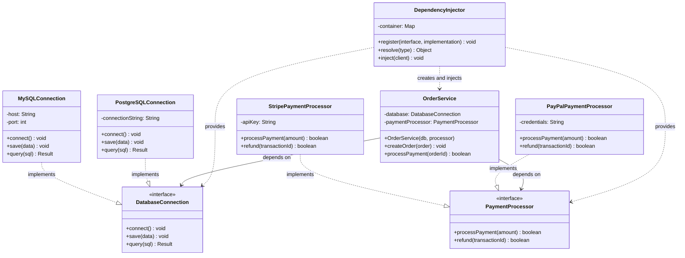

#java #software-engineering #software-architecture #software-testing #design-pattern #quarkus #micronaut #jakarta-ee #inversion-of-control #spring-boot #spring-framework
#object-oriented-programming 
# Purpose
- <mark class="hltr-yellow">Decouples</mark> the creation of the client's dependencies from its own behavior.
# Application
- There are <mark class="hltr-yellow">multiple concrete implementations</mark> of a same interface. These implementations must be flexibly swapped without modifying the consuming class.
- The system needs different configuration across environment.
- Cross-cutting concerns such as logging, security and transaction management must be centralized.
# Components

## Service Interface
- Defines a *contract* between the Client and its Dependencies.
- Decouples the Client from the concrete implementation of its Dependencies.
## Service objects - Dependencies
- Service objects are the *concrete objects* that implements the Interface and are required to execute the Client's logic.
## Injector - Dependency provider
- Serves as the central authority responsible for *creating dependencies* and providing them to clients.
- Resolves dependency graph, *manages the object lifecycle* and perform the actual injection into clients at the appropriate time. 
- Dependency resolution is implemented by a factory class or a complicated inversion-of-control container such as Spring Container.
## Dependent object - Client
- The client is the class which *requires external dependencies* to fulfill its own business logic.
- Declares its mandatory dependencies via its constructors, properties or setter methods but does not internally create these dependencies.
- Does not know the lifecycle of the dependencies but relies on the Injector.
# Flowchart
- ![[Pasted image 20251206213815.png]]
1. The Injector *instantiates* the Service objects via `create()` method.
2. Once the Dependencies are successfully created, the Injector *wires* the concrete objects with their interface via `inject(Service)` method. At moment, the Dependencies are provided from an external source rather being internally constructed.
3. After the injection, the Client is able to execute its own logic by *delegating* the necessary responsibility to the Service via `execute()` method instead of implementing it on its own. The Client is *unaware* of how the Dependencies are created or which specific implementation is injected.
# Example

## Service Interface
```Java title='Service interface'
interface DatabaseConnection {
    void connect();
    void save(Object data);
    String query(String sql);
}

interface PaymentProcessor {
    boolean processPayment(double amount);
    boolean refund(String transactionId);
}
```
## Service objects
```Java title='Concrete Database implementation - Concrete Service'
/ Concrete Database Implementations
class MySQLConnection implements DatabaseConnection {
    private String host;
    private int port;
    
    public MySQLConnection(String host, int port) {
        this.host = host;
        this.port = port;
    }
    
    @Override
    public void connect() {
        System.out.println("Connecting to MySQL at " + host + ":" + port);
    }
    
    @Override
    public void save(Object data) {
        System.out.println("Saving to MySQL: " + data);
    }
    
    @Override
    public String query(String sql) {
        return "MySQL result for: " + sql;
    }
}

class PostgreSQLConnection implements DatabaseConnection {
    private String connectionString;
    
    public PostgreSQLConnection(String connectionString) {
        this.connectionString = connectionString;
    }
    
    @Override
    public void connect() {
        System.out.println("Connecting to PostgreSQL: " + connectionString);
    }
    
    @Override
    public void save(Object data) {
        System.out.println("Saving to PostgreSQL: " + data);
    }
    
    @Override
    public String query(String sql) {
        return "PostgreSQL result for: " + sql;
    }
}
```

```Java title='Concrete Payment implementation - Concrete Service'
class StripePaymentProcessor implements PaymentProcessor {
    private String apiKey;
    
    public StripePaymentProcessor(String apiKey) {
        this.apiKey = apiKey;
    }
    
    @Override
    public boolean processPayment(double amount) {
        System.out.println("Processing $" + amount + " via Stripe");
        return true;
    }
    
    @Override
    public boolean refund(String transactionId) {
        System.out.println("Refunding Stripe transaction: " + transactionId);
        return true;
    }
}

class PayPalPaymentProcessor implements PaymentProcessor {
    private String credentials;
    
    public PayPalPaymentProcessor(String credentials) {
        this.credentials = credentials;
    }
    
    @Override
    public boolean processPayment(double amount) {
        System.out.println("Processing $" + amount + " via PayPal");
        return true;
    }
    
    @Override
    public boolean refund(String transactionId) {
        System.out.println("Refunding PayPal transaction: " + transactionId);
        return true;
    }
}
```
## Client
```Java title='class OrderService as Client'
class OrderService {
    private final DatabaseConnection database;
    private final PaymentProcessor paymentProcessor;
    
    // Constructor injection - dependencies provided from external source
    public OrderService(DatabaseConnection database, PaymentProcessor paymentProcessor) {
        this.database = database;
        this.paymentProcessor = paymentProcessor;
    }
    
    public void createOrder(String orderData) {
        database.connect();
        database.save(orderData);
        System.out.println("Order created successfully");
    }
    
    public boolean processPayment(String orderId, double amount) {
        String order = database.query("SELECT * FROM orders WHERE id = " + orderId);
        return paymentProcessor.processPayment(amount);
    }
}
```
## Injector
```Java title='Dependency injector'
class DependencyInjector {
    private String environment;
    
    public DependencyInjector(String environment) {
        this.environment = environment;
    }
    
    public DatabaseConnection provideDatabase() {
        if ("production".equals(environment)) {
            return new PostgreSQLConnection("prod-db.example.com");
        } else {
            return new MySQLConnection("localhost", 3306);
        }
    }
    
    public PaymentProcessor providePaymentProcessor() {
        if ("production".equals(environment)) {
            return new StripePaymentProcessor("sk_live_12345");
        } else {
            return new PayPalPaymentProcessor("sandbox_credentials");
        }
    }
    
    public OrderService createOrderService() {
        DatabaseConnection db = provideDatabase();
        PaymentProcessor processor = providePaymentProcessor();
        return new OrderService(db, processor);
    }
}
```
## Driver class
```Java title='Driver class - Entry point of program'
public class ECommerceApplication {
    public static void main(String[] args) {
        // Development environment
        DependencyInjector devInjector = new DependencyInjector("development");
        OrderService devOrderService = devInjector.createOrderService();
        devOrderService.createOrder("Order #123");
        devOrderService.processPayment("123", 99.99);
        
        System.out.println("\n--- Switching to Production ---\n");
        
        // Production environment
        DependencyInjector prodInjector = new DependencyInjector("production");
        OrderService prodOrderService = prodInjector.createOrderService();
        prodOrderService.createOrder("Order #456");
        prodOrderService.processPayment("456", 199.99);
    }
}
```
# Real example
- Jakarta EE Dependency injection specification for frameworks such as Spring Framework, Quarkus and Micronaut.
# Consequences
- Enhances modularity and flexibility of the system because this inversion-of-control mechanism creates a *plugin-and-play* architecture where implementations can be exchanged without modifying the dependent client. However, this also introduces the *complexity* of dependencies and performance *overhead*.
- Enhances testability and test isolation of the system because the loosely coupling *simplifies the mocking* of dependencies.
- The object lifecycle and configuration are *centralized*.
- Heavily relying on a framework-based dependency injection such as Spring Framework makes it *challenging to migrate* to another framework.
***
# References
1. https://java-design-patterns.com/patterns/dependency-injection/ for Dependency Injection in Java.
2. 
``